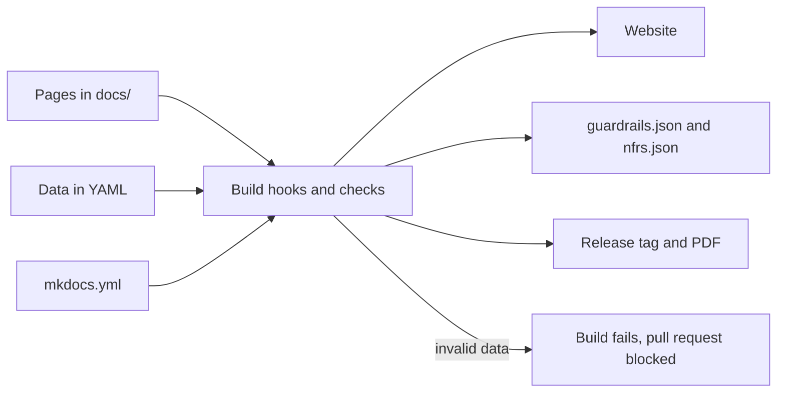

<!-- https://howellsr.github.io/architecture/contribute/team-guide/ | maturity: draft | site version 0.3.0 | generated from contribute/team-guide.md -->

# Updating the Defra architecture site: a guide for the team

Start here if you are new to updating this site. It explains how the site is built, the rules every change follows, which file to edit for each kind of change and how a change gets published.

!!! warning "Draft - to be confirmed"
    Parts of this page, such as names, timings and thresholds, are still being confirmed by the architecture team. Use it as a guide, and check with your solution design authority before relying on the detail.

For the exact fields, templates and commands, use the [contribute](https://howellsr.github.io/architecture/contribute/) page. This guide gives you the overview.

## How the site is built

The site is generated from Markdown and YAML files in the [DEFRA/architecture](https://github.com/DEFRA/architecture) repository. Nobody edits HTML. Every change goes through a pull request, is checked automatically, and is published when it is merged to `main`.

- **MkDocs with the Material theme.** Settings and the navigation are in `mkdocs.yml`. A new page does not appear in the navigation until you add it there.
- **Pages are Markdown with front matter.** Each guardrail page holds its guardrails as text (heading, Must, Should or Could badge, why and how to meet it) and their metadata as YAML at the top of the file: phases, lead roles, evidence, and links to the Service Standard, the Technology Code of Practice (TCoP) and Secure by Design.
- **Data is YAML.** Capabilities, non-functional requirements (NFRs), service tiers, the delivery lifecycle, platforms, roles, approvals and exceptions are YAML files, not pages. Pages show them through markers such as `

<label class="gl-field">Search<input type="search" id="gl-search" placeholder="e.g. secrets, hosting, GR-API-02" autocomplete="off"></label><label class="gl-field">Area<select id="gl-area"><option value="">All areas</option><option value="Architecture principles">Architecture principles</option><option value="APIs and integration">APIs and integration</option><option value="Artificial intelligence">Artificial intelligence</option><option value="Choosing technology">Choosing technology</option><option value="Data">Data</option><option value="Digital first and end-to-end services">Digital first and end-to-end services</option><option value="Field working and devices">Field working and devices</option><option value="Front end and accessibility">Front end and accessibility</option><option value="Hosting and platforms">Hosting and platforms</option><option value="Identity and access">Identity and access</option><option value="Observability and operations">Observability and operations</option><option value="Open source and working in the open">Open source and working in the open</option><option value="Products and platforms">Products and platforms</option><option value="Security">Security</option><option value="Software development">Software development</option><option value="Sustainability">Sustainability</option></select></label><label class="gl-field">Phase<select id="gl-phase"><option value="">All phases</option><option value="discovery">Discovery</option><option value="alpha">Alpha</option><option value="beta">Beta</option><option value="live">Live</option></select></label><label class="gl-field">Role<select id="gl-role"><option value="">Any role</option><option value="product-manager">Product manager</option><option value="delivery-manager">Delivery manager</option><option value="service-designer">Service designer</option><option value="interaction-designer">Interaction designer</option><option value="content-designer">Content designer</option><option value="user-researcher">User researcher</option><option value="developer">Developer</option><option value="technical-architect">Technical architect</option><option value="security-architect">Security architect</option><option value="data-architect">Data architect</option><option value="performance-analyst">Performance analyst</option></select></label><label class="gl-field">Status<select id="gl-status"><option value="">Any status</option><option value="draft">Draft</option><option value="endorsed">Endorsed</option><option value="deprecated">Deprecated</option></select></label><fieldset class="gl-levels"><legend>Level</legend><label class="gl-chip"><input type="checkbox" name="gl-level" value="principle" checked> Principle 8</label><label class="gl-chip"><input type="checkbox" name="gl-level" value="must" checked> Must 29</label><label class="gl-chip"><input type="checkbox" name="gl-level" value="should" checked> Should 69</label><label class="gl-chip"><input type="checkbox" name="gl-level" value="could" checked> Could 4</label></fieldset>

Showing <strong id="gl-shown">110</strong> of 110 guardrails

<article class="gl-card" data-level="principle" data-area="Architecture principles" data-phases="discovery alpha beta live" data-roles="" data-status="endorsed" data-search="gr-prin-01 delivery-focused architecture architecture is a service to delivery teams. architecture principles will support seamless delivery pipelines, enabling rapid, low-risk releases. architecture principles ">
Principle<code>GR-PRIN-01</code>EndorsedArchitecture principles
<h3 class="gl-card__title"><a href="../../principles/architecture-principles/#gr-prin-01">Delivery-focused architecture</a></h3>
Architecture is a service to delivery teams. Architecture principles will support seamless delivery pipelines, enabling rapid, low-risk releases.
</article><article class="gl-card" data-level="principle" data-area="Architecture principles" data-phases="discovery alpha beta live" data-roles="" data-status="endorsed" data-search="gr-prin-02 design for users create intuitive, accessible, user-friendly and consistent solutions that simplify access and improve user experience. architecture principles ">
Principle<code>GR-PRIN-02</code>EndorsedArchitecture principles
<h3 class="gl-card__title"><a href="../../principles/architecture-principles/#gr-prin-02">Design for users</a></h3>
Create intuitive, accessible, user-friendly and consistent solutions that simplify access and improve user experience.
</article><article class="gl-card" data-level="principle" data-area="Architecture principles" data-phases="discovery alpha beta live" data-roles="" data-status="endorsed" data-search="gr-prin-03 maximise value, minimise waste focus on delivering greater value to customers and citizens through reuse of common capabilities and effective technology management. architecture principles ">
Principle<code>GR-PRIN-03</code>EndorsedArchitecture principles
<h3 class="gl-card__title"><a href="../../principles/architecture-principles/#gr-prin-03">Maximise value, minimise waste</a></h3>
Focus on delivering greater value to customers and citizens through reuse of common capabilities and effective technology management.
</article><article class="gl-card" data-level="principle" data-area="Architecture principles" data-phases="discovery alpha beta live" data-roles="" data-status="endorsed" data-search="gr-prin-04 clean data, clear decisions ensure data is clean, accurate, consistent, timely and accessible, using ai to enhance data quality, integration and insights. architecture principles ">
Principle<code>GR-PRIN-04</code>EndorsedArchitecture principles
<h3 class="gl-card__title"><a href="../../principles/architecture-principles/#gr-prin-04">Clean data, clear decisions</a></h3>
Ensure data is clean, accurate, consistent, timely and accessible, using AI to enhance data quality, integration and insights.
</article><article class="gl-card" data-level="principle" data-area="Architecture principles" data-phases="discovery alpha beta live" data-roles="" data-status="endorsed" data-search="gr-prin-05 connect and collaborate create a flexible, connected and interoperable ecosystem through integration, automation and ai, to give streamlined user journeys and seamless data flows. architecture principles ">
Principle<code>GR-PRIN-05</code>EndorsedArchitecture principles
<h3 class="gl-card__title"><a href="../../principles/architecture-principles/#gr-prin-05">Connect and collaborate</a></h3>
Create a flexible, connected and interoperable ecosystem through integration, automation and AI, to give streamlined user journeys and seamless data flows.
</article><article class="gl-card" data-level="principle" data-area="Architecture principles" data-phases="discovery alpha beta live" data-roles="" data-status="endorsed" data-search="gr-prin-06 secure today, safe tomorrow implement robust security measures to protect data and systems and maintain a secure environment. architecture principles ">
Principle<code>GR-PRIN-06</code>EndorsedArchitecture principles
<h3 class="gl-card__title"><a href="../../principles/architecture-principles/#gr-prin-06">Secure today, safe tomorrow</a></h3>
Implement robust security measures to protect data and systems and maintain a secure environment.
</article><article class="gl-card" data-level="principle" data-area="Architecture principles" data-phases="discovery alpha beta live" data-roles="" data-status="endorsed" data-search="gr-prin-07 empower to innovate give the business the knowledge and tools to use its creativity to deliver innovative change. architecture principles ">
Principle<code>GR-PRIN-07</code>EndorsedArchitecture principles
<h3 class="gl-card__title"><a href="../../principles/architecture-principles/#gr-prin-07">Empower to innovate</a></h3>
Give the business the knowledge and tools to use its creativity to deliver innovative change.
</article><article class="gl-card" data-level="principle" data-area="Architecture principles" data-phases="discovery alpha beta live" data-roles="" data-status="endorsed" data-search="gr-prin-08 right tools, right place equip staff with the tools and devices they need to communicate and operate effectively in all conditions. architecture principles ">
Principle<code>GR-PRIN-08</code>EndorsedArchitecture principles
<h3 class="gl-card__title"><a href="../../principles/architecture-principles/#gr-prin-08">Right tools, right place</a></h3>
Equip staff with the tools and devices they need to communicate and operate effectively in all conditions.
</article><article class="gl-card" data-level="should" data-area="Artificial intelligence" data-phases="discovery alpha" data-roles="product-manager service-designer" data-status="draft" data-search="gr-ai-01 consider ai first when designing a service or process, actively explore whether ai can improve quality, productivity, user experience or outcomes before choosing a traditional approach, and record the reasoning either way. artificial intelligence adr recording the ai options considered and why they were or were not used">
Should<code>GR-AI-01</code>DraftArtificial intelligence
<h3 class="gl-card__title"><a href="../../guardrails/ai/#gr-ai-01">Consider AI first</a></h3>
When designing a service or process, actively explore whether AI can improve quality, productivity, user experience or outcomes before choosing a traditional approach, and record the reasoning either way.
<dl class="gl-card__facts"><dt>Evidence</dt><dd>ADR recording the AI options considered and why they were or were not used</dd><dt>Automated check</dt><dd>Manual</dd><dt>Phases</dt><dd>Discovery, Alpha</dd><dt>Led by</dt><dd>Product manager, Service designer</dd></dl></article><article class="gl-card" data-level="must" data-area="Artificial intelligence" data-phases="discovery alpha beta live" data-roles="technical-architect security-architect" data-status="draft" data-search="gr-ai-02 use approved ai services and tenancies services you build run their ai in defra&#x27;s cloud tenancies or under approved enterprise agreements. when anyone uses an ai tool, they put defra data into it only as the using data with ai rules in the ai digital toolkit allow - for example, never official-sensitive or personal data in a public consumer tool. artificial intelligence list of the ai services the service uses and the defra tenancy or enterprise agreement each runs under">
Must<code>GR-AI-02</code>DraftArtificial intelligence
<h3 class="gl-card__title"><a href="../../guardrails/ai/#gr-ai-02">Use approved AI services and tenancies</a></h3>
Services you build run their AI in Defra&#x27;s cloud tenancies or under approved enterprise agreements. When anyone uses an AI tool, they put Defra data into it only as the using data with AI rules in the AI digital toolkit allow - for example, never OFFICIAL-SENSITIVE or personal data in a public consumer tool.
<dl class="gl-card__facts"><dt>Evidence</dt><dd>List of the AI services the service uses and the Defra tenancy or enterprise agreement each runs under</dd><dt>Automated check</dt><dd>Manual</dd><dt>Phases</dt><dd>Discovery, Alpha, Beta, Live</dd><dt>Led by</dt><dd>Technical architect, Security architect</dd></dl></article><article class="gl-card" data-level="must" data-area="Artificial intelligence" data-phases="alpha beta live" data-roles="service-designer user-researcher" data-status="draft" data-search="gr-ai-03 keep a human accountable decisions with legal or significant effects on people or organisations - such as licensing, enforcement or payments - have meaningful human oversight, and the ability to challenge. artificial intelligence design of the human oversight and challenge route, tested with users">
Must<code>GR-AI-03</code>DraftArtificial intelligence
<h3 class="gl-card__title"><a href="../../guardrails/ai/#gr-ai-03">Keep a human accountable</a></h3>
Decisions with legal or significant effects on people or organisations - such as licensing, enforcement or payments - have meaningful human oversight, and the ability to challenge.
<dl class="gl-card__facts"><dt>Evidence</dt><dd>Design of the human oversight and challenge route, tested with users</dd><dt>Automated check</dt><dd>Manual</dd><dt>Phases</dt><dd>Alpha, Beta, Live</dd><dt>Led by</dt><dd>Service designer, User researcher</dd></dl></article><article class="gl-card" data-level="must" data-area="Artificial intelligence" data-phases="beta live" data-roles="content-designer interaction-designer" data-status="draft" data-search="gr-ai-04 be transparent publish an algorithmic transparency recording standard record for algorithmic tools that meet its scope, and tell users when they are interacting with ai. artificial intelligence link to the published algorithmic transparency recording standard record and the ai notice shown to users">
Must<code>GR-AI-04</code>DraftArtificial intelligence
<h3 class="gl-card__title"><a href="../../guardrails/ai/#gr-ai-04">Be transparent</a></h3>
Publish an Algorithmic Transparency Recording Standard record for algorithmic tools that meet its scope, and tell users when they are interacting with AI.
<dl class="gl-card__facts"><dt>Evidence</dt><dd>Link to the published Algorithmic Transparency Recording Standard record and the AI notice shown to users</dd><dt>Automated check</dt><dd>Manual</dd><dt>Phases</dt><dd>Beta, Live</dd><dt>Led by</dt><dd>Content designer, Interaction designer</dd></dl></article><article class="gl-card" data-level="should" data-area="Artificial intelligence" data-phases="alpha beta live" data-roles="data-architect security-architect" data-status="draft" data-search="gr-ai-05 evaluate, monitor and threat model evaluate models for accuracy, bias and safety before release, monitor them in live, and include ai-specific threats (prompt injection, data leakage, model abuse) in your threat model. artificial intelligence model evaluation results for accuracy, bias and safety, live monitoring, and a threat model that covers ai-specific threats">
Should<code>GR-AI-05</code>DraftArtificial intelligence
<h3 class="gl-card__title"><a href="../../guardrails/ai/#gr-ai-05">Evaluate, monitor and threat model</a></h3>
Evaluate models for accuracy, bias and safety before release, monitor them in live, and include AI-specific threats (prompt injection, data leakage, model abuse) in your threat model.
<dl class="gl-card__facts"><dt>Evidence</dt><dd>Model evaluation results for accuracy, bias and safety, live monitoring, and a threat model that covers AI-specific threats</dd><dt>Automated check</dt><dd>Manual</dd><dt>Phases</dt><dd>Alpha, Beta, Live</dd><dt>Led by</dt><dd>Data architect, Security architect</dd></dl></article><article class="gl-card" data-level="should" data-area="Artificial intelligence" data-phases="discovery alpha" data-roles="technical-architect" data-status="draft" data-search="gr-ai-06 talk to the tda about novel use novel uses of ai, and any use of generative ai in decision making, are reviewed by the technical design authority. artificial intelligence technical design authority review outcome recorded in the adr">
Should<code>GR-AI-06</code>DraftArtificial intelligence
<h3 class="gl-card__title"><a href="../../guardrails/ai/#gr-ai-06">Talk to the TDA about novel use</a></h3>
Novel uses of AI, and any use of generative AI in decision making, are reviewed by the Technical Design Authority.
<dl class="gl-card__facts"><dt>Evidence</dt><dd>Technical Design Authority review outcome recorded in the ADR</dd><dt>Automated check</dt><dd>Manual</dd><dt>Phases</dt><dd>Discovery, Alpha</dd><dt>Led by</dt><dd>Technical architect</dd></dl></article><article class="gl-card" data-level="should" data-area="Artificial intelligence" data-phases="alpha beta live" data-roles="delivery-manager developer" data-status="draft" data-search="gr-ai-07 suppliers use ai coding assistants openly and safely delivery partners who use ai coding assistants on defra work agree which tools they use with defra, use them only under terms that meet gr-ai-02, have a person review every change before it is merged, and say in pull requests or delivery reports where ai did significant work. artificial intelligence supplier&#x27;s agreed list of ai coding assistants and how each runs within defra-approved terms, the review process for generated code, and disclosure in pull requests or delivery reports">
Should<code>GR-AI-07</code>DraftArtificial intelligence
<h3 class="gl-card__title"><a href="../../guardrails/ai/#gr-ai-07">Suppliers use AI coding assistants openly and safely</a></h3>
Delivery partners who use AI coding assistants on Defra work agree which tools they use with Defra, use them only under terms that meet GR-AI-02, have a person review every change before it is merged, and say in pull requests or delivery reports where AI did significant work.
<dl class="gl-card__facts"><dt>Evidence</dt><dd>Supplier&#x27;s agreed list of AI coding assistants and how each runs within Defra-approved terms, the review process for generated code, and disclosure in pull requests or delivery reports</dd><dt>Automated check</dt><dd>Manual</dd><dt>Phases</dt><dd>Alpha, Beta, Live</dd><dt>Led by</dt><dd>Delivery manager, Developer</dd></dl></article><article class="gl-card" data-level="should" data-area="Artificial intelligence" data-phases="alpha beta live" data-roles="technical-architect security-architect" data-status="draft" data-search="gr-ai-08 give agents the least privilege they need ai agents act under their own identity, with access only to the tools, data and actions their task needs, and never with a person&#x27;s full permissions. artificial intelligence list of each agent&#x27;s tools and permissions, granted to the agent&#x27;s own identity and reviewed">
Should<code>GR-AI-08</code>DraftArtificial intelligence
<h3 class="gl-card__title"><a href="../../guardrails/ai/#gr-ai-08">Give agents the least privilege they need</a></h3>
AI agents act under their own identity, with access only to the tools, data and actions their task needs, and never with a person&#x27;s full permissions.
<dl class="gl-card__facts"><dt>Evidence</dt><dd>List of each agent&#x27;s tools and permissions, granted to the agent&#x27;s own identity and reviewed</dd><dt>Automated check</dt><dd>Manual</dd><dt>Phases</dt><dd>Alpha, Beta, Live</dd><dt>Led by</dt><dd>Technical architect, Security architect</dd></dl></article><article class="gl-card" data-level="should" data-area="Artificial intelligence" data-phases="alpha beta live" data-roles="service-designer technical-architect" data-status="draft" data-search="gr-ai-09 get human approval for consequential actions an agent does not take an action with legal, financial or significant effects on people, or one that cannot easily be undone, without approval from an accountable person. artificial intelligence design showing which agent actions need human approval, and tests proving they cannot happen without it">
Should<code>GR-AI-09</code>DraftArtificial intelligence
<h3 class="gl-card__title"><a href="../../guardrails/ai/#gr-ai-09">Get human approval for consequential actions</a></h3>
An agent does not take an action with legal, financial or significant effects on people, or one that cannot easily be undone, without approval from an accountable person.
<dl class="gl-card__facts"><dt>Evidence</dt><dd>Design showing which agent actions need human approval, and tests proving they cannot happen without it</dd><dt>Automated check</dt><dd>Manual</dd><dt>Phases</dt><dd>Alpha, Beta, Live</dd><dt>Led by</dt><dd>Service designer, Technical architect</dd></dl></article><article class="gl-card" data-level="should" data-area="Artificial intelligence" data-phases="beta live" data-roles="developer security-architect" data-status="draft" data-search="gr-ai-10 keep an audit trail of what agents do record what each agent was asked, what it read, which tools it called with what inputs, who approved what, and the outcome - and send security-relevant events to security monitoring. artificial intelligence audit records of agent inputs, tool calls, approvals and outcomes, sent to security monitoring">
Should<code>GR-AI-10</code>DraftArtificial intelligence
<h3 class="gl-card__title"><a href="../../guardrails/ai/#gr-ai-10">Keep an audit trail of what agents do</a></h3>
Record what each agent was asked, what it read, which tools it called with what inputs, who approved what, and the outcome - and send security-relevant events to security monitoring.
<dl class="gl-card__facts"><dt>Evidence</dt><dd>Audit records of agent inputs, tool calls, approvals and outcomes, sent to security monitoring</dd><dt>Automated check</dt><dd>Manual</dd><dt>Phases</dt><dd>Beta, Live</dd><dt>Led by</dt><dd>Developer, Security architect</dd></dl></article><article class="gl-card" data-level="should" data-area="Artificial intelligence" data-phases="alpha beta live" data-roles="security-architect developer" data-status="draft" data-search="gr-ai-11 defend agents against prompt injection treat everything an agent reads - documents, emails, web pages, tool results - as untrusted input that may try to change its instructions, and design controls that hold even if it does. artificial intelligence threat model covering prompt injection through every input the agent reads, with tested mitigations">
Should<code>GR-AI-11</code>DraftArtificial intelligence
<h3 class="gl-card__title"><a href="../../guardrails/ai/#gr-ai-11">Defend agents against prompt injection</a></h3>
Treat everything an agent reads - documents, emails, web pages, tool results - as untrusted input that may try to change its instructions, and design controls that hold even if it does.
<dl class="gl-card__facts"><dt>Evidence</dt><dd>Threat model covering prompt injection through every input the agent reads, with tested mitigations</dd><dt>Automated check</dt><dd>Manual</dd><dt>Phases</dt><dd>Alpha, Beta, Live</dd><dt>Led by</dt><dd>Security architect, Developer</dd></dl></article><article class="gl-card" data-level="should" data-area="APIs and integration" data-phases="alpha beta" data-roles="technical-architect" data-status="draft" data-search="gr-api-01 api first design the api for a capability before (or with) the user interface, so other services and partners can use it. apis and integration api specification written before or alongside the user interface">
Should<code>GR-API-01</code>DraftAPIs and integration
<h3 class="gl-card__title"><a href="../../guardrails/apis-and-integration/#gr-api-01">API first</a></h3>
Design the API for a capability before (or with) the user interface, so other services and partners can use it.
<dl class="gl-card__facts"><dt>Evidence</dt><dd>API specification written before or alongside the user interface</dd><dt>Automated check</dt><dd>Manual</dd><dt>Phases</dt><dd>Alpha, Beta</dd><dt>Led by</dt><dd>Technical architect</dd></dl></article><article class="gl-card" data-level="should" data-area="APIs and integration" data-phases="alpha beta live" data-roles="developer" data-status="draft" data-search="gr-api-02 describe apis with open specifications synchronous apis are described with openapi 3, and asynchronous/event interfaces with asyncapi, kept in the same repository as the code. apis and integration openapi 3 or asyncapi documents in the service repository that match the running api">
Should<code>GR-API-02</code>DraftAPIs and integration
<h3 class="gl-card__title"><a href="../../guardrails/apis-and-integration/#gr-api-02">Describe APIs with open specifications</a></h3>
Synchronous APIs are described with OpenAPI 3, and asynchronous/event interfaces with AsyncAPI, kept in the same repository as the code.
<dl class="gl-card__facts"><dt>Evidence</dt><dd>OpenAPI 3 or AsyncAPI documents in the service repository that match the running API</dd><dt>Automated check</dt><dd>Guardrail check (tools/guardrail-check): OpenAPI 3 and AsyncAPI documents present and well formed</dd><dt>Phases</dt><dd>Alpha, Beta, Live</dd><dt>Led by</dt><dd>Developer</dd></dl></article><article class="gl-card" data-level="should" data-area="APIs and integration" data-phases="alpha beta live" data-roles="developer technical-architect" data-status="draft" data-search="gr-api-03 follow government api standards follow the api technical and data standards: restful resources, json, https only, consistent error formats and standard identifiers from the data standards. apis and integration api design reviewed against the gds api technical and data standards">
Should<code>GR-API-03</code>DraftAPIs and integration
<h3 class="gl-card__title"><a href="../../guardrails/apis-and-integration/#gr-api-03">Follow government API standards</a></h3>
Follow the API technical and data standards: RESTful resources, JSON, HTTPS only, consistent error formats and standard identifiers from the data standards.
<dl class="gl-card__facts"><dt>Evidence</dt><dd>API design reviewed against the GDS API technical and data standards</dd><dt>Automated check</dt><dd>Manual</dd><dt>Phases</dt><dd>Alpha, Beta, Live</dd><dt>Led by</dt><dd>Developer, Technical architect</dd></dl></article><article class="gl-card" data-level="should" data-area="APIs and integration" data-phases="beta live" data-roles="technical-architect product-manager" data-status="draft" data-search="gr-api-04 version and deprecate deliberately breaking changes are versioned, consumers are told in advance, and old versions have a published retirement date. apis and integration published versioning policy, deprecation notices sent to consumers and retirement dates for old versions">
Should<code>GR-API-04</code>DraftAPIs and integration
<h3 class="gl-card__title"><a href="../../guardrails/apis-and-integration/#gr-api-04">Version and deprecate deliberately</a></h3>
Breaking changes are versioned, consumers are told in advance, and old versions have a published retirement date.
<dl class="gl-card__facts"><dt>Evidence</dt><dd>Published versioning policy, deprecation notices sent to consumers and retirement dates for old versions</dd><dt>Automated check</dt><dd>Manual</dd><dt>Phases</dt><dd>Beta, Live</dd><dt>Led by</dt><dd>Technical architect, Product manager</dd></dl></article><article class="gl-card" data-level="should" data-area="APIs and integration" data-phases="alpha beta live" data-roles="technical-architect" data-status="draft" data-search="gr-api-05 no integration through shared databases services do not read or write another service&#x27;s database directly. integrate through apis, events or governed data products. apis and integration container diagram showing integration only through apis, events or governed data products">
Should<code>GR-API-05</code>DraftAPIs and integration
<h3 class="gl-card__title"><a href="../../guardrails/apis-and-integration/#gr-api-05">No integration through shared databases</a></h3>
Services do not read or write another service&#x27;s database directly. Integrate through APIs, events or governed data products.
<dl class="gl-card__facts"><dt>Evidence</dt><dd>Container diagram showing integration only through APIs, events or governed data products</dd><dt>Automated check</dt><dd>Manual</dd><dt>Phases</dt><dd>Alpha, Beta, Live</dd><dt>Led by</dt><dd>Technical architect</dd></dl></article><article class="gl-card" data-level="should" data-area="APIs and integration" data-phases="alpha beta" data-roles="technical-architect developer" data-status="draft" data-search="gr-api-06 use events for change notifications use asynchronous messages or events when other services need to react to something that happened (an application submitted, a permit issued), rather than polling. apis and integration event and message definitions described in asyncapi">
Should<code>GR-API-06</code>DraftAPIs and integration
<h3 class="gl-card__title"><a href="../../guardrails/apis-and-integration/#gr-api-06">Use events for change notifications</a></h3>
Use asynchronous messages or events when other services need to react to something that happened (an application submitted, a permit issued), rather than polling.
<dl class="gl-card__facts"><dt>Evidence</dt><dd>Event and message definitions described in AsyncAPI</dd><dt>Automated check</dt><dd>Manual</dd><dt>Phases</dt><dd>Alpha, Beta</dd><dt>Led by</dt><dd>Technical architect, Developer</dd></dl></article><article class="gl-card" data-level="must" data-area="APIs and integration" data-phases="alpha beta live" data-roles="security-architect developer" data-status="draft" data-search="gr-api-07 secure every api all apis authenticate callers (oauth 2.0 / openid connect or mutual tls), authorise every request, validate input and apply rate limiting. no api is &quot;internal so it&#x27;s safe&quot;. apis and integration authentication and authorisation design, rate limits and input validation, covered by security testing">
Must<code>GR-API-07</code>DraftAPIs and integration
<h3 class="gl-card__title"><a href="../../guardrails/apis-and-integration/#gr-api-07">Secure every API</a></h3>
All APIs authenticate callers (OAuth 2.0 / OpenID Connect or mutual TLS), authorise every request, validate input and apply rate limiting. No API is &quot;internal so it&#x27;s safe&quot;.
<dl class="gl-card__facts"><dt>Evidence</dt><dd>Authentication and authorisation design, rate limits and input validation, covered by security testing</dd><dt>Automated check</dt><dd>Manual</dd><dt>Phases</dt><dd>Alpha, Beta, Live</dd><dt>Led by</dt><dd>Security architect, Developer</dd></dl></article><article class="gl-card" data-level="should" data-area="APIs and integration" data-phases="beta live" data-roles="technical-architect" data-status="draft" data-search="gr-api-08 make apis discoverable register apis in the platform api catalogue and, where they are useful beyond defra, the government api catalogue. apis and integration entry in the platform api catalogue">
Should<code>GR-API-08</code>DraftAPIs and integration
<h3 class="gl-card__title"><a href="../../guardrails/apis-and-integration/#gr-api-08">Make APIs discoverable</a></h3>
Register APIs in the platform API catalogue and, where they are useful beyond Defra, the government API catalogue.
<dl class="gl-card__facts"><dt>Evidence</dt><dd>Entry in the platform API catalogue</dd><dt>Automated check</dt><dd>Manual</dd><dt>Phases</dt><dd>Beta, Live</dd><dt>Led by</dt><dd>Technical architect</dd></dl></article><article class="gl-card" data-level="must" data-area="Choosing technology" data-phases="discovery alpha" data-roles="technical-architect" data-status="draft" data-search="gr-tech-01 look for something to reuse first before buying or building, check the technology capability catalogue and cross-government components for something that already meets the need. choosing technology adr listing the reuse options considered from the technology capability catalogue and cross-government components">
Must<code>GR-TECH-01</code>DraftChoosing technology
<h3 class="gl-card__title"><a href="../../guardrails/choosing-technology/#gr-tech-01">Look for something to reuse first</a></h3>
Before buying or building, check the technology capability catalogue and cross-government components for something that already meets the need.
<dl class="gl-card__facts"><dt>Evidence</dt><dd>ADR listing the reuse options considered from the technology capability catalogue and cross-government components</dd><dt>Automated check</dt><dd>Manual</dd><dt>Phases</dt><dd>Discovery, Alpha</dd><dt>Led by</dt><dd>Technical architect</dd></dl></article><article class="gl-card" data-level="should" data-area="Choosing technology" data-phases="discovery alpha" data-roles="technical-architect product-manager" data-status="draft" data-search="gr-tech-02 buy commodity, build differentiating buy or use saas for commodity needs (email, hr, finance, crm, document management). build only where the capability is specific to defra&#x27;s mission and no product fits without heavy customisation. choosing technology buy or build options appraisal in the adr or business case">
Should<code>GR-TECH-02</code>DraftChoosing technology
<h3 class="gl-card__title"><a href="../../guardrails/choosing-technology/#gr-tech-02">Buy commodity, build differentiating</a></h3>
Buy or use SaaS for commodity needs (email, HR, finance, CRM, document management). Build only where the capability is specific to Defra&#x27;s mission and no product fits without heavy customisation.
<dl class="gl-card__facts"><dt>Evidence</dt><dd>Buy or build options appraisal in the ADR or business case</dd><dt>Automated check</dt><dd>Manual</dd><dt>Phases</dt><dd>Discovery, Alpha</dd><dt>Led by</dt><dd>Technical architect, Product manager</dd></dl></article><article class="gl-card" data-level="should" data-area="Choosing technology" data-phases="alpha beta live" data-roles="technical-architect delivery-manager" data-status="draft" data-search="gr-tech-03 plan your exit before you enter any new product, platform or significant supplier dependency has a documented exit plan covering data export in open formats, contract terms and an estimate of switching cost. choosing technology exit plan covering data export in open formats, contract terms and an estimate of switching cost">
Should<code>GR-TECH-03</code>DraftChoosing technology
<h3 class="gl-card__title"><a href="../../guardrails/choosing-technology/#gr-tech-03">Plan your exit before you enter</a></h3>
Any new product, platform or significant supplier dependency has a documented exit plan covering data export in open formats, contract terms and an estimate of switching cost.
<dl class="gl-card__facts"><dt>Evidence</dt><dd>Exit plan covering data export in open formats, contract terms and an estimate of switching cost</dd><dt>Automated check</dt><dd>Manual</dd><dt>Phases</dt><dd>Alpha, Beta, Live</dd><dt>Led by</dt><dd>Technical architect, Delivery manager</dd></dl></article><article class="gl-card" data-level="must" data-area="Choosing technology" data-phases="discovery alpha" data-roles="security-architect technical-architect" data-status="draft" data-search="gr-tech-04 assess saas before you adopt it saas and third-party hosted products are assessed for security, data protection, data location, accessibility and integration before contract. choosing technology supplier security assessment, dpia where personal data is involved, data location, accessibility and single sign-on confirmed before contract">
Must<code>GR-TECH-04</code>DraftChoosing technology
<h3 class="gl-card__title"><a href="../../guardrails/choosing-technology/#gr-tech-04">Assess SaaS before you adopt it</a></h3>
SaaS and third-party hosted products are assessed for security, data protection, data location, accessibility and integration before contract.
<dl class="gl-card__facts"><dt>Evidence</dt><dd>Supplier security assessment, DPIA where personal data is involved, data location, accessibility and single sign-on confirmed before contract</dd><dt>Automated check</dt><dd>Manual</dd><dt>Phases</dt><dd>Discovery, Alpha</dd><dt>Led by</dt><dd>Security architect, Technical architect</dd></dl></article><article class="gl-card" data-level="should" data-area="Choosing technology" data-phases="alpha" data-roles="technical-architect" data-status="draft" data-search="gr-tech-05 prefer open standards and portable technology choose products and components that use open standards and can be run on more than one provider. choosing technology adr noting the open standards used and how portable the choice is">
Should<code>GR-TECH-05</code>DraftChoosing technology
<h3 class="gl-card__title"><a href="../../guardrails/choosing-technology/#gr-tech-05">Prefer open standards and portable technology</a></h3>
Choose products and components that use open standards and can be run on more than one provider.
<dl class="gl-card__facts"><dt>Evidence</dt><dd>ADR noting the open standards used and how portable the choice is</dd><dt>Automated check</dt><dd>Manual</dd><dt>Phases</dt><dd>Alpha</dd><dt>Led by</dt><dd>Technical architect</dd></dl></article><article class="gl-card" data-level="must" data-area="Choosing technology" data-phases="discovery" data-roles="delivery-manager product-manager" data-status="draft" data-search="gr-tech-06 get spend approval early spend that falls under the government digital and technology spend control is discussed with the architecture team before procurement starts. choosing technology record of the conversation with the architecture team before procurement started">
Must<code>GR-TECH-06</code>DraftChoosing technology
<h3 class="gl-card__title"><a href="../../guardrails/choosing-technology/#gr-tech-06">Get spend approval early</a></h3>
Spend that falls under the government digital and technology spend control is discussed with the architecture team before procurement starts.
<dl class="gl-card__facts"><dt>Evidence</dt><dd>Record of the conversation with the architecture team before procurement started</dd><dt>Automated check</dt><dd>Manual</dd><dt>Phases</dt><dd>Discovery</dd><dt>Led by</dt><dd>Delivery manager, Product manager</dd></dl></article><article class="gl-card" data-level="should" data-area="Data" data-phases="alpha beta live" data-roles="data-architect product-manager" data-status="draft" data-search="gr-data-01 every data set has an owner each data set a service creates or holds has a named business owner (information asset owner) and is recorded in the information asset register. data information asset register entries with a named owner for each data set">
Should<code>GR-DATA-01</code>DraftData
<h3 class="gl-card__title"><a href="../../guardrails/data/#gr-data-01">Every data set has an owner</a></h3>
Each data set a service creates or holds has a named business owner (information asset owner) and is recorded in the information asset register.
<dl class="gl-card__facts"><dt>Evidence</dt><dd>Information asset register entries with a named owner for each data set</dd><dt>Automated check</dt><dd>Manual</dd><dt>Phases</dt><dd>Alpha, Beta, Live</dd><dt>Led by</dt><dd>Data architect, Product manager</dd></dl></article><article class="gl-card" data-level="should" data-area="Data" data-phases="discovery alpha beta live" data-roles="data-architect" data-status="draft" data-search="gr-data-02 use authoritative sources use the authoritative source for shared entities - customers, organisations, land parcels, holdings, locations, species - rather than creating local copies that drift. see defra on a page. data data flow diagram naming the authoritative source for each shared entity, with refresh arrangements for any copies">
Should<code>GR-DATA-02</code>DraftData
<h3 class="gl-card__title"><a href="../../guardrails/data/#gr-data-02">Use authoritative sources</a></h3>
Use the authoritative source for shared entities - customers, organisations, land parcels, holdings, locations, species - rather than creating local copies that drift. See Defra on a page.
<dl class="gl-card__facts"><dt>Evidence</dt><dd>Data flow diagram naming the authoritative source for each shared entity, with refresh arrangements for any copies</dd><dt>Automated check</dt><dd>Manual</dd><dt>Phases</dt><dd>Discovery, Alpha, Beta, Live</dd><dt>Led by</dt><dd>Data architect</dd></dl></article><article class="gl-card" data-level="should" data-area="Data" data-phases="alpha beta" data-roles="data-architect" data-status="draft" data-search="gr-data-03 use agreed data standards and identifiers use the data standards for dates, addresses, locations, identifiers and code lists, so data can be joined across services. data data model that uses the agreed data standards and identifiers">
Should<code>GR-DATA-03</code>DraftData
<h3 class="gl-card__title"><a href="../../guardrails/data/#gr-data-03">Use agreed data standards and identifiers</a></h3>
Use the data standards for dates, addresses, locations, identifiers and code lists, so data can be joined across services.
<dl class="gl-card__facts"><dt>Evidence</dt><dd>Data model that uses the agreed data standards and identifiers</dd><dt>Automated check</dt><dd>Manual</dd><dt>Phases</dt><dd>Alpha, Beta</dd><dt>Led by</dt><dd>Data architect</dd></dl></article><article class="gl-card" data-level="should" data-area="Data" data-phases="alpha beta" data-roles="service-designer" data-status="draft" data-search="gr-data-04 collect once, share safely do not ask users for information defra already holds. share data between services through apis or governed data products, with data sharing agreements where required. data journey design showing users are not asked for information defra already holds, and data sharing agreements where required">
Should<code>GR-DATA-04</code>DraftData
<h3 class="gl-card__title"><a href="../../guardrails/data/#gr-data-04">Collect once, share safely</a></h3>
Do not ask users for information Defra already holds. Share data between services through APIs or governed data products, with data sharing agreements where required.
<dl class="gl-card__facts"><dt>Evidence</dt><dd>Journey design showing users are not asked for information Defra already holds, and data sharing agreements where required</dd><dt>Automated check</dt><dd>Manual</dd><dt>Phases</dt><dd>Alpha, Beta</dd><dt>Led by</dt><dd>Service designer</dd></dl></article><article class="gl-card" data-level="should" data-area="Data" data-phases="beta live" data-roles="data-architect" data-status="draft" data-search="gr-data-05 describe your data publish metadata for data sets so they can be found and understood - uk gemini for geospatial data and dcat for other data sets. data published metadata records in uk gemini or dcat">
Should<code>GR-DATA-05</code>DraftData
<h3 class="gl-card__title"><a href="../../guardrails/data/#gr-data-05">Describe your data</a></h3>
Publish metadata for data sets so they can be found and understood - UK GEMINI for geospatial data and DCAT for other data sets.
<dl class="gl-card__facts"><dt>Evidence</dt><dd>Published metadata records in UK GEMINI or DCAT</dd><dt>Automated check</dt><dd>Manual</dd><dt>Phases</dt><dd>Beta, Live</dd><dt>Led by</dt><dd>Data architect</dd></dl></article><article class="gl-card" data-level="must" data-area="Data" data-phases="discovery alpha beta live" data-roles="data-architect product-manager" data-status="draft" data-search="gr-data-06 protect personal data by design complete a data protection impact assessment (dpia) before processing personal data, minimise what you collect, and apply retention and deletion automatically. data approved dpia, and retention and deletion built into the service">
Must<code>GR-DATA-06</code>DraftData
<h3 class="gl-card__title"><a href="../../guardrails/data/#gr-data-06">Protect personal data by design</a></h3>
Complete a data protection impact assessment (DPIA) before processing personal data, minimise what you collect, and apply retention and deletion automatically.
<dl class="gl-card__facts"><dt>Evidence</dt><dd>Approved DPIA, and retention and deletion built into the service</dd><dt>Automated check</dt><dd>Manual</dd><dt>Phases</dt><dd>Discovery, Alpha, Beta, Live</dd><dt>Led by</dt><dd>Data architect, Product manager</dd></dl></article><article class="gl-card" data-level="should" data-area="Data" data-phases="beta live" data-roles="data-architect product-manager" data-status="draft" data-search="gr-data-07 open by default publish non-personal, non-sensitive data as open data under the open government licence, through the defra data services platform or data.gov.uk. data link to the published open data and its licence">
Should<code>GR-DATA-07</code>DraftData
<h3 class="gl-card__title"><a href="../../guardrails/data/#gr-data-07">Open by default</a></h3>
Publish non-personal, non-sensitive data as open data under the Open Government Licence, through the Defra Data Services Platform or data.gov.uk.
<dl class="gl-card__facts"><dt>Evidence</dt><dd>Link to the published open data and its licence</dd><dt>Automated check</dt><dd>Manual</dd><dt>Phases</dt><dd>Beta, Live</dd><dt>Led by</dt><dd>Data architect, Product manager</dd></dl></article><article class="gl-card" data-level="should" data-area="Data" data-phases="beta live" data-roles="data-architect performance-analyst" data-status="draft" data-search="gr-data-08 manage data quality define, measure and report data quality using the government data quality framework, especially for data that feeds payments, regulatory decisions or official statistics. data data quality measures and regular reports">
Should<code>GR-DATA-08</code>DraftData
<h3 class="gl-card__title"><a href="../../guardrails/data/#gr-data-08">Manage data quality</a></h3>
Define, measure and report data quality using the Government Data Quality Framework, especially for data that feeds payments, regulatory decisions or official statistics.
<dl class="gl-card__facts"><dt>Evidence</dt><dd>Data quality measures and regular reports</dd><dt>Automated check</dt><dd>Manual</dd><dt>Phases</dt><dd>Beta, Live</dd><dt>Led by</dt><dd>Data architect, Performance analyst</dd></dl></article><article class="gl-card" data-level="must" data-area="Data" data-phases="beta live" data-roles="data-architect" data-status="draft" data-search="gr-data-09 retain and dispose of records properly apply defra&#x27;s retention schedules. records of permanent value are identified for transfer to the national archives. data retention schedule applied and records of permanent value identified">
Must<code>GR-DATA-09</code>DraftData
<h3 class="gl-card__title"><a href="../../guardrails/data/#gr-data-09">Retain and dispose of records properly</a></h3>
Apply Defra&#x27;s retention schedules. Records of permanent value are identified for transfer to The National Archives.
<dl class="gl-card__facts"><dt>Evidence</dt><dd>Retention schedule applied and records of permanent value identified</dd><dt>Automated check</dt><dd>Manual</dd><dt>Phases</dt><dd>Beta, Live</dd><dt>Led by</dt><dd>Data architect</dd></dl></article><article class="gl-card" data-level="should" data-area="Data" data-phases="discovery alpha beta live" data-roles="user-researcher" data-status="draft" data-search="gr-data-10 handle research data safely collect research data only with informed consent, store recordings and notes only in defra-approved places, delete them when they are no longer needed, use only defra-approved research tools, and screen research for a dpia. data research plan showing consent, where recordings and notes are stored, when they are deleted, the approved tools used and dpia screening">
Should<code>GR-DATA-10</code>DraftData
<h3 class="gl-card__title"><a href="../../guardrails/data/#gr-data-10">Handle research data safely</a></h3>
Collect research data only with informed consent, store recordings and notes only in Defra-approved places, delete them when they are no longer needed, use only Defra-approved research tools, and screen research for a DPIA.
<dl class="gl-card__facts"><dt>Evidence</dt><dd>Research plan showing consent, where recordings and notes are stored, when they are deleted, the approved tools used and DPIA screening</dd><dt>Automated check</dt><dd>Manual</dd><dt>Phases</dt><dd>Discovery, Alpha, Beta, Live</dd><dt>Led by</dt><dd>User researcher</dd></dl></article><article class="gl-card" data-level="should" data-area="Data" data-phases="discovery alpha beta" data-roles="interaction-designer user-researcher developer" data-status="draft" data-search="gr-data-11 no real personal data in prototypes prototypes, research materials and test environments use made-up or anonymised data, never real personal data copied from a live service or spreadsheet. data prototypes and test environments use made-up or anonymised data, never real personal data">
Should<code>GR-DATA-11</code>DraftData
<h3 class="gl-card__title"><a href="../../guardrails/data/#gr-data-11">No real personal data in prototypes</a></h3>
Prototypes, research materials and test environments use made-up or anonymised data, never real personal data copied from a live service or spreadsheet.
<dl class="gl-card__facts"><dt>Evidence</dt><dd>Prototypes and test environments use made-up or anonymised data, never real personal data</dd><dt>Automated check</dt><dd>Manual</dd><dt>Phases</dt><dd>Discovery, Alpha, Beta</dd><dt>Led by</dt><dd>Interaction designer, User researcher, Developer</dd></dl></article><article class="gl-card" data-level="should" data-area="Digital first and end-to-end services" data-phases="discovery alpha" data-roles="service-designer user-researcher" data-status="draft" data-search="gr-dig-01 challenge paper and manual processes do not put a paper or email process online as it is. find out why each step exists, and remove, automate or redesign it. digital first and end-to-end services discovery findings showing paper, email and manual steps in the current process and how the new design removes or justifies each one">
Should<code>GR-DIG-01</code>DraftDigital first and end-to-end services
<h3 class="gl-card__title"><a href="../../guardrails/digital-first/#gr-dig-01">Challenge paper and manual processes</a></h3>
Do not put a paper or email process online as it is. Find out why each step exists, and remove, automate or redesign it.
<dl class="gl-card__facts"><dt>Evidence</dt><dd>Discovery findings showing paper, email and manual steps in the current process and how the new design removes or justifies each one</dd><dt>Automated check</dt><dd>Manual</dd><dt>Phases</dt><dd>Discovery, Alpha</dd><dt>Led by</dt><dd>Service designer, User researcher</dd></dl></article><article class="gl-card" data-level="should" data-area="Digital first and end-to-end services" data-phases="discovery alpha beta" data-roles="service-designer" data-status="draft" data-search="gr-dig-02 design across organisational boundaries design the end-to-end service from the user&#x27;s point of view, even when parts of it are delivered by other defra organisations or other parts of government. digital first and end-to-end services a map of the whole service, including the parts other teams and organisations deliver, and agreed hand-offs between them">
Should<code>GR-DIG-02</code>DraftDigital first and end-to-end services
<h3 class="gl-card__title"><a href="../../guardrails/digital-first/#gr-dig-02">Design across organisational boundaries</a></h3>
Design the end-to-end service from the user&#x27;s point of view, even when parts of it are delivered by other Defra organisations or other parts of government.
<dl class="gl-card__facts"><dt>Evidence</dt><dd>A map of the whole service, including the parts other teams and organisations deliver, and agreed hand-offs between them</dd><dt>Automated check</dt><dd>Manual</dd><dt>Phases</dt><dd>Discovery, Alpha, Beta</dd><dt>Led by</dt><dd>Service designer</dd></dl></article><article class="gl-card" data-level="should" data-area="Digital first and end-to-end services" data-phases="alpha beta live" data-roles="service-designer user-researcher" data-status="draft" data-search="gr-dig-03 provide assisted digital and offline routes make sure people who cannot use the online service, or cannot use it alone, can still get what they need - with help, by phone or on paper - and that those routes lead to the same outcome and data. digital first and end-to-end services assisted digital and offline routes designed and tested with users who need them">
Should<code>GR-DIG-03</code>DraftDigital first and end-to-end services
<h3 class="gl-card__title"><a href="../../guardrails/digital-first/#gr-dig-03">Provide assisted digital and offline routes</a></h3>
Make sure people who cannot use the online service, or cannot use it alone, can still get what they need - with help, by phone or on paper - and that those routes lead to the same outcome and data.
<dl class="gl-card__facts"><dt>Evidence</dt><dd>Assisted digital and offline routes designed and tested with users who need them</dd><dt>Automated check</dt><dd>Manual</dd><dt>Phases</dt><dd>Alpha, Beta, Live</dd><dt>Led by</dt><dd>Service designer, User researcher</dd></dl></article><article class="gl-card" data-level="should" data-area="Field working and devices" data-phases="discovery alpha" data-roles="user-researcher service-designer" data-status="draft" data-search="gr-field-01 choose devices that suit the job choose devices for field work from research into where and how people work - outdoors, in bad weather, wearing gloves, in the dark - not from what is already on the desk. field working and devices user research on the working environment, and the device choice recorded in an adr">
Should<code>GR-FIELD-01</code>DraftField working and devices
<h3 class="gl-card__title"><a href="../../guardrails/field-working-and-devices/#gr-field-01">Choose devices that suit the job</a></h3>
Choose devices for field work from research into where and how people work - outdoors, in bad weather, wearing gloves, in the dark - not from what is already on the desk.
<dl class="gl-card__facts"><dt>Evidence</dt><dd>User research on the working environment, and the device choice recorded in an ADR</dd><dt>Automated check</dt><dd>Manual</dd><dt>Phases</dt><dd>Discovery, Alpha</dd><dt>Led by</dt><dd>User researcher, Service designer</dd></dl></article><article class="gl-card" data-level="should" data-area="Field working and devices" data-phases="alpha beta live" data-roles="interaction-designer developer" data-status="draft" data-search="gr-field-02 design field tools to work offline field tools work without a connection: they download what is needed before a visit, save work on the device, and sync safely when back in signal. field working and devices field journeys tested with no connection, including sync after reconnecting and conflict handling">
Should<code>GR-FIELD-02</code>DraftField working and devices
<h3 class="gl-card__title"><a href="../../guardrails/field-working-and-devices/#gr-field-02">Design field tools to work offline</a></h3>
Field tools work without a connection: they download what is needed before a visit, save work on the device, and sync safely when back in signal.
<dl class="gl-card__facts"><dt>Evidence</dt><dd>Field journeys tested with no connection, including sync after reconnecting and conflict handling</dd><dt>Automated check</dt><dd>Manual</dd><dt>Phases</dt><dd>Alpha, Beta, Live</dd><dt>Led by</dt><dd>Interaction designer, Developer</dd></dl></article><article class="gl-card" data-level="should" data-area="Field working and devices" data-phases="alpha beta live" data-roles="security-architect" data-status="draft" data-search="gr-field-03 manage and secure every device devices that hold or access defra data are enrolled in defra device management, encrypted, kept patched, protected by a screen lock and able to be wiped remotely if lost. field working and devices devices enrolled in defra device management, with encryption, patching and remote wipe confirmed">
Should<code>GR-FIELD-03</code>DraftField working and devices
<h3 class="gl-card__title"><a href="../../guardrails/field-working-and-devices/#gr-field-03">Manage and secure every device</a></h3>
Devices that hold or access Defra data are enrolled in Defra device management, encrypted, kept patched, protected by a screen lock and able to be wiped remotely if lost.
<dl class="gl-card__facts"><dt>Evidence</dt><dd>Devices enrolled in Defra device management, with encryption, patching and remote wipe confirmed</dd><dt>Automated check</dt><dd>Manual</dd><dt>Phases</dt><dd>Alpha, Beta, Live</dd><dt>Led by</dt><dd>Security architect</dd></dl></article><article class="gl-card" data-level="could" data-area="Field working and devices" data-phases="discovery alpha" data-roles="user-researcher technical-architect" data-status="draft" data-search="gr-field-04 check connectivity before you design check the mobile and broadband coverage where the service will be used before choosing an approach, rather than assuming it. field working and devices connectivity in the places the service will be used checked, and the approach recorded">
Could<code>GR-FIELD-04</code>DraftField working and devices
<h3 class="gl-card__title"><a href="../../guardrails/field-working-and-devices/#gr-field-04">Check connectivity before you design</a></h3>
Check the mobile and broadband coverage where the service will be used before choosing an approach, rather than assuming it.
<dl class="gl-card__facts"><dt>Evidence</dt><dd>Connectivity in the places the service will be used checked, and the approach recorded</dd><dt>Automated check</dt><dd>Manual</dd><dt>Phases</dt><dd>Discovery, Alpha</dd><dt>Led by</dt><dd>User researcher, Technical architect</dd></dl></article><article class="gl-card" data-level="must" data-area="Front end and accessibility" data-phases="alpha beta live" data-roles="interaction-designer developer" data-status="draft" data-search="gr-fe-01 meet wcag 2.2 aa public and staff-facing services meet wcag 2.2 level aa, are tested with assistive technology and publish an accessibility statement. front end and accessibility accessibility audit, assistive technology testing results and a published accessibility statement">
Must<code>GR-FE-01</code>DraftFront end and accessibility
<h3 class="gl-card__title"><a href="../../guardrails/front-end-and-accessibility/#gr-fe-01">Meet WCAG 2.2 AA</a></h3>
Public and staff-facing services meet WCAG 2.2 level AA, are tested with assistive technology and publish an accessibility statement.
<dl class="gl-card__facts"><dt>Evidence</dt><dd>Accessibility audit, assistive technology testing results and a published accessibility statement</dd><dt>Automated check</dt><dd>Automated accessibility tests such as axe in the pipeline. These find some issues only; manual testing is still needed.</dd><dt>Phases</dt><dd>Alpha, Beta, Live</dd><dt>Led by</dt><dd>Interaction designer, Developer</dd></dl></article><article class="gl-card" data-level="must" data-area="Front end and accessibility" data-phases="alpha beta live" data-roles="interaction-designer developer" data-status="draft" data-search="gr-fe-02 use the gov.uk design system public-facing services use gov.uk frontend and patterns. staff-facing services should use them too. front end and accessibility the service uses gov.uk frontend and design decisions record where it departs from the patterns">
Must<code>GR-FE-02</code>DraftFront end and accessibility
<h3 class="gl-card__title"><a href="../../guardrails/front-end-and-accessibility/#gr-fe-02">Use the GOV.UK Design System</a></h3>
Public-facing services use GOV.UK Frontend and patterns. Staff-facing services should use them too.
<dl class="gl-card__facts"><dt>Evidence</dt><dd>The service uses GOV.UK Frontend and design decisions record where it departs from the patterns</dd><dt>Automated check</dt><dd>Manual</dd><dt>Phases</dt><dd>Alpha, Beta, Live</dd><dt>Led by</dt><dd>Interaction designer, Developer</dd></dl></article><article class="gl-card" data-level="should" data-area="Front end and accessibility" data-phases="alpha beta" data-roles="developer interaction-designer" data-status="draft" data-search="gr-fe-03 progressive enhancement core journeys work without javascript, and are server-rendered. use javascript to enhance, not to make things work. front end and accessibility core journeys tested with javascript turned off">
Should<code>GR-FE-03</code>DraftFront end and accessibility
<h3 class="gl-card__title"><a href="../../guardrails/front-end-and-accessibility/#gr-fe-03">Progressive enhancement</a></h3>
Core journeys work without JavaScript, and are server-rendered. Use JavaScript to enhance, not to make things work.
<dl class="gl-card__facts"><dt>Evidence</dt><dd>Core journeys tested with JavaScript turned off</dd><dt>Automated check</dt><dd>Manual</dd><dt>Phases</dt><dd>Alpha, Beta</dd><dt>Led by</dt><dd>Developer, Interaction designer</dd></dl></article><article class="gl-card" data-level="should" data-area="Front end and accessibility" data-phases="discovery alpha" data-roles="service-designer technical-architect" data-status="draft" data-search="gr-fe-04 consider forms platforms first for form-based services, consider the forms options under customer service before building a bespoke front end. front end and accessibility adr noting whether the forms capability was considered">
Should<code>GR-FE-04</code>DraftFront end and accessibility
<h3 class="gl-card__title"><a href="../../guardrails/front-end-and-accessibility/#gr-fe-04">Consider forms platforms first</a></h3>
For form-based services, consider the forms options under Customer Service before building a bespoke front end.
<dl class="gl-card__facts"><dt>Evidence</dt><dd>ADR noting whether the forms capability was considered</dd><dt>Automated check</dt><dd>Manual</dd><dt>Phases</dt><dd>Discovery, Alpha</dd><dt>Led by</dt><dd>Service designer, Technical architect</dd></dl></article><article class="gl-card" data-level="should" data-area="Front end and accessibility" data-phases="alpha beta" data-roles="service-designer user-researcher" data-status="draft" data-search="gr-fe-05 design for low bandwidth and rural users many defra users - farmers, land managers, field staff - work in places with poor connectivity. keep pages light, support saving progress, and consider offline working for field tools. front end and accessibility page weight budget, save-progress design and testing on slow connections">
Should<code>GR-FE-05</code>DraftFront end and accessibility
<h3 class="gl-card__title"><a href="../../guardrails/front-end-and-accessibility/#gr-fe-05">Design for low bandwidth and rural users</a></h3>
Many Defra users - farmers, land managers, field staff - work in places with poor connectivity. Keep pages light, support saving progress, and consider offline working for field tools.
<dl class="gl-card__facts"><dt>Evidence</dt><dd>Page weight budget, save-progress design and testing on slow connections</dd><dt>Automated check</dt><dd>Manual</dd><dt>Phases</dt><dd>Alpha, Beta</dd><dt>Led by</dt><dd>Service designer, User researcher</dd></dl></article><article class="gl-card" data-level="must" data-area="Front end and accessibility" data-phases="alpha beta live" data-roles="content-designer" data-status="draft" data-search="gr-fe-06 support welsh where required services used in wales meet the welsh language standards where they apply. design for translation from the start. front end and accessibility assessment of whether the welsh language standards apply and translated content where they do">
Must<code>GR-FE-06</code>DraftFront end and accessibility
<h3 class="gl-card__title"><a href="../../guardrails/front-end-and-accessibility/#gr-fe-06">Support Welsh where required</a></h3>
Services used in Wales meet the Welsh Language Standards where they apply. Design for translation from the start.
<dl class="gl-card__facts"><dt>Evidence</dt><dd>Assessment of whether the Welsh Language Standards apply and translated content where they do</dd><dt>Automated check</dt><dd>Manual</dd><dt>Phases</dt><dd>Alpha, Beta, Live</dd><dt>Led by</dt><dd>Content designer</dd></dl></article><article class="gl-card" data-level="should" data-area="Front end and accessibility" data-phases="alpha beta live" data-roles="content-designer developer interaction-designer" data-status="draft" data-search="gr-fe-07 tell users what is happening when things fail or are slow when a service is slow, a dependency fails or something is still being processed, users see a clear message saying what has happened, whether their work is saved, and what to do next - not a generic error or a page that seems to hang. front end and accessibility designed and tested content for each way the service can fail or slow down, and the front end showing it">
Should<code>GR-FE-07</code>DraftFront end and accessibility
<h3 class="gl-card__title"><a href="../../guardrails/front-end-and-accessibility/#gr-fe-07">Tell users what is happening when things fail or are slow</a></h3>
When a service is slow, a dependency fails or something is still being processed, users see a clear message saying what has happened, whether their work is saved, and what to do next - not a generic error or a page that seems to hang.
<dl class="gl-card__facts"><dt>Evidence</dt><dd>Designed and tested content for each way the service can fail or slow down, and the front end showing it</dd><dt>Automated check</dt><dd>Manual</dd><dt>Phases</dt><dd>Alpha, Beta, Live</dd><dt>Led by</dt><dd>Content designer, Developer, Interaction designer</dd></dl></article><article class="gl-card" data-level="must" data-area="Hosting and platforms" data-phases="discovery alpha beta live" data-roles="technical-architect" data-status="draft" data-search="gr-host-01 use defra&#x27;s strategic delivery platform by default new digital services are hosted on the defra core delivery platform (cdp) unless an exception has been agreed. hosting and platforms the service runs on the core delivery platform, or an approved exception">
Must<code>GR-HOST-01</code>DraftHosting and platforms
<h3 class="gl-card__title"><a href="../../guardrails/hosting-and-platforms/#gr-host-01">Use Defra&#x27;s strategic delivery platform by default</a></h3>
New digital services are hosted on the Defra Core Delivery Platform (CDP) unless an exception has been agreed.
<dl class="gl-card__facts"><dt>Evidence</dt><dd>The service runs on the Core Delivery Platform, or an approved exception</dd><dt>Automated check</dt><dd>Manual</dd><dt>Phases</dt><dd>Discovery, Alpha, Beta, Live</dd><dt>Led by</dt><dd>Technical architect</dd></dl></article><article class="gl-card" data-level="should" data-area="Hosting and platforms" data-phases="alpha beta live" data-roles="technical-architect" data-status="draft" data-search="gr-host-02 public cloud first where a service cannot use a strategic platform, it is hosted in a defra-managed public cloud tenancy. new on-premises hosting is not permitted. hosting and platforms hosting design showing a defra-managed public cloud tenancy">
Should<code>GR-HOST-02</code>DraftHosting and platforms
<h3 class="gl-card__title"><a href="../../guardrails/hosting-and-platforms/#gr-host-02">Public cloud first</a></h3>
Where a service cannot use a strategic platform, it is hosted in a Defra-managed public cloud tenancy. New on-premises hosting is not permitted.
<dl class="gl-card__facts"><dt>Evidence</dt><dd>Hosting design showing a Defra-managed public cloud tenancy</dd><dt>Automated check</dt><dd>Manual</dd><dt>Phases</dt><dd>Alpha, Beta, Live</dd><dt>Led by</dt><dd>Technical architect</dd></dl></article><article class="gl-card" data-level="should" data-area="Hosting and platforms" data-phases="beta live" data-roles="developer" data-status="draft" data-search="gr-host-03 everything as code infrastructure, configuration, pipelines and policies are defined as code, version-controlled and deployed through automated pipelines. no manual changes to production. hosting and platforms infrastructure, configuration and pipeline code in the repository, and drift detection results">
Should<code>GR-HOST-03</code>DraftHosting and platforms
<h3 class="gl-card__title"><a href="../../guardrails/hosting-and-platforms/#gr-host-03">Everything as code</a></h3>
Infrastructure, configuration, pipelines and policies are defined as code, version-controlled and deployed through automated pipelines. No manual changes to production.
<dl class="gl-card__facts"><dt>Evidence</dt><dd>Infrastructure, configuration and pipeline code in the repository, and drift detection results</dd><dt>Automated check</dt><dd>Manual</dd><dt>Phases</dt><dd>Beta, Live</dd><dt>Led by</dt><dd>Developer</dd></dl></article><article class="gl-card" data-level="should" data-area="Hosting and platforms" data-phases="alpha beta" data-roles="technical-architect developer" data-status="draft" data-search="gr-host-04 use managed services before self-managed prefer managed cloud services (databases, queues, storage) over running your own on virtual machines. hosting and platforms hosting design listing the managed services used">
Should<code>GR-HOST-04</code>DraftHosting and platforms
<h3 class="gl-card__title"><a href="../../guardrails/hosting-and-platforms/#gr-host-04">Use managed services before self-managed</a></h3>
Prefer managed cloud services (databases, queues, storage) over running your own on virtual machines.
<dl class="gl-card__facts"><dt>Evidence</dt><dd>Hosting design listing the managed services used</dd><dt>Automated check</dt><dd>Manual</dd><dt>Phases</dt><dd>Alpha, Beta</dd><dt>Led by</dt><dd>Technical architect, Developer</dd></dl></article><article class="gl-card" data-level="should" data-area="Hosting and platforms" data-phases="alpha beta live" data-roles="developer" data-status="draft" data-search="gr-host-05 consistent, disposable environments have at least development, test and production environments, created from the same code, with production data never copied to lower environments unless anonymised. hosting and platforms environments created from the same code, and how lower environments avoid real personal data">
Should<code>GR-HOST-05</code>DraftHosting and platforms
<h3 class="gl-card__title"><a href="../../guardrails/hosting-and-platforms/#gr-host-05">Consistent, disposable environments</a></h3>
Have at least development, test and production environments, created from the same code, with production data never copied to lower environments unless anonymised.
<dl class="gl-card__facts"><dt>Evidence</dt><dd>Environments created from the same code, and how lower environments avoid real personal data</dd><dt>Automated check</dt><dd>Manual</dd><dt>Phases</dt><dd>Alpha, Beta, Live</dd><dt>Led by</dt><dd>Developer</dd></dl></article><article class="gl-card" data-level="should" data-area="Hosting and platforms" data-phases="alpha beta live" data-roles="technical-architect security-architect" data-status="draft" data-search="gr-host-06 host data in the uk data classified official is held in uk regions unless an assessed and approved exception exists. hosting and platforms data location confirmed for every data store and backup">
Should<code>GR-HOST-06</code>DraftHosting and platforms
<h3 class="gl-card__title"><a href="../../guardrails/hosting-and-platforms/#gr-host-06">Host data in the UK</a></h3>
Data classified OFFICIAL is held in UK regions unless an assessed and approved exception exists.
<dl class="gl-card__facts"><dt>Evidence</dt><dd>Data location confirmed for every data store and backup</dd><dt>Automated check</dt><dd>Manual</dd><dt>Phases</dt><dd>Alpha, Beta, Live</dd><dt>Led by</dt><dd>Technical architect, Security architect</dd></dl></article><article class="gl-card" data-level="should" data-area="Hosting and platforms" data-phases="alpha beta live" data-roles="technical-architect product-manager" data-status="draft" data-search="gr-host-07 design for the resilience the service needs agree recovery time and recovery point objectives with the service owner, design to them across availability zones, and test recovery at least once a year. hosting and platforms agreed recovery time and recovery point objectives, a multi-zone design and the date of the last recovery test">
Should<code>GR-HOST-07</code>DraftHosting and platforms
<h3 class="gl-card__title"><a href="../../guardrails/hosting-and-platforms/#gr-host-07">Design for the resilience the service needs</a></h3>
Agree recovery time and recovery point objectives with the service owner, design to them across availability zones, and test recovery at least once a year.
<dl class="gl-card__facts"><dt>Evidence</dt><dd>Agreed recovery time and recovery point objectives, a multi-zone design and the date of the last recovery test</dd><dt>Automated check</dt><dd>Manual</dd><dt>Phases</dt><dd>Alpha, Beta, Live</dd><dt>Led by</dt><dd>Technical architect, Product manager</dd></dl></article><article class="gl-card" data-level="must" data-area="Identity and access" data-phases="discovery alpha beta live" data-roles="technical-architect service-designer" data-status="draft" data-search="gr-iam-01 use the strategic customer identity services services for citizens, farmers and businesses use defra customer identity (defra id), which uses gov.uk one login and government gateway as identity providers, for authentication. services do not build their own sign-in. see defra customer identity in the defra digital service manual. identity and access integration with defra customer identity and the agreed level of identity assurance">
Must<code>GR-IAM-01</code>DraftIdentity and access
<h3 class="gl-card__title"><a href="../../guardrails/identity-and-access/#gr-iam-01">Use the strategic customer identity services</a></h3>
Services for citizens, farmers and businesses use Defra Customer Identity (Defra ID), which uses GOV.UK One Login and Government Gateway as identity providers, for authentication. Services do not build their own sign-in. See Defra Customer Identity in the Defra Digital Service Manual.
<dl class="gl-card__facts"><dt>Evidence</dt><dd>Integration with Defra Customer Identity and the agreed level of identity assurance</dd><dt>Automated check</dt><dd>Manual</dd><dt>Phases</dt><dd>Discovery, Alpha, Beta, Live</dd><dt>Led by</dt><dd>Technical architect, Service designer</dd></dl></article><article class="gl-card" data-level="must" data-area="Identity and access" data-phases="beta live" data-roles="technical-architect" data-status="draft" data-search="gr-iam-02 staff sign in with microsoft entra id staff-facing services and products, including saas, use single sign-on through microsoft entra id with multi-factor authentication. no local staff accounts. identity and access single sign-on through microsoft entra id with multi-factor authentication and no local staff accounts">
Must<code>GR-IAM-02</code>DraftIdentity and access
<h3 class="gl-card__title"><a href="../../guardrails/identity-and-access/#gr-iam-02">Staff sign in with Microsoft Entra ID</a></h3>
Staff-facing services and products, including SaaS, use single sign-on through Microsoft Entra ID with multi-factor authentication. No local staff accounts.
<dl class="gl-card__facts"><dt>Evidence</dt><dd>Single sign-on through Microsoft Entra ID with multi-factor authentication and no local staff accounts</dd><dt>Automated check</dt><dd>Manual</dd><dt>Phases</dt><dd>Beta, Live</dd><dt>Led by</dt><dd>Technical architect</dd></dl></article><article class="gl-card" data-level="must" data-area="Identity and access" data-phases="beta live" data-roles="security-architect developer" data-status="draft" data-search="gr-iam-03 authorise on least privilege users, services and pipelines get only the permissions they need, granted through roles or groups, and reviewed regularly. identity and access role and group model and a record of access reviews">
Must<code>GR-IAM-03</code>DraftIdentity and access
<h3 class="gl-card__title"><a href="../../guardrails/identity-and-access/#gr-iam-03">Authorise on least privilege</a></h3>
Users, services and pipelines get only the permissions they need, granted through roles or groups, and reviewed regularly.
<dl class="gl-card__facts"><dt>Evidence</dt><dd>Role and group model and a record of access reviews</dd><dt>Automated check</dt><dd>Manual</dd><dt>Phases</dt><dd>Beta, Live</dd><dt>Led by</dt><dd>Security architect, Developer</dd></dl></article><article class="gl-card" data-level="should" data-area="Identity and access" data-phases="alpha beta" data-roles="developer technical-architect" data-status="draft" data-search="gr-iam-04 separate authentication from authorisation use the identity provider to establish who someone is; keep business authorisation rules (for example &quot;can act for this holding&quot;) explicit, testable and in the right service. identity and access authorisation rules written down and covered by automated tests">
Should<code>GR-IAM-04</code>DraftIdentity and access
<h3 class="gl-card__title"><a href="../../guardrails/identity-and-access/#gr-iam-04">Separate authentication from authorisation</a></h3>
Use the identity provider to establish who someone is; keep business authorisation rules (for example &quot;can act for this holding&quot;) explicit, testable and in the right service.
<dl class="gl-card__facts"><dt>Evidence</dt><dd>Authorisation rules written down and covered by automated tests</dd><dt>Automated check</dt><dd>Manual</dd><dt>Phases</dt><dd>Alpha, Beta</dd><dt>Led by</dt><dd>Developer, Technical architect</dd></dl></article><article class="gl-card" data-level="must" data-area="Identity and access" data-phases="alpha beta live" data-roles="developer" data-status="draft" data-search="gr-iam-05 no secrets in code secrets, keys and credentials are held in a managed secrets store, rotated, and never committed to source control. use workload identity in preference to long-lived keys. identity and access secrets held in a managed store with rotation and secret scanning enabled">
Must<code>GR-IAM-05</code>DraftIdentity and access
<h3 class="gl-card__title"><a href="../../guardrails/identity-and-access/#gr-iam-05">No secrets in code</a></h3>
Secrets, keys and credentials are held in a managed secrets store, rotated, and never committed to source control. Use workload identity in preference to long-lived keys.
<dl class="gl-card__facts"><dt>Evidence</dt><dd>Secrets held in a managed store with rotation and secret scanning enabled</dd><dt>Automated check</dt><dd>GitHub secret scanning with push protection</dd><dt>Phases</dt><dd>Alpha, Beta, Live</dd><dt>Led by</dt><dd>Developer</dd></dl></article><article class="gl-card" data-level="must" data-area="Identity and access" data-phases="beta live" data-roles="security-architect" data-status="draft" data-search="gr-iam-06 privileged access is controlled and audited production and administrative access is just-in-time, uses phishing-resistant mfa, and is logged to the security operations centre. identity and access just-in-time privileged access with phishing-resistant mfa and logs reaching the security operations centre">
Must<code>GR-IAM-06</code>DraftIdentity and access
<h3 class="gl-card__title"><a href="../../guardrails/identity-and-access/#gr-iam-06">Privileged access is controlled and audited</a></h3>
Production and administrative access is just-in-time, uses phishing-resistant MFA, and is logged to the security operations centre.
<dl class="gl-card__facts"><dt>Evidence</dt><dd>Just-in-time privileged access with phishing-resistant MFA and logs reaching the security operations centre</dd><dt>Automated check</dt><dd>Manual</dd><dt>Phases</dt><dd>Beta, Live</dd><dt>Led by</dt><dd>Security architect</dd></dl></article><article class="gl-card" data-level="should" data-area="Observability and operations" data-phases="beta live" data-roles="developer" data-status="draft" data-search="gr-ops-01 use the platform&#x27;s observability tooling send structured logs, metrics and traces to the platform&#x27;s observability tooling, and security events to the security operations centre. observability and operations dashboards and alerts in the platform&#x27;s observability tooling and security events reaching the security operations centre">
Should<code>GR-OPS-01</code>DraftObservability and operations
<h3 class="gl-card__title"><a href="../../guardrails/observability-and-operations/#gr-ops-01">Use the platform&#x27;s observability tooling</a></h3>
Send structured logs, metrics and traces to the platform&#x27;s observability tooling, and security events to the security operations centre.
<dl class="gl-card__facts"><dt>Evidence</dt><dd>Dashboards and alerts in the platform&#x27;s observability tooling and security events reaching the security operations centre</dd><dt>Automated check</dt><dd>Manual</dd><dt>Phases</dt><dd>Beta, Live</dd><dt>Led by</dt><dd>Developer</dd></dl></article><article class="gl-card" data-level="should" data-area="Observability and operations" data-phases="beta live" data-roles="developer" data-status="draft" data-search="gr-ops-02 log in a structured, safe way use structured (json) logs with correlation identifiers across service boundaries. never log secrets, tokens or unnecessary personal data. observability and operations sample logs showing structured fields and correlation identifiers and no secrets">
Should<code>GR-OPS-02</code>DraftObservability and operations
<h3 class="gl-card__title"><a href="../../guardrails/observability-and-operations/#gr-ops-02">Log in a structured, safe way</a></h3>
Use structured (JSON) logs with correlation identifiers across service boundaries. Never log secrets, tokens or unnecessary personal data.
<dl class="gl-card__facts"><dt>Evidence</dt><dd>Sample logs showing structured fields and correlation identifiers and no secrets</dd><dt>Automated check</dt><dd>Manual</dd><dt>Phases</dt><dd>Beta, Live</dd><dt>Led by</dt><dd>Developer</dd></dl></article><article class="gl-card" data-level="should" data-area="Observability and operations" data-phases="beta live" data-roles="product-manager performance-analyst technical-architect" data-status="draft" data-search="gr-ops-03 define and measure service levels agree service level objectives for availability, latency and correctness with the service owner, monitor them, and alert on what matters to users rather than on every metric. observability and operations agreed service level objectives with monitoring and alerts">
Should<code>GR-OPS-03</code>DraftObservability and operations
<h3 class="gl-card__title"><a href="../../guardrails/observability-and-operations/#gr-ops-03">Define and measure service levels</a></h3>
Agree service level objectives for availability, latency and correctness with the service owner, monitor them, and alert on what matters to users rather than on every metric.
<dl class="gl-card__facts"><dt>Evidence</dt><dd>Agreed service level objectives with monitoring and alerts</dd><dt>Automated check</dt><dd>Manual</dd><dt>Phases</dt><dd>Beta, Live</dd><dt>Led by</dt><dd>Product manager, Performance analyst, Technical architect</dd></dl></article><article class="gl-card" data-level="should" data-area="Observability and operations" data-phases="beta live" data-roles="developer interaction-designer" data-status="draft" data-search="gr-ops-04 health checks and graceful degradation expose health endpoints, set timeouts and retries on dependencies, and degrade gracefully (for example save progress and tell the user) when a dependency fails. observability and operations health endpoints, timeout and retry settings, and a design for when dependencies fail">
Should<code>GR-OPS-04</code>DraftObservability and operations
<h3 class="gl-card__title"><a href="../../guardrails/observability-and-operations/#gr-ops-04">Health checks and graceful degradation</a></h3>
Expose health endpoints, set timeouts and retries on dependencies, and degrade gracefully (for example save progress and tell the user) when a dependency fails.
<dl class="gl-card__facts"><dt>Evidence</dt><dd>Health endpoints, timeout and retry settings, and a design for when dependencies fail</dd><dt>Automated check</dt><dd>Manual</dd><dt>Phases</dt><dd>Beta, Live</dd><dt>Led by</dt><dd>Developer, Interaction designer</dd></dl></article><article class="gl-card" data-level="must" data-area="Observability and operations" data-phases="beta live" data-roles="delivery-manager product-manager" data-status="draft" data-search="gr-ops-05 be ready for live before you go live before public beta, agree the support model, on-call arrangements, runbooks, incident process and who owns the service in live. register the service in the service catalogue. observability and operations support model, on-call arrangements, runbooks, incident process, named live owner and service catalogue entry">
Must<code>GR-OPS-05</code>DraftObservability and operations
<h3 class="gl-card__title"><a href="../../guardrails/observability-and-operations/#gr-ops-05">Be ready for live before you go live</a></h3>
Before public beta, agree the support model, on-call arrangements, runbooks, incident process and who owns the service in live. Register the service in the service catalogue.
<dl class="gl-card__facts"><dt>Evidence</dt><dd>Support model, on-call arrangements, runbooks, incident process, named live owner and service catalogue entry</dd><dt>Automated check</dt><dd>Manual</dd><dt>Phases</dt><dd>Beta, Live</dd><dt>Led by</dt><dd>Delivery manager, Product manager</dd></dl></article><article class="gl-card" data-level="should" data-area="Observability and operations" data-phases="live" data-roles="delivery-manager" data-status="draft" data-search="gr-ops-06 learn from incidents hold blameless post-incident reviews for significant incidents and share the lessons in the open where appropriate. observability and operations post-incident reviews and the actions taken">
Should<code>GR-OPS-06</code>DraftObservability and operations
<h3 class="gl-card__title"><a href="../../guardrails/observability-and-operations/#gr-ops-06">Learn from incidents</a></h3>
Hold blameless post-incident reviews for significant incidents and share the lessons in the open where appropriate.
<dl class="gl-card__facts"><dt>Evidence</dt><dd>Post-incident reviews and the actions taken</dd><dt>Automated check</dt><dd>Manual</dd><dt>Phases</dt><dd>Live</dd><dt>Led by</dt><dd>Delivery manager</dd></dl></article><article class="gl-card" data-level="should" data-area="Observability and operations" data-phases="beta live" data-roles="performance-analyst product-manager" data-status="draft" data-search="gr-ops-07 measure performance and cost publish the mandatory key performance indicators and tag cloud resources so cost can be attributed to the service and business capability. observability and operations published key performance indicators and cost tags on cloud resources">
Should<code>GR-OPS-07</code>DraftObservability and operations
<h3 class="gl-card__title"><a href="../../guardrails/observability-and-operations/#gr-ops-07">Measure performance and cost</a></h3>
Publish the mandatory key performance indicators and tag cloud resources so cost can be attributed to the service and business capability.
<dl class="gl-card__facts"><dt>Evidence</dt><dd>Published key performance indicators and cost tags on cloud resources</dd><dt>Automated check</dt><dd>Manual</dd><dt>Phases</dt><dd>Beta, Live</dd><dt>Led by</dt><dd>Performance analyst, Product manager</dd></dl></article><article class="gl-card" data-level="must" data-area="Open source and working in the open" data-phases="alpha beta live" data-roles="developer delivery-manager" data-status="draft" data-search="gr-open-01 code in the open new source code is public from the start, in a defra github organisation, unless there is a recorded reason to keep a specific repository private (for example fraud rules or unannounced policy). open source and working in the open public repository in a defra github organisation, or a recorded reason for keeping it private">
Must<code>GR-OPEN-01</code>DraftOpen source and working in the open
<h3 class="gl-card__title"><a href="../../guardrails/open-source/#gr-open-01">Code in the open</a></h3>
New source code is public from the start, in a Defra GitHub organisation, unless there is a recorded reason to keep a specific repository private (for example fraud rules or unannounced policy).
<dl class="gl-card__facts"><dt>Evidence</dt><dd>Public repository in a Defra GitHub organisation, or a recorded reason for keeping it private</dd><dt>Automated check</dt><dd>Manual</dd><dt>Phases</dt><dd>Alpha, Beta, Live</dd><dt>Led by</dt><dd>Developer, Delivery manager</dd></dl></article><article class="gl-card" data-level="should" data-area="Open source and working in the open" data-phases="alpha beta live" data-roles="developer" data-status="draft" data-search="gr-open-02 licence clearly code is released under the open government licence or the mit licence, with a licence file in every repository. open source and working in the open licence file with the open government licence or mit licence in every repository">
Should<code>GR-OPEN-02</code>DraftOpen source and working in the open
<h3 class="gl-card__title"><a href="../../guardrails/open-source/#gr-open-02">Licence clearly</a></h3>
Code is released under the Open Government Licence or the MIT licence, with a LICENCE file in every repository.
<dl class="gl-card__facts"><dt>Evidence</dt><dd>LICENCE file with the Open Government Licence or MIT licence in every repository</dd><dt>Automated check</dt><dd>Guardrail check (tools/guardrail-check): LICENCE file with the Open Government Licence or MIT</dd><dt>Phases</dt><dd>Alpha, Beta, Live</dd><dt>Led by</dt><dd>Developer</dd></dl></article><article class="gl-card" data-level="should" data-area="Open source and working in the open" data-phases="alpha beta live" data-roles="developer security-architect" data-status="draft" data-search="gr-open-03 publish safely enable secret scanning and push protection on every repository. keep secrets, credentials and sensitive configuration out of code. open source and working in the open secret scanning and push protection enabled on every repository">
Should<code>GR-OPEN-03</code>DraftOpen source and working in the open
<h3 class="gl-card__title"><a href="../../guardrails/open-source/#gr-open-03">Publish safely</a></h3>
Enable secret scanning and push protection on every repository. Keep secrets, credentials and sensitive configuration out of code.
<dl class="gl-card__facts"><dt>Evidence</dt><dd>Secret scanning and push protection enabled on every repository</dd><dt>Automated check</dt><dd>Guardrail check (tools/guardrail-check): secret scanning and push protection turned on, with a token that can read security settings</dd><dt>Phases</dt><dd>Alpha, Beta, Live</dd><dt>Led by</dt><dd>Developer, Security architect</dd></dl></article><article class="gl-card" data-level="should" data-area="Open source and working in the open" data-phases="alpha beta live" data-roles="developer" data-status="draft" data-search="gr-open-04 reuse and contribute back use and improve existing open source and defra components rather than forking or rewriting. contribute fixes back upstream. open source and working in the open reuse and upstream contributions noted in adrs and pull requests">
Should<code>GR-OPEN-04</code>DraftOpen source and working in the open
<h3 class="gl-card__title"><a href="../../guardrails/open-source/#gr-open-04">Reuse and contribute back</a></h3>
Use and improve existing open source and Defra components rather than forking or rewriting. Contribute fixes back upstream.
<dl class="gl-card__facts"><dt>Evidence</dt><dd>Reuse and upstream contributions noted in ADRs and pull requests</dd><dt>Automated check</dt><dd>Manual</dd><dt>Phases</dt><dd>Alpha, Beta, Live</dd><dt>Led by</dt><dd>Developer</dd></dl></article><article class="gl-card" data-level="could" data-area="Open source and working in the open" data-phases="discovery alpha beta live" data-roles="delivery-manager" data-status="draft" data-search="gr-open-05 blog and show the thing share what you learn on the defra digital blog, at show and tells, and in this repository. open source and working in the open blog posts, show and tells or contributions to this site">
Could<code>GR-OPEN-05</code>DraftOpen source and working in the open
<h3 class="gl-card__title"><a href="../../guardrails/open-source/#gr-open-05">Blog and show the thing</a></h3>
Share what you learn on the Defra Digital blog, at show and tells, and in this repository.
<dl class="gl-card__facts"><dt>Evidence</dt><dd>Blog posts, show and tells or contributions to this site</dd><dt>Automated check</dt><dd>Manual</dd><dt>Phases</dt><dd>Discovery, Alpha, Beta, Live</dd><dt>Led by</dt><dd>Delivery manager</dd></dl></article><article class="gl-card" data-level="should" data-area="Products and platforms" data-phases="alpha beta live" data-roles="product-manager" data-status="draft" data-search="gr-prod-01 fund and run products, not projects build and run digital services as products, owned by a long-lived team that keeps improving them, rather than as projects that end at go-live. products and platforms a named, long-lived team responsible for the product, with a roadmap beyond the current funding period">
Should<code>GR-PROD-01</code>DraftProducts and platforms
<h3 class="gl-card__title"><a href="../../guardrails/products-and-platforms/#gr-prod-01">Fund and run products, not projects</a></h3>
Build and run digital services as products, owned by a long-lived team that keeps improving them, rather than as projects that end at go-live.
<dl class="gl-card__facts"><dt>Evidence</dt><dd>A named, long-lived team responsible for the product, with a roadmap beyond the current funding period</dd><dt>Automated check</dt><dd>Manual</dd><dt>Phases</dt><dd>Alpha, Beta, Live</dd><dt>Led by</dt><dd>Product manager</dd></dl></article><article class="gl-card" data-level="should" data-area="Products and platforms" data-phases="discovery alpha beta live" data-roles="product-manager delivery-manager" data-status="draft" data-search="gr-prod-02 name the product owner and service owner every product has a named product owner, and every service a named service owner, who are accountable for it throughout its life. products and platforms named product owner and service owner, recorded in the service catalogue">
Should<code>GR-PROD-02</code>DraftProducts and platforms
<h3 class="gl-card__title"><a href="../../guardrails/products-and-platforms/#gr-prod-02">Name the product owner and service owner</a></h3>
Every product has a named product owner, and every service a named service owner, who are accountable for it throughout its life.
<dl class="gl-card__facts"><dt>Evidence</dt><dd>Named product owner and service owner, recorded in the service catalogue</dd><dt>Automated check</dt><dd>Manual</dd><dt>Phases</dt><dd>Discovery, Alpha, Beta, Live</dd><dt>Led by</dt><dd>Product manager, Delivery manager</dd></dl></article><article class="gl-card" data-level="should" data-area="Products and platforms" data-phases="alpha beta live" data-roles="technical-architect product-manager" data-status="draft" data-search="gr-prod-03 contribute to platforms rather than working around them when a shared platform does not meet a need, raise it with the platform team and contribute to fixing it, rather than building a local workaround. products and platforms requests and contributions raised with platform teams, and adrs where the team worked around a platform">
Should<code>GR-PROD-03</code>DraftProducts and platforms
<h3 class="gl-card__title"><a href="../../guardrails/products-and-platforms/#gr-prod-03">Contribute to platforms rather than working around them</a></h3>
When a shared platform does not meet a need, raise it with the platform team and contribute to fixing it, rather than building a local workaround.
<dl class="gl-card__facts"><dt>Evidence</dt><dd>Requests and contributions raised with platform teams, and ADRs where the team worked around a platform</dd><dt>Automated check</dt><dd>Manual</dd><dt>Phases</dt><dd>Alpha, Beta, Live</dd><dt>Led by</dt><dd>Technical architect, Product manager</dd></dl></article><article class="gl-card" data-level="should" data-area="Products and platforms" data-phases="live" data-roles="product-manager" data-status="draft" data-search="gr-prod-04 plan for the end of a product&#x27;s life know where each product is in its lifecycle - growing, stable, being replaced or retiring - and plan its retirement as deliberately as its launch. products and platforms product lifecycle stage recorded, with a retirement plan for products being replaced">
Should<code>GR-PROD-04</code>DraftProducts and platforms
<h3 class="gl-card__title"><a href="../../guardrails/products-and-platforms/#gr-prod-04">Plan for the end of a product&#x27;s life</a></h3>
Know where each product is in its lifecycle - growing, stable, being replaced or retiring - and plan its retirement as deliberately as its launch.
<dl class="gl-card__facts"><dt>Evidence</dt><dd>Product lifecycle stage recorded, with a retirement plan for products being replaced</dd><dt>Automated check</dt><dd>Manual</dd><dt>Phases</dt><dd>Live</dd><dt>Led by</dt><dd>Product manager</dd></dl></article><article class="gl-card" data-level="must" data-area="Security" data-phases="discovery alpha beta live" data-roles="security-architect" data-status="draft" data-search="gr-sec-01 follow secure by design every new service and significant change follows the secure by design activities, with a named risk owner, from discovery onward. security named risk owner and the secure by design activities completed for the phase">
Must<code>GR-SEC-01</code>DraftSecurity
<h3 class="gl-card__title"><a href="../../guardrails/security/#gr-sec-01">Follow Secure by Design</a></h3>
Every new service and significant change follows the Secure by Design activities, with a named risk owner, from discovery onward.
<dl class="gl-card__facts"><dt>Evidence</dt><dd>Named risk owner and the Secure by Design activities completed for the phase</dd><dt>Automated check</dt><dd>Manual</dd><dt>Phases</dt><dd>Discovery, Alpha, Beta, Live</dd><dt>Led by</dt><dd>Security architect</dd></dl></article><article class="gl-card" data-level="must" data-area="Security" data-phases="alpha beta live" data-roles="security-architect developer" data-status="draft" data-search="gr-sec-02 keep a current threat model each service has a threat model, created by the team in alpha and revisited at every significant change and at least annually. security current, dated threat model, reviewed at the last significant change and at least annually">
Must<code>GR-SEC-02</code>DraftSecurity
<h3 class="gl-card__title"><a href="../../guardrails/security/#gr-sec-02">Keep a current threat model</a></h3>
Each service has a threat model, created by the team in alpha and revisited at every significant change and at least annually.
<dl class="gl-card__facts"><dt>Evidence</dt><dd>Current, dated threat model, reviewed at the last significant change and at least annually</dd><dt>Automated check</dt><dd>Manual</dd><dt>Phases</dt><dd>Alpha, Beta, Live</dd><dt>Led by</dt><dd>Security architect, Developer</dd></dl></article><article class="gl-card" data-level="must" data-area="Security" data-phases="discovery alpha" data-roles="security-architect data-architect" data-status="draft" data-search="gr-sec-03 classify information identify the government security classification and data types the service handles, and design controls to match. security security classification and data types recorded with the controls that match them">
Must<code>GR-SEC-03</code>DraftSecurity
<h3 class="gl-card__title"><a href="../../guardrails/security/#gr-sec-03">Classify information</a></h3>
Identify the government security classification and data types the service handles, and design controls to match.
<dl class="gl-card__facts"><dt>Evidence</dt><dd>Security classification and data types recorded with the controls that match them</dd><dt>Automated check</dt><dd>Manual</dd><dt>Phases</dt><dd>Discovery, Alpha</dd><dt>Led by</dt><dd>Security architect, Data architect</dd></dl></article><article class="gl-card" data-level="must" data-area="Security" data-phases="beta live" data-roles="developer security-architect" data-status="draft" data-search="gr-sec-04 encrypt in transit and at rest use tls 1.2 or higher for all traffic, internal and external, and encrypt data at rest using platform-managed or customer-managed keys. security tls configuration and encryption at rest settings for every data store">
Must<code>GR-SEC-04</code>DraftSecurity
<h3 class="gl-card__title"><a href="../../guardrails/security/#gr-sec-04">Encrypt in transit and at rest</a></h3>
Use TLS 1.2 or higher for all traffic, internal and external, and encrypt data at rest using platform-managed or customer-managed keys.
<dl class="gl-card__facts"><dt>Evidence</dt><dd>TLS configuration and encryption at rest settings for every data store</dd><dt>Automated check</dt><dd>Manual</dd><dt>Phases</dt><dd>Beta, Live</dd><dt>Led by</dt><dd>Developer, Security architect</dd></dl></article><article class="gl-card" data-level="must" data-area="Security" data-phases="beta live" data-roles="developer" data-status="draft" data-search="gr-sec-05 scan continuously and fix quickly run static analysis, dependency, container and infrastructure scanning in the pipeline. fix critical vulnerabilities within 14 days and high within 30 days, or record a risk decision. security pipeline scanning results and the time taken to fix critical and high vulnerabilities">
Must<code>GR-SEC-05</code>DraftSecurity
<h3 class="gl-card__title"><a href="../../guardrails/security/#gr-sec-05">Scan continuously and fix quickly</a></h3>
Run static analysis, dependency, container and infrastructure scanning in the pipeline. Fix critical vulnerabilities within 14 days and high within 30 days, or record a risk decision.
<dl class="gl-card__facts"><dt>Evidence</dt><dd>Pipeline scanning results and the time taken to fix critical and high vulnerabilities</dd><dt>Automated check</dt><dd>Static analysis, dependency, container and infrastructure scanning in the pipeline</dd><dt>Phases</dt><dd>Beta, Live</dd><dt>Led by</dt><dd>Developer</dd></dl></article><article class="gl-card" data-level="must" data-area="Security" data-phases="beta live" data-roles="security-architect delivery-manager" data-status="draft" data-search="gr-sec-06 test before go-live and after major change commission an independent it health check (penetration test) proportionate to risk before go-live and after significant change, and track remediation. security it health check report and remediation tracker">
Must<code>GR-SEC-06</code>DraftSecurity
<h3 class="gl-card__title"><a href="../../guardrails/security/#gr-sec-06">Test before go-live and after major change</a></h3>
Commission an independent IT health check (penetration test) proportionate to risk before go-live and after significant change, and track remediation.
<dl class="gl-card__facts"><dt>Evidence</dt><dd>IT health check report and remediation tracker</dd><dt>Automated check</dt><dd>Manual</dd><dt>Phases</dt><dd>Beta, Live</dd><dt>Led by</dt><dd>Security architect, Delivery manager</dd></dl></article><article class="gl-card" data-level="must" data-area="Security" data-phases="beta live" data-roles="developer security-architect" data-status="draft" data-search="gr-sec-07 log for detection and response send security-relevant events (authentication, authorisation failures, administrative actions, data exports) to the security operations centre. see gr-ops-01. security security-relevant events reaching the security operations centre">
Must<code>GR-SEC-07</code>DraftSecurity
<h3 class="gl-card__title"><a href="../../guardrails/security/#gr-sec-07">Log for detection and response</a></h3>
Send security-relevant events (authentication, authorisation failures, administrative actions, data exports) to the security operations centre. See GR-OPS-01.
<dl class="gl-card__facts"><dt>Evidence</dt><dd>Security-relevant events reaching the security operations centre</dd><dt>Automated check</dt><dd>Manual</dd><dt>Phases</dt><dd>Beta, Live</dd><dt>Led by</dt><dd>Developer, Security architect</dd></dl></article><article class="gl-card" data-level="should" data-area="Security" data-phases="alpha beta live" data-roles="security-architect developer" data-status="draft" data-search="gr-sec-08 protect the supply chain assess suppliers and third-party products for security before use, pin and verify dependencies, and know what is in your software (keep a software bill of materials). security supplier security assessments, pinned dependencies and a software bill of materials">
Should<code>GR-SEC-08</code>DraftSecurity
<h3 class="gl-card__title"><a href="../../guardrails/security/#gr-sec-08">Protect the supply chain</a></h3>
Assess suppliers and third-party products for security before use, pin and verify dependencies, and know what is in your software (keep a software bill of materials).
<dl class="gl-card__facts"><dt>Evidence</dt><dd>Supplier security assessments, pinned dependencies and a software bill of materials</dd><dt>Automated check</dt><dd>Dependency review and software bill of materials generation in the pipeline</dd><dt>Phases</dt><dd>Alpha, Beta, Live</dd><dt>Led by</dt><dd>Security architect, Developer</dd></dl></article><article class="gl-card" data-level="must" data-area="Security" data-phases="alpha beta live" data-roles="security-architect product-manager" data-status="draft" data-search="gr-sec-09 manage risk explicitly where a control cannot be met, record the risk and get it accepted by the right owner through the security exception process. accepted risks are time-limited. security risk register entries with an owner and an expiry date for every accepted risk">
Must<code>GR-SEC-09</code>DraftSecurity
<h3 class="gl-card__title"><a href="../../guardrails/security/#gr-sec-09">Manage risk explicitly</a></h3>
Where a control cannot be met, record the risk and get it accepted by the right owner through the security exception process. Accepted risks are time-limited.
<dl class="gl-card__facts"><dt>Evidence</dt><dd>Risk register entries with an owner and an expiry date for every accepted risk</dd><dt>Automated check</dt><dd>Manual</dd><dt>Phases</dt><dd>Alpha, Beta, Live</dd><dt>Led by</dt><dd>Security architect, Product manager</dd></dl></article><article class="gl-card" data-level="should" data-area="Software development" data-phases="alpha" data-roles="technical-architect developer" data-status="draft" data-search="gr-dev-01 use the supported languages and frameworks use defra&#x27;s approved technologies and languages for new services so that skills, libraries and support are shared. software development adr recording the reason wherever the service uses a different stack">
Should<code>GR-DEV-01</code>DraftSoftware development
<h3 class="gl-card__title"><a href="../../guardrails/software-development/#gr-dev-01">Use the supported languages and frameworks</a></h3>
Use Defra&#x27;s approved technologies and languages for new services so that skills, libraries and support are shared.
<dl class="gl-card__facts"><dt>Evidence</dt><dd>ADR recording the reason wherever the service uses a different stack</dd><dt>Automated check</dt><dd>Manual</dd><dt>Phases</dt><dd>Alpha</dd><dt>Led by</dt><dd>Technical architect, Developer</dd></dl></article><article class="gl-card" data-level="must" data-area="Software development" data-phases="alpha beta live" data-roles="developer delivery-manager" data-status="draft" data-search="gr-dev-02 all code in defra source control all source code, including infrastructure and pipeline code written by suppliers, lives in a defra-owned github organisation from day one. software development all source code in a defra-owned github organisation from the first commit">
Must<code>GR-DEV-02</code>DraftSoftware development
<h3 class="gl-card__title"><a href="../../guardrails/software-development/#gr-dev-02">All code in Defra source control</a></h3>
All source code, including infrastructure and pipeline code written by suppliers, lives in a Defra-owned GitHub organisation from day one.
<dl class="gl-card__facts"><dt>Evidence</dt><dd>All source code in a Defra-owned GitHub organisation from the first commit</dd><dt>Automated check</dt><dd>Manual</dd><dt>Phases</dt><dd>Alpha, Beta, Live</dd><dt>Led by</dt><dd>Developer, Delivery manager</dd></dl></article><article class="gl-card" data-level="should" data-area="Software development" data-phases="alpha beta live" data-roles="developer" data-status="draft" data-search="gr-dev-03 protect the main branch main branches are protected: changes arrive through pull requests with at least one review and passing automated checks. software development branch protection on the main branch requiring a review and passing checks">
Should<code>GR-DEV-03</code>DraftSoftware development
<h3 class="gl-card__title"><a href="../../guardrails/software-development/#gr-dev-03">Protect the main branch</a></h3>
Main branches are protected: changes arrive through pull requests with at least one review and passing automated checks.
<dl class="gl-card__facts"><dt>Evidence</dt><dd>Branch protection on the main branch requiring a review and passing checks</dd><dt>Automated check</dt><dd>Guardrail check (tools/guardrail-check): default branch protected by branch protection or a ruleset</dd><dt>Phases</dt><dd>Alpha, Beta, Live</dd><dt>Led by</dt><dd>Developer</dd></dl></article><article class="gl-card" data-level="should" data-area="Software development" data-phases="beta live" data-roles="developer" data-status="draft" data-search="gr-dev-04 continuous integration and delivery every change is built, tested, scanned and deployed by an automated pipeline. releases to production are small, frequent and reversible. software development pipeline definition in the repository and deployment history">
Should<code>GR-DEV-04</code>DraftSoftware development
<h3 class="gl-card__title"><a href="../../guardrails/software-development/#gr-dev-04">Continuous integration and delivery</a></h3>
Every change is built, tested, scanned and deployed by an automated pipeline. Releases to production are small, frequent and reversible.
<dl class="gl-card__facts"><dt>Evidence</dt><dd>Pipeline definition in the repository and deployment history</dd><dt>Automated check</dt><dd>Manual</dd><dt>Phases</dt><dd>Beta, Live</dd><dt>Led by</dt><dd>Developer</dd></dl></article><article class="gl-card" data-level="should" data-area="Software development" data-phases="alpha beta live" data-roles="developer" data-status="draft" data-search="gr-dev-05 automated testing at the right levels use a balanced set of automated tests - unit, integration/contract, end-to-end journey, accessibility, performance and security - run in the pipeline. software development test results from the pipeline at each level">
Should<code>GR-DEV-05</code>DraftSoftware development
<h3 class="gl-card__title"><a href="../../guardrails/software-development/#gr-dev-05">Automated testing at the right levels</a></h3>
Use a balanced set of automated tests - unit, integration/contract, end-to-end journey, accessibility, performance and security - run in the pipeline.
<dl class="gl-card__facts"><dt>Evidence</dt><dd>Test results from the pipeline at each level</dd><dt>Automated check</dt><dd>Manual</dd><dt>Phases</dt><dd>Alpha, Beta, Live</dd><dt>Led by</dt><dd>Developer</dd></dl></article><article class="gl-card" data-level="should" data-area="Software development" data-phases="beta live" data-roles="developer" data-status="draft" data-search="gr-dev-06 manage dependencies actively use automated dependency updates and software composition analysis, and keep runtimes on supported versions. software development dependabot or renovate configuration and runtimes on supported versions">
Should<code>GR-DEV-06</code>DraftSoftware development
<h3 class="gl-card__title"><a href="../../guardrails/software-development/#gr-dev-06">Manage dependencies actively</a></h3>
Use automated dependency updates and software composition analysis, and keep runtimes on supported versions.
<dl class="gl-card__facts"><dt>Evidence</dt><dd>Dependabot or Renovate configuration and runtimes on supported versions</dd><dt>Automated check</dt><dd>Guardrail check (tools/guardrail-check): Dependabot or Renovate configured</dd><dt>Phases</dt><dd>Beta, Live</dd><dt>Led by</dt><dd>Developer</dd></dl></article><article class="gl-card" data-level="should" data-area="Software development" data-phases="alpha beta live" data-roles="developer" data-status="draft" data-search="gr-dev-07 follow shared coding standards use automated linting and formatting, and follow the defra software development standards, so code looks and behaves consistently across teams. software development linting and formatting checks in the pipeline">
Should<code>GR-DEV-07</code>DraftSoftware development
<h3 class="gl-card__title"><a href="../../guardrails/software-development/#gr-dev-07">Follow shared coding standards</a></h3>
Use automated linting and formatting, and follow the Defra software development standards, so code looks and behaves consistently across teams.
<dl class="gl-card__facts"><dt>Evidence</dt><dd>Linting and formatting checks in the pipeline</dd><dt>Automated check</dt><dd>Lint and format checks in the pipeline</dd><dt>Phases</dt><dd>Alpha, Beta, Live</dd><dt>Led by</dt><dd>Developer</dd></dl></article><article class="gl-card" data-level="should" data-area="Software development" data-phases="alpha beta live" data-roles="developer" data-status="draft" data-search="gr-dev-08 document as you go each repository has a readme explaining what it does, how to run it locally, how to test it and how to deploy it, and links to its adrs. software development readme explaining what the service does and how to run, test and deploy it, with links to its adrs">
Should<code>GR-DEV-08</code>DraftSoftware development
<h3 class="gl-card__title"><a href="../../guardrails/software-development/#gr-dev-08">Document as you go</a></h3>
Each repository has a README explaining what it does, how to run it locally, how to test it and how to deploy it, and links to its ADRs.
<dl class="gl-card__facts"><dt>Evidence</dt><dd>README explaining what the service does and how to run, test and deploy it, with links to its ADRs</dd><dt>Automated check</dt><dd>Guardrail check (tools/guardrail-check): README sections on running, testing and deploying, and a link to ADRs</dd><dt>Phases</dt><dd>Alpha, Beta, Live</dd><dt>Led by</dt><dd>Developer</dd></dl></article><article class="gl-card" data-level="should" data-area="Software development" data-phases="discovery alpha beta live" data-roles="technical-architect" data-status="draft" data-search="gr-dev-09 record significant decisions as adrs record significant architecture decisions as architecture decision records (adrs), kept with the code or linked from the repository&#x27;s readme. software development adr log in the repository or linked from its readme">
Should<code>GR-DEV-09</code>DraftSoftware development
<h3 class="gl-card__title"><a href="../../guardrails/software-development/#gr-dev-09">Record significant decisions as ADRs</a></h3>
Record significant architecture decisions as architecture decision records (ADRs), kept with the code or linked from the repository&#x27;s README.
<dl class="gl-card__facts"><dt>Evidence</dt><dd>ADR log in the repository or linked from its README</dd><dt>Automated check</dt><dd>Guardrail check (tools/guardrail-check): ADRs in docs/adr</dd><dt>Phases</dt><dd>Discovery, Alpha, Beta, Live</dd><dt>Led by</dt><dd>Technical architect</dd></dl></article><article class="gl-card" data-level="should" data-area="Sustainability" data-phases="discovery alpha" data-roles="technical-architect" data-status="draft" data-search="gr-sus-01 consider sustainability in design decisions include environmental impact as a factor in adrs for hosting, architecture and technology choices. sustainability environmental impact recorded in adrs for hosting and technology choices">
Should<code>GR-SUS-01</code>DraftSustainability
<h3 class="gl-card__title"><a href="../../guardrails/sustainability/#gr-sus-01">Consider sustainability in design decisions</a></h3>
Include environmental impact as a factor in ADRs for hosting, architecture and technology choices.
<dl class="gl-card__facts"><dt>Evidence</dt><dd>Environmental impact recorded in ADRs for hosting and technology choices</dd><dt>Automated check</dt><dd>Manual</dd><dt>Phases</dt><dd>Discovery, Alpha</dd><dt>Led by</dt><dd>Technical architect</dd></dl></article><article class="gl-card" data-level="should" data-area="Sustainability" data-phases="beta live" data-roles="developer" data-status="draft" data-search="gr-sus-02 right-size and switch off use autoscaling, scale non-production environments down out of hours, and delete unused resources. sustainability autoscaling and out-of-hours schedules for non-production environments">
Should<code>GR-SUS-02</code>DraftSustainability
<h3 class="gl-card__title"><a href="../../guardrails/sustainability/#gr-sus-02">Right-size and switch off</a></h3>
Use autoscaling, scale non-production environments down out of hours, and delete unused resources.
<dl class="gl-card__facts"><dt>Evidence</dt><dd>Autoscaling and out-of-hours schedules for non-production environments</dd><dt>Automated check</dt><dd>Manual</dd><dt>Phases</dt><dd>Beta, Live</dd><dt>Led by</dt><dd>Developer</dd></dl></article><article class="gl-card" data-level="could" data-area="Sustainability" data-phases="alpha" data-roles="technical-architect" data-status="draft" data-search="gr-sus-03 choose lower-carbon regions and services where data rules allow, prefer cloud regions and services with lower carbon intensity, and use providers&#x27; carbon reporting. sustainability region and service choice recorded with its carbon intensity">
Could<code>GR-SUS-03</code>DraftSustainability
<h3 class="gl-card__title"><a href="../../guardrails/sustainability/#gr-sus-03">Choose lower-carbon regions and services</a></h3>
Where data rules allow, prefer cloud regions and services with lower carbon intensity, and use providers&#x27; carbon reporting.
<dl class="gl-card__facts"><dt>Evidence</dt><dd>Region and service choice recorded with its carbon intensity</dd><dt>Automated check</dt><dd>Manual</dd><dt>Phases</dt><dd>Alpha</dd><dt>Led by</dt><dd>Technical architect</dd></dl></article><article class="gl-card" data-level="should" data-area="Sustainability" data-phases="alpha beta live" data-roles="developer interaction-designer" data-status="draft" data-search="gr-sus-04 keep data and pages lean store only the data you need, for as long as you need it, and keep page weight low - which also helps users on slow connections (gr-fe-05). sustainability data retention settings and page weight measurements">
Should<code>GR-SUS-04</code>DraftSustainability
<h3 class="gl-card__title"><a href="../../guardrails/sustainability/#gr-sus-04">Keep data and pages lean</a></h3>
Store only the data you need, for as long as you need it, and keep page weight low - which also helps users on slow connections (GR-FE-05).
<dl class="gl-card__facts"><dt>Evidence</dt><dd>Data retention settings and page weight measurements</dd><dt>Automated check</dt><dd>Manual</dd><dt>Phases</dt><dd>Alpha, Beta, Live</dd><dt>Led by</dt><dd>Developer, Interaction designer</dd></dl></article><article class="gl-card" data-level="could" data-area="Sustainability" data-phases="live" data-roles="performance-analyst technical-architect" data-status="draft" data-search="gr-sus-05 measure and report track the carbon footprint of your service using cloud provider tooling and report it alongside cost. sustainability carbon footprint reported alongside cost">
Could<code>GR-SUS-05</code>DraftSustainability
<h3 class="gl-card__title"><a href="../../guardrails/sustainability/#gr-sus-05">Measure and report</a></h3>
Track the carbon footprint of your service using cloud provider tooling and report it alongside cost.
<dl class="gl-card__facts"><dt>Evidence</dt><dd>Carbon footprint reported alongside cost</dd><dt>Automated check</dt><dd>Manual</dd><dt>Phases</dt><dd>Live</dd><dt>Led by</dt><dd>Performance analyst, Technical architect</dd></dl></article>

No guardrails match. Try a different word, or clear the filters.

`.
- **Build hooks check and generate.** Small Python scripts in `hooks/` read the YAML and front matter, check it and generate the guardrail library, traceability tables, open questions list, draft banners and abbreviation tooltips. If the data is wrong, the build fails with a message saying what to fix.
- **Machine-readable outputs.** Every build publishes `guardrails.json` and `nfrs.json`. Every release also gets a version tag and a PDF of every guardrail, so contracts can cite a fixed version.

You change words in `docs/` and values in the YAML files. You almost never need to touch `hooks/`, `overrides/` or the stylesheets.

## Rules every change follows

Most of these are enforced by the build, so breaking one fails the pull request rather than reaching the site.

| Rule | What it means in practice | Checked by |
| --- | --- | --- |
| Ids are permanent | Never renumber, rename, reuse or delete a guardrail, principle, doctrine or NFR id, because contracts cite them. To retire one, set `status: deprecated` and `replaced_by:`. A new one takes the next free number in its area and starts as `status: draft`. | Build and tests |
| Never guess a Defra fact | Names, mailboxes, web addresses, lead times, approvals and owners come from someone who knows. If you do not know, add a "To be confirmed" box. It appears on the [open questions](https://howellsr.github.io/architecture/about/open-questions/) page automatically. | Review |
| Musts only where required | A Must needs a legal, policy or security reason, evidence for each phase, review by the Technical Design Authority and approval by the Technology Governance Board. Use Should by default. | Tests limit the number of Musts |
| Link, do not repeat | Step-by-step tasks, contacts and team processes belong in the [Defra Digital Service Manual](https://digital.defra.gov.uk/). Guardrails, decisions and evidence belong here. See [where things live](https://howellsr.github.io/architecture/contribute/where-things-live/). | Matching links test |
| GOV.UK style | Plain English, active voice, sentence case headings. Lead with what the team must do and explain why. Expand abbreviations the first time you use them. See [content style](https://howellsr.github.io/architecture/contribute/content-style/). | Prose checks (warnings) |
| Accessible | WCAG 2.2 AA in light and dark mode. Every diagram needs `accTitle` and `accDescr`. Link text says where the link goes. | Accessibility test and tests |
| Public repository | No secrets, internal hostnames, IP addresses, personal data, commercially sensitive detail or detailed security weaknesses. | Review |
| Record every change | Add a line under `## [Unreleased]` in `CHANGELOG.md` and update [what's new](https://howellsr.github.io/architecture/about/changelog/). | Review |

Edit the YAML or front matter, never the generated output. Keep each pull request to one change so it can be reviewed quickly.

## Which file to edit

The [common tasks](https://howellsr.github.io/architecture/contribute/#common-tasks) on the contribute page give the exact fields and templates for each of these.

| To | Edit | Watch out for |
| --- | --- | --- |
| Fix wording on any page | The page in `docs/`, or select **Edit this page** on the site | Nothing else - a small pull request is fine |
| Reword a guardrail | Its section in `docs/guardrails/` | Keep the heading shape `## GR-HOST-01 Title {#gr-host-01}` and the badge at the start of the first line. Changing what a Must asks for needs the `must-change` label. |
| Add a guardrail | Heading, badge, why and how to meet it in the page, and a `guardrails:` entry in the front matter | Next free id, `status: draft`, `lead_roles`, and for a Must `evidence` and `evidence_by_phase` for every phase |
| Retire a guardrail | Its metadata: `status: deprecated` and `replaced_by:` | Leave the section on the page - never delete it |
| Change who a page applies to | `applicability:` in the page front matter | Write `tbc` until it is agreed |
| Change the doctrine or principles | `docs/principles/doctrine.md` or `docs/principles/architecture-principles.md` | Keep the heading shapes. Changes need Technology Governance Board approval. |
| Add a pattern | Copy a page in `docs/patterns/`, set its `pattern:` front matter and add it to the navigation | Keep every section in order and the `<!-- patterns: -->` markers |
| Change an NFR or service tier | `nfrs/catalogue.yaml` or `nfrs/service-tiers.yaml` | Comments at the top of each file explain every field |
| Change the lifecycle, platforms or roles | The files in `delivery/` | Write `tbc` for a platform detail that is not known yet |
| Change the capability model | The files in `capabilities/` | The map, catalogue and mapping matrix are generated from them |
| Record an approval or exception | The files in `registers/` | Ids, dates and guardrail ids are checked |
| Answer an open question | Replace the "To be confirmed" box with the fact | Close the `open-question` issue from the pull request |
| Mark a page as draft | `status: draft` in its front matter | Remove it once the content is agreed |
| Mark a whole section as a prototype | Add it under `extra.prototype` in `mkdocs.yml`, with a note | Every page in the section shows a prototype banner. Remove the entry once the section has been tested. |
| Add an abbreviation | `includes/abbreviations.md` | Still write it in full the first time it is used on each page |
| Add a page | A new Markdown file in the right `docs/` folder | Add it to `nav` in `mkdocs.yml` |

To change a Must, label the pull request `must-change` and do not merge it until the Technical Design Authority has reviewed it and the Technology Governance Board has approved it. Then record the decision in `registers/approvals.yaml`. [MAINTAINERS.md](https://github.com/DEFRA/architecture/blob/main/MAINTAINERS.md) has the full route.

## From change to published site

1. **Make the change on a branch**, or select **Edit this page**, which makes a branch for you. Add a line to `CHANGELOG.md` under `## [Unreleased]`.
2. **Check it on your computer** if you can: install the tools, run `mkdocs serve` and open the page. Before you push, run `pytest` and `mkdocs build --strict`. The [checks](https://howellsr.github.io/architecture/contribute/#checks) table lists every command.
3. **Open a pull request.** The template asks what changed and why. The checks run automatically and the right reviewer is asked for a review.
4. **Review and merge.** Every pull request is triaged within 2 weeks. Changes to a Must wait for the Technical Design Authority and Technology Governance Board.
5. **Publish.** Merging to `main` publishes the site within a few minutes. A maintainer makes a release by giving the `Unreleased` changes a version number. The release workflow then tags it and attaches the guardrails PDF.

If you cannot see your change on the site, your browser may be showing an old copy. Reload the page while holding Shift.

## If a check fails

Open the failed check and read the last lines. The message names the file and what to fix.

| The message says | Fix |
| --- | --- |
| has anchor ..., expected ... | Make the `{#gr-...}` anchor the id in lower case |
| has no Principle/Must/Should/Could badge | Put the badge at the start of the first line under the heading |
| has no metadata under 'guardrails:' | Add the id to the page's front matter |
| metadata for ..., which has no heading | The id in the front matter and the id in the heading do not match |
| a Must with no evidence | Add `evidence`, and an `evidence_by_phase` entry for each phase |
| is replaced by ..., which does not exist | Correct `replaced_by` |
| add 'applicability:' | Add `applicability: tbc` to the page's front matter |
| an email address that is not allowed | Use an agreed mailbox. A maintainer adds new ones to the allowed list in the tests. |
| a diagram without accTitle or accDescr | Add both lines to the diagram |
| a link or anchor that was not found | Link to the `.md` file with a relative path, and check the heading exists |

## Who to ask

Ask the content designer about wording and style, the owner named in a guardrail's metadata about that guardrail, and the lead maintainer about the build and releases. [MAINTAINERS.md](https://github.com/DEFRA/architecture/blob/main/MAINTAINERS.md) lists the roles.

!!! warning "To be confirmed"
    **TODO:** the names of the content designer, guardrail area owners and lead maintainer.

