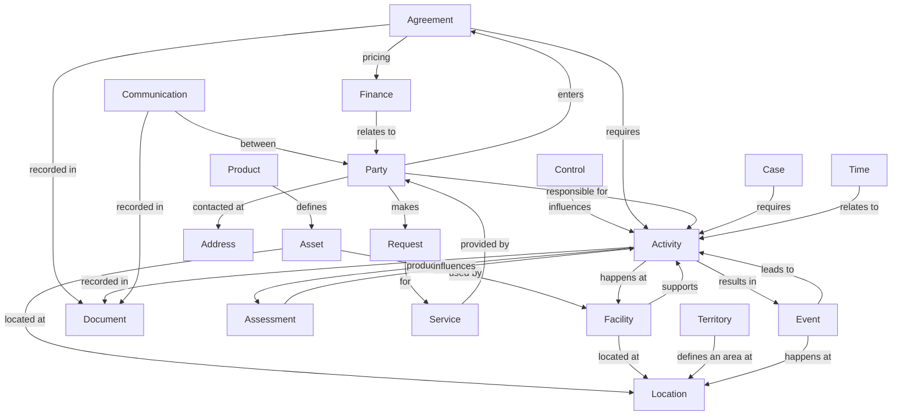
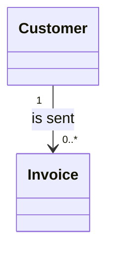

<!-- https://howellsr.github.io/architecture/data/defra-on-a-page/ | maturity: published | site version 0.3.0 | generated from data/defra-on-a-page.md -->

# Defra on a page

Defra on a page (DoaP) is a high-level conceptual data model showing the enterprise conceptual data entities that underpin Defra's business data concepts.

It provides a common vocabulary for describing the things that matter to Defra and the indicative relationships between them. It is conceptual rather than physical: it does not define database tables, attributes, operations or platform-specific implementation.

## About the model

A conceptual data model shows conceptual data entities and their relationships. It is the most abstract form of data model and is intended to communicate clearly with business stakeholders.

A conceptual data entity is a singular, identifiable and discrete object of significance to Defra about which information needs to be kept to support business operations. The entities are independent of platforms and implementation choices.

The relationships in the model are indicative examples. They are not intended to be comprehensive. In principle, any entity may relate to any other entity. More detailed domain data models expand these relationships and show cardinality.

## Enterprise conceptual data model

The diagram is a simplified, accessible representation of the indicative relationships in the source model. Use the entity definitions below as the authoritative description of scope.

## Conceptual data entities

### Activity

A deliberate action carried out by a party, or by an automaton acting on behalf of a party. An activity may have happened in the past or be planned for the future.

Activities generally take place at facilities. They differ from events because activities are actions, while events are occurrences that affect the organisation or result from activities.

Examples include:

- maintenance tasks relating to assets and facilities
- project plan activities comprising detailed planned tasks
- transfers or exports of goods or materials involving multiple steps

### Address

A method of contact for the purpose of location or communication.

### Agreement

A mutual understanding between two or more parties that records agreed terms and conditions. An agreement may be formal or informal, may be constructed from other agreements, and may be qualified by related agreements. It may be signed and published in a document, such as a contract.

Examples include:

- licences to extract water or handle waste
- import and export agreements
- agreements to pay for services supplied by third-party organisations

### Assessment

The result of an activity involving analysis, observation, estimation, judgement or appraisal. Assessments help the organisation shape behaviour and make decisions that affect future actions.

An assessment may be fine-grained, such as determining whether a measurement exceeds a level, or broad, such as a habitat survey. One assessment may consolidate several smaller assessments.

### Asset

A physical or intangible object that has value to one or more parties. Assets include instances of products, equipment used to make or transport other assets, raw materials, and resulting structures.

Assets differ from facilities. A facility uses assets to support activities. For example, a manufacturing facility may use buildings as assets to house manufacturing activities.

Examples include buildings, land, equipment, harvested crops and livestock animals.

### Case

An incidence that requires investigation or action.

### Communication

An interchange of information between parties. A communication normally involves one initiating party and one or more receiving parties.

Activities may be associated with communications. For example, a marketing campaign may send communications and process responses. Letters, emails, attachments, voice recordings and video recordings are captured through associated documents.

### Control

A means of limiting or regulating something. Controls may be provided at different levels of detail, including directives, laws and regulations, principles, policies, recommendations and operating rules.

### Document

A piece of written, printed or electronic matter that provides information. A document may be electronic or physical, may be a copy of another document, and may contain sub-documents in a dossier or folder.

### Event

The occurrence of an incident or phenomenon. Events may have occurred or may happen in future, and may be real-world occurrences or predictions produced through modelling.

Events may occur naturally or be caused by activities. Defra may respond to events by carrying out business activities, and the relationship between an event and the activities that caused or responded to it may be recorded.

### Facility

A place with a purpose where known types of activity are carried out. A facility may use assets to support activities and is managed or operated by one or more parties.

Examples include:

- manufacturing sites
- meat processing plants
- laboratories
- parks

A facility differs from an asset because it involves parties supporting activities that may produce assets. Assets may be used by facilities, but facilities are not used by assets.

### Finance

Monetary amounts relevant to finance and accounting.

Examples include:

- payments between parties
- financial account transactions
- accounting transactions
- ledger account items
- estimates of value, budgets and commitments

### Location

Any place in three-dimensional space: above, inside or below the earth, including the ocean, land-based water bodies, the atmosphere and orbital space.

### Party

A person or organisation of interest to Defra, including its executive agencies and key delivery partners.

### Product

A specification of a good or item offered by one party to another, including the terms and conditions governing its exchange, sale and servicing.

Products provide specifications for types of assets; assets are the individual instances described by products. Product specifications may cover items used by Defra, items produced by Defra organisations, or items produced by third parties that Defra organisations monitor and control. Specifications may be formal or informal.

Examples include vehicles, monitoring equipment, environmental samples and waste products.

### Request

A call for something by one party to another. A request is generally made under an existing agreement or against an advertised service provided by the receiving party.

Examples include:

- an application for an agreement with a third party
- a claim for funds under an existing agreement
- a sales, purchase or work order
- a request to process information in a submission supporting an application

### Service

A means of delivering value to customers by facilitating outcomes that customers and beneficiaries want to achieve.

This entity describes an instance or implementation of a service specification. A specification may be implemented in different ways, with each implementation representing a different service.

### Territory

An area whose boundary has been defined by a state or private organisation for managing particular types of activity carried out by parties operating in that area.

Examples include:

- Sites of Special Scientific Interest
- bathing water zones
- operational catchments
- internal drainage districts

### Time

A point in time measured in the context of day, week, month and year. Where a time of day is recorded, use the 24-hour clock and the ISO 8601 format `T[hh]:[mm]:[ss]`. Consult ISO 8601 where more complex time or elapsed-time representations are needed.

## Relationship notation

Detailed domain models use UML multiplicity notation to show how many instances of one entity may relate to an instance of another:

- `0..*` means zero to many
- `1..*` means one to many
- `1..1` means exactly one
- `0..1` means zero or one

For example, a customer may be sent zero to many invoices, while each invoice must be sent to exactly one customer.

## Using Defra on a page

Use this model to:

- establish a common vocabulary across Defra
- identify the enterprise concepts relevant to a service or domain
- provide a starting point for domain conceptual and logical data models
- make relationships between business concepts explicit
- avoid embedding platform or implementation choices too early

When developing a more detailed model, retain these enterprise concepts where they apply, add domain-specific concepts and relationships, and show cardinality at the appropriate level of detail.

## Source and status

This page is a web representation of *Defra on a Page (DoaP)*, document version 1.1, updated 15 March 2023. The document describes the package status as proposed. The source PDF remains available on [Defra SharePoint](https://defra.sharepoint.com/:b:/r/teams/Team3221/Published%20Architecture%20Documents/Data%20Architecture/Defra%20on%20a%20Page%20-%20(DoaP).pdf?d=wd6f38d7f0519422b8d1eea2c2bb3a645&csf=1&web=1&e=zG82TF).

