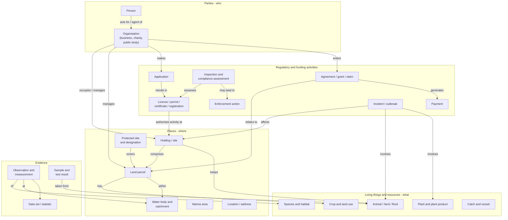

# Defra on a page

A single conceptual view of the things Defra cares about and how they relate. Use it to find where authoritative data lives and to use a common language across services.

!!! info "Conceptual, not physical"
    This is a conceptual model - it describes *things in the world* and their relationships, not database tables. Services implement parts of it in their own way, but should use the same identifiers and authoritative sources.

## The model

## Core entities and authoritative sources

The table shows the starting point for where authoritative data lives. If you are unsure, ask the data architecture team before creating a new copy.

| Entity | What it is | Key identifier | Authoritative source (current view) |
| --- | --- | --- | --- |
| **Person** | An individual we interact with - citizen, farmer, agent, staff member | Defra ID account identifier; CRN for rural payments customers | Customer identity ([TC01](../handrail/technology-capabilities.md#tc01)) |
| **Organisation** | A business, charity, public body or other organisation | Companies House number, Charity number; SBI for rural payments businesses | Companies House plus Defra customer registers ([TC17](../handrail/technology-capabilities.md#tc17)) |
| **Land parcel** | A defined area of land | Land parcel identifier (sheet and parcel) | Rural Payments Agency land register |
| **Holding / site** | A place where regulated activity happens - a farm, premises, facility | County Parish Holding (CPH) number; site/permit references | Regime-specific registers; consolidation in progress |
| **Location / address** | Any point, area or address | UPRN, USRN; British National Grid coordinates | Ordnance Survey (AddressBase, OS MasterMap) via PSGA |
| **Water body / catchment** | Rivers, lakes, groundwater, coastal and transitional waters | Water Framework Directive water body id | Environment Agency catchment data |
| **Protected site** | SSSI, SAC, SPA, Ramsar, National Nature Reserve and other designations | Site code | Natural England designations data |
| **Animal** | Individual animal, herd or flock | Official ear tag / passport numbers; CPH for location | Livestock and animal health registers |
| **Species and habitat** | Wild species, habitats and ecosystems | Species dictionary codes | National Biodiversity Network and Defra group species data |
| **Licence / permit** | A grant of permission to do a regulated activity | Permit number | Owning regulator's case management system |
| **Agreement and payment** | A scheme agreement, claim or grant and the payments made | Agreement / claim number | Rural Payments Agency and scheme systems |
| **Incident** | An event requiring a response - outbreak, flood, pollution | Incident reference | Owning body's incident management system |
| **Observation / sample** | A measurement, survey record or laboratory result | Sampling point id, sample id | Monitoring and laboratory systems |

!!! warning "Help us keep this accurate"
    Authoritative sources change as Defra consolidates systems. If you know a row is wrong or out of date, please [suggest an edit](https://github.com/howellsr/architecture/edit/main/docs/data/defra-on-a-page.md).

## How to use it

- **Starting a new service?** Identify which entities you create, which you only reference, and which you need to update. Reference rather than copy.
- **Designing an API?** Use the entity names and identifiers here so consumers recognise them.
- **Found a gap?** If an entity you need is missing or has no authoritative source, raise it with the TDA - it is likely a cross-cutting need.
