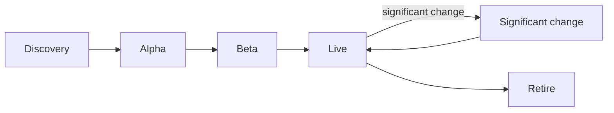

# Deliver a service

What architecture your team needs at each stage of delivery: the guardrails that apply, the artefacts to produce, who to talk to and the evidence to bring to an assessment.

This section is for delivery team leads, product managers, architects and delivery partners. It covers the architecture evidence only. For how to run each phase, research with users and prepare for a service assessment, use the [Defra Digital Service Manual](https://digital.defra.gov.uk/service-manual) and the [GOV.UK Service Manual](https://www.gov.uk/service-manual). We link to them rather than repeat them.

!!! warning "To be confirmed"
    **TODO:** links to the Defra Digital Service Manual pages that describe Defra's service assessment process for each phase, so each phase page can point to them directly.

## Phases and events

<!-- deliver:journey -->

Each phase has a printable **assessment evidence checklist**, built from the same guardrail data as the [guardrail library](../guardrails/library.md), so they never disagree.

## Before you start

- [Guardrails by role](roles/index.md): the guardrails each role leads, phase by phase - for product managers, designers, researchers, developers, architects and analysts.
- [Getting onto Defra platforms](platforms.md): what the shared platforms give you, and how to get access.
- [Check your repository automatically](guardrail-check.md) against the guardrails a tool can check.
- [Check a decision](../governance/decision-check.md) to find your governance route.
- [Reference architectures](../handrail/reference-architectures/index.md) to start from a known-good shape.
- [Service tiers](../nfrs/service-tiers.md) and the [NFR catalogue](../nfrs/catalogue.md) to set your quality targets.

## The architecture artefacts

The same small set of artefacts carries through every phase. Start them light and keep them current. Assessors, solution design authorities and security teams all ask for them, so prepare them once.

| Artefact | Why |
| --- | --- |
| [Architecture decision record (ADR) log](../governance/architecture-decision-records.md) | Shows what you decided and why ([GR-DEV-09](../guardrails/software-development.md#gr-dev-09)) |
| C4 context and container diagrams | Show the service, its users, dependencies and building blocks. See the [C4 model](https://c4model.com/). |
| [Threat model](../security/threat-modelling.md) | Shows what can go wrong and what you are doing about it ([GR-SEC-02](../guardrails/security.md#gr-sec-02)) |
| Data protection impact assessment (DPIA) | Shows personal data is handled lawfully ([GR-DATA-06](../guardrails/data.md#gr-data-06)) |
| [Service tier](../nfrs/service-tiers.md) and [NFRs](../nfrs/catalogue.md) | Set how reliable, fast and recoverable the service must be |
| Exit plan | Shows how Defra could change product or supplier ([GR-TECH-03](../guardrails/choosing-technology.md#gr-tech-03)) |
| Runbooks and support model | Show the service can be run by people who did not build it ([GR-OPS-05](../guardrails/observability-and-operations.md#gr-ops-05)) |
