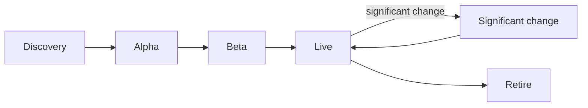

# Deliver a service

What architecture your team needs at each stage of delivery: the guardrails that apply, the artefacts to produce, who to talk to and the evidence to bring to an assessment.

This section is for delivery team leads, product managers, architects and delivery partners. It covers the **architecture** evidence only. The [Defra Digital Service Manual](https://digital.defra.gov.uk/service-manual) is the place for how Defra delivers services, and we link to it rather than repeat it:

| For | Use the Defra Digital Service Manual |
| --- | --- |
| When services are assessed (after alpha, private beta and public beta), and how to book | [Service assessments](https://digital.defra.gov.uk/service-assessments) and [book an assessment](https://digital.defra.gov.uk/service-assessments/book-an-assessment) |
| What assessors ask | [Assessment questions](https://digital.defra.gov.uk/service-assessments/assessment-questions) |
| Getting ready to run a live service, including the operational service design review board at the start of beta | [Operational service readiness](https://digital.defra.gov.uk/delivery-groups/follow-delivery-governance/assurance/operational-service-readiness) |
| Recording and approving spend | [Spend control](https://digital.defra.gov.uk/delivery-groups/follow-delivery-governance/assurance/spend-control) |
| Who decides what in a delivery group | [Governance model](https://digital.defra.gov.uk/delivery-groups/follow-delivery-governance/governance-model) |
| Designing, researching and writing content | [Design](https://digital.defra.gov.uk/design), [user research](https://digital.defra.gov.uk/user-research) and [content design](https://digital.defra.gov.uk/content) |
| Building on Defra's common tools and approved technologies | [Architecture](https://digital.defra.gov.uk/architecture) and [software development](https://digital.defra.gov.uk/software-development) |

This site adds what is specific to architecture: the guardrails, the decisions to record and the architecture evidence for each phase.

## Phases and events

<!-- deliver:journey -->

Each phase has a printable **assessment evidence checklist**, built from the same guardrail data as the [guardrail library](../guardrails/library.md), so they never disagree.

## Before you start

- [Working with architects](working-with-architects.md): for designers and researchers - when to involve an architect, what to bring and what to expect.
- [Guardrails by role](roles/index.md): the guardrails each role leads, phase by phase - for product managers, designers, researchers, developers, architects and analysts.
- [Getting onto Defra platforms](platforms.md): what the shared platforms give you, and how to get access.
- [Check your repository automatically](guardrail-check.md) against the guardrails a tool can check.
- [Check a decision](../governance/decision-check.md) to find your governance route.
- [Reference architectures](../handrail/reference-architectures/index.md) to start from a known-good shape.
- [Service tiers](../nfrs/service-tiers.md) and the [NFR catalogue](../nfrs/catalogue.md) to set your quality targets.

## The architecture artefacts

The same small set of artefacts carries through every phase. Start them light and keep them current. Assessors, solution design authorities and security teams all ask for them, so prepare them once.

| Artefact | Why |
| --- | --- |
| [Architecture decision record (ADR) log](../governance/architecture-decision-records.md) | Shows what you decided and why ([GR-DEV-09](../guardrails/software-development.md#gr-dev-09)) |
| C4 context and container diagrams | Show the service, its users, dependencies and building blocks. See the [C4 model](https://c4model.com/). |
| [Threat model](../security/threat-modelling.md) | Shows what can go wrong and what you are doing about it ([GR-SEC-02](../guardrails/security.md#gr-sec-02)) |
| Data protection impact assessment (DPIA) | Shows personal data is handled lawfully ([GR-DATA-06](../guardrails/data.md#gr-data-06)) |
| [Service tier](../nfrs/service-tiers.md) and [NFRs](../nfrs/catalogue.md) | Set how reliable, fast and recoverable the service must be |
| Exit plan | Shows how Defra could change product or supplier ([GR-TECH-03](../guardrails/choosing-technology.md#gr-tech-03)) |
| Runbooks and support model | Show the service can be run by people who did not build it ([GR-OPS-05](../guardrails/observability-and-operations.md#gr-ops-05)) |
