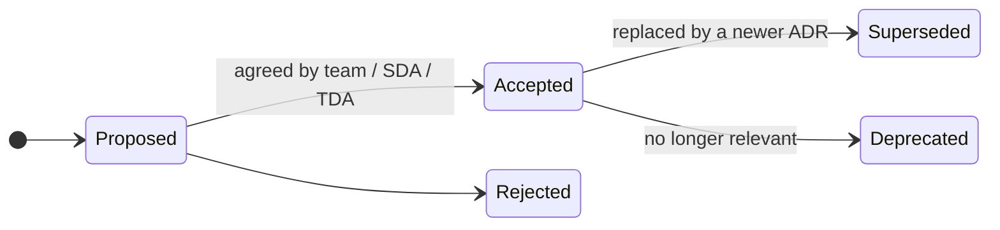

# Architecture decision records

An architecture decision record (ADR) captures one significant decision, its context and its consequences. ADRs are how we make governance light: a decision that is written down well rarely needs a meeting.

## What to record

Record a decision when it:

- is hard or expensive to reverse
- departs from a guardrail or reference architecture
- affects other teams, services or users
- chooses between real options (technology, pattern, supplier, hosting)
- someone in a year's time will ask "why did they do it this way?"

You do not need an ADR for routine implementation choices.

## Where to keep them

Keep ADRs as Markdown in your service repository, in `docs/adr/`, numbered in order (`0001-use-defra-id-for-sign-in.md`). They then live with the code, are reviewed through pull requests and are public by default ([GR-OPEN-01](../guardrails/open-source.md#gr-open-01)).

Decisions taken by the TDA and TGB are recorded in this repository.

## How to write a good ADR

- **One decision per record.** Short is good - a page is usually enough.
- **Make the context clear** for someone who was not in the room.
- **Show real options**, including the strategic option from the [handrail](../handrail/technology-capabilities.md).
- **Reference guardrail and capability ids** (for example `GR-HOST-01`, `BC05`, `TC08`) so decisions can be searched across Defra.
- **Be honest about consequences**, including the downsides.
- **Never edit an accepted ADR's decision.** Supersede it with a new one and link the two.

## Template

Copy the [ADR template](templates/adr.md).

## Lifecycle

