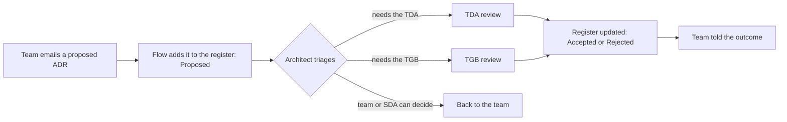
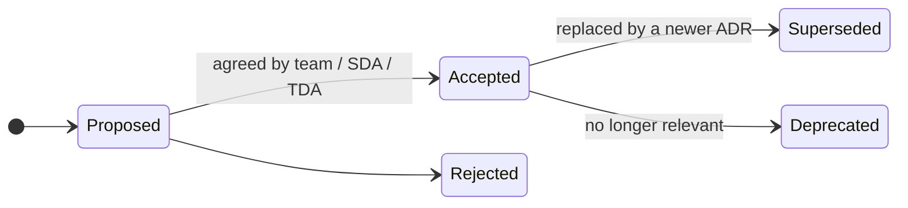

# Architecture decision records

An architecture decision record (ADR) captures one significant decision, its context and its consequences. ADRs are how we make governance light: a decision that is written down well rarely needs a meeting.

## What to record

Record a decision when it:

- is hard or expensive to reverse
- departs from a guardrail or reference architecture
- affects other teams, services or users
- chooses between real options (technology, pattern, supplier, hosting)
- someone in a year's time will ask "why did they do it this way?"

You do not need an ADR for routine implementation choices.

## Where to keep them

Where an ADR lives depends on who makes the decision.

| Decision | Made by | Where it is kept |
| --- | --- | --- |
| A decision about one service or product | The team, or its solution design authority (SDA) | In the service repository, in `docs/adr/` |
| A decision that affects other teams, departs from a guardrail or sets direction for Defra | The [Technical Design Authority (TDA)](tda.md) or the [Technology Governance Board (TGB)](tgb.md) | In the architecture decision register, a SharePoint list on the Defra architecture SharePoint site |

### Team decisions: in your repository

Keep ADRs as Markdown in your service repository, in `docs/adr/`, numbered in order (`0001-use-defra-id-for-sign-in.md`). They then live with the code, are reviewed through pull requests and are public by default ([GR-OPEN-01](../guardrails/open-source.md#gr-open-01)).

### Enterprise decisions: in the architecture decision register

Decisions taken by the TDA and TGB are recorded in the architecture decision register, in the Defra Microsoft 365 tenancy. Keeping them there means they are under Defra's records management, can include information that should not be public, and do not depend on access to any one repository.

!!! warning "To be confirmed"
    **TODO:** the address of the architecture decision register on the Defra architecture SharePoint site, who can read it, and who owns it.

## Raise a decision for review

If your decision needs the TDA or TGB, send it to them by email. You do not need a GitHub account or access to the SharePoint site.

1. Write the decision using the [ADR template](templates/adr.md), with status **Proposed**. For a TDA item, also complete the [TDA submission template](templates/tda-submission.md).
2. Email it to [StrategicEnterpriseArchitecture@defra.gov.uk](mailto:StrategicEnterpriseArchitecture@defra.gov.uk), with "ADR:" and the decision title as the subject.
3. An automated flow adds it to the register as **Proposed** and tells the architecture team.
4. An architect triages it: it goes to the TDA, to the TGB, or back to your team or SDA if it does not need either.
5. When the decision is made, the register is updated to **Accepted** or **Rejected**, with the date and any conditions, and you are told the outcome. Copy the outcome into your own repository's ADR if you keep one.

!!! warning "To be confirmed"
    **TODO:** the Power Automate flow that adds emailed decisions to the register, who owns it, and how long triage takes.

This site does not hold a copy of the register. Decisions about this site itself are in [decisions about this site](../adr/index.md).

## How to write a good ADR

- **One decision per record.** Short is good - a page is usually enough.
- **Make the context clear** for someone who was not in the room.
- **Show real options**, including the strategic option from the [handrail](../handrail/technology-capabilities.md).
- **Reference guardrail and capability ids** (for example `GR-HOST-01`, `BC05`, `TC08`) so decisions can be searched across Defra.
- **Be honest about consequences**, including the downsides.
- **Never edit an accepted ADR's decision.** Supersede it with a new one and link the two.

## Template

Copy the [ADR template](templates/adr.md).

## Lifecycle

An ADR starts as **Proposed**. It becomes **Accepted** when the team, SDA or TDA agrees it, or **Rejected**. An accepted ADR is later **Superseded** by a newer ADR, or **Deprecated** when it no longer applies.

