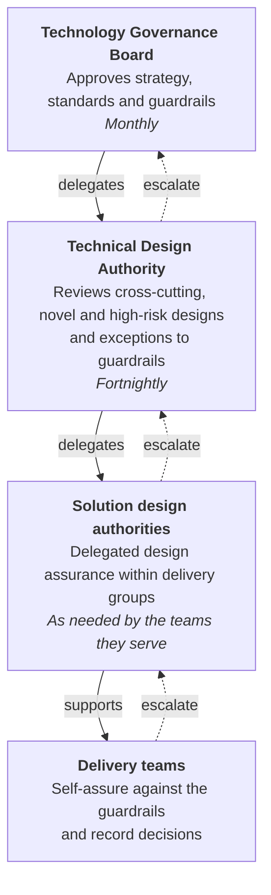

# Governance

Light-touch, proportionate and as delegated as possible. Our governance exists to help teams make good decisions quickly, not to slow them down.

## Our approach

- **Delegate by default.** Most decisions should be made by delivery teams and their solution design authority. Central boards look only at what genuinely needs them.
- **Guardrails earn autonomy.** The closer a design is to the [guardrails](../guardrails/index.md) and the [handrail](../handrail/index.md), the less governance it needs.
- **Engage early, not at the end.** A 30-minute conversation in discovery saves weeks of rework at a gate.
- **Decide in the open.** Decisions are recorded as [ADRs](architecture-decision-records.md), published wherever possible, and reusable by other teams.
- **Proportionate to risk.** The route depends on novelty, reach and risk - not on the size of the team or the supplier.

## Seek advice, not permission

Most architecture decisions do not need a board. They need the right conversation at the right time. Before making a significant decision, a team:

1. **Asks for advice** from the people with relevant expertise - an architect, the platform team, security - and from the people who will be affected by it.
2. **Decides** - the team remains accountable for the decision and its outcome.
3. **Records** the decision and the advice it received as an [ADR](architecture-decision-records.md), in the open.

This keeps decisions close to the work and fast enough to learn from, while making sure no one is surprised. It reflects the [DDTS doctrine](../principles/doctrine.md) - teams decide without escalating every choice - and the government [lightweight architecture](https://technology.blog.gov.uk/2026/08/28/lightweight-architecture-for-learning-at-pace/) approach. The boards below are for the minority of decisions that are novel, cross-cutting or outside the guardrails.

## Three tiers

| Tier | Decides | Typical items |
| --- | --- | --- |
| [Technology Governance Board](tgb.md) | Strategy, standards, guardrails, significant investment | Technology strategy, cloud strategy, new strategic platforms, retiring a capability |
| [Technical Design Authority](tda.md) | Cross-cutting and novel designs, exceptions to Must guardrails | A new shared component, a new hosting model, novel AI use, a design affecting several services |
| [Solution design authorities](solution-design-authorities.md) | Designs inside the guardrails, and Should-level deviations | Service designs at phase gates, technology choices within the supported stack |
| Delivery teams | Day-to-day design decisions | Libraries, data models, API design, implementation choices |

## Where to start

-   **[Check a decision](decision-check.md)**

    ---

    An interactive check that suggests your route and drafts a decision record.

-   **[Which route do I take?](triage.md)**

    ---

    How triage works, and when you can self-assure or need a board.

-   **[Record a decision](architecture-decision-records.md)**

    ---

    How to write a good ADR, with a template.

-   **[Request an exception](exceptions.md)**

    ---

    When you cannot meet a guardrail, and how to get a quick answer.

-   **[Templates](templates/index.md)**

    ---

    ADR, TDA submission, exception request and threat model templates.

## How this relates to other assurance

Architecture governance works alongside, not instead of:

- **Service assessments** against the [Service Standard](https://www.gov.uk/service-manual/service-standard) - see [service assessments](https://digital.defra.gov.uk/service-assessments) in the Defra Digital Service Manual
- **Operational service readiness**, including the operational service design review board at the start of beta - see [operational service readiness](https://digital.defra.gov.uk/delivery-groups/follow-delivery-governance/assurance/operational-service-readiness)
- **Spend control** under the Portfolio Assurance Board (PAB)
- **Security assurance** through [Secure by Design](../security/secure-by-design.md)
- **Data protection** through DPIAs and the Data Protection Officer
- **Investment approvals** through the department's business case process (InvestCo)

Delivery groups have their own [governance model](https://digital.defra.gov.uk/delivery-groups/follow-delivery-governance/governance-model), in which principal architects set the technology guardrails for the group in line with the enterprise architecture principles. The Delivery Architecture team handles exceptions to the [Defra software development standards](https://defra.github.io/software-development-standards/) - see [architecture](https://digital.defra.gov.uk/architecture) in the Defra Digital Service Manual.

!!! warning "To be confirmed"
    **TODO:** how the Technology Governance Board, Technical Design Authority and solution design authorities on this site relate to delivery group governance and the Delivery Architecture team's exception process, so teams know which route applies.

We aim to reuse evidence across these: an ADR log, threat model and architecture diagram prepared for one should satisfy the others.
