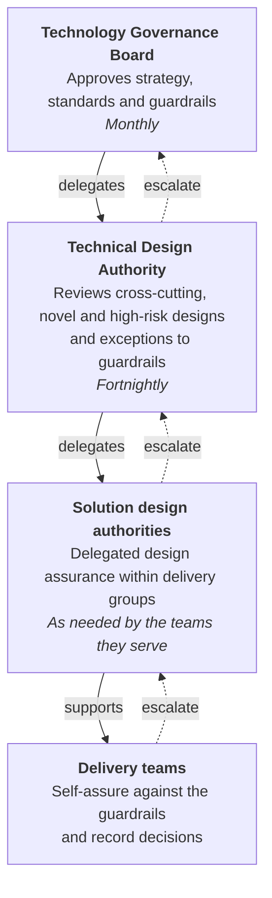

# Governance

Light-touch, proportionate and as delegated as possible. Our governance exists to help teams make good decisions quickly, not to slow them down.

## Our approach

- **Delegate by default.** Most decisions should be made by delivery teams and their solution design authority. Central boards look only at what genuinely needs them.
- **Guardrails earn autonomy.** The closer a design is to the [guardrails](../guardrails/index.md) and the [handrail](../handrail/index.md), the less governance it needs.
- **Engage early, not at the end.** A 30-minute conversation in discovery saves weeks of rework at a gate.
- **Decide in the open.** Decisions are recorded as [ADRs](architecture-decision-records.md), published wherever possible, and reusable by other teams.
- **Proportionate to risk.** The route depends on novelty, reach and risk - not on the size of the team or the supplier.

## Three tiers

| Tier | Decides | Typical items |
| --- | --- | --- |
| [Technology Governance Board](tgb.md) | Strategy, standards, guardrails, significant investment | Technology strategy, cloud strategy, new strategic platforms, retiring a capability |
| [Technical Design Authority](tda.md) | Cross-cutting and novel designs, exceptions to Must guardrails | A new shared component, a new hosting model, novel AI use, a design affecting several services |
| [Solution design authorities](solution-design-authorities.md) | Designs inside the guardrails, and Should-level deviations | Service designs at phase gates, technology choices within the supported stack |
| Delivery teams | Day-to-day design decisions | Libraries, data models, API design, implementation choices |

## Where to start

-   **[Check a decision](decision-check.md)**

    ---

    An interactive check that suggests your route and drafts a decision record.

-   **[Which route do I take?](triage.md)**

    ---

    How triage works, and when you can self-assure or need a board.

-   **[Record a decision](architecture-decision-records.md)**

    ---

    How to write a good ADR, with a template.

-   **[Request an exception](exceptions.md)**

    ---

    When you cannot meet a guardrail, and how to get a quick answer.

-   **[Templates](templates/index.md)**

    ---

    ADR, TDA submission, exception request and threat model templates.

## How this relates to other assurance

Architecture governance works alongside, not instead of:

- **Service assessments** against the [Service Standard](https://www.gov.uk/service-manual/service-standard) - see the [Defra Digital Service Manual](https://digital.defra.gov.uk/service-manual)
- **Spend control** under the government digital and technology spend control
- **Security assurance** through [Secure by Design](../security/secure-by-design.md)
- **Data protection** through DPIAs and the Data Protection Officer
- **Investment approvals** through the department's business case process

We aim to reuse evidence across these: an ADR log, threat model and architecture diagram prepared for one should satisfy the others.
