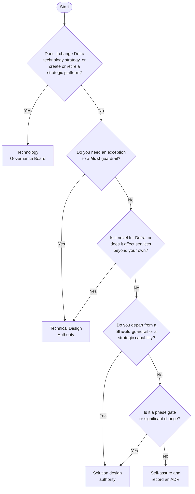

# Which route do I take?

Answer five questions to find the lightest governance route that fits your work.

!!! tip "Prefer an interactive version?"
    The [decision check](decision-check.md) walks you through these questions, suggests a route and drafts a decision record for you.

## The questions in more detail

### 1. Does it change strategy or a strategic platform?

Examples: adopting a new cloud provider, introducing a new strategic platform, changing a Must guardrail, retiring a capability used across Defra. These go to the [Technology Governance Board](tgb.md), normally after review by the TDA.

### 2. Do you need an exception to a Must guardrail?

Examples: hosting outside the Core Delivery Platform, building your own sign-in, keeping code private. Go to the [Technical Design Authority](tda.md) via the [exception process](exceptions.md).

### 3. Is it novel or cross-cutting?

**Novel** means Defra has not done it before: a new technology, a new integration pattern, a first use of generative AI in a service. **Cross-cutting** means other services, teams or arm's length bodies will depend on it or be affected by it: a new shared API, a change to a shared data set, a new identity integration pattern. Go to the [TDA](tda.md).

### 4. Do you depart from a Should guardrail or strategic capability?

Record your reasoning in an [ADR](architecture-decision-records.md) and agree it with your [solution design authority](solution-design-authorities.md).

### 5. Is it a phase gate or significant change?

Share your architecture, ADR log and threat model with your SDA ahead of alpha, beta and live assessments, and before significant changes.

### Otherwise - self-assure

Use the [10-minute self-assurance checklist](../guardrails/index.md#self-assure-in-10-minutes), record significant decisions as ADRs, and carry on.

## Not sure?

Ask. The architecture team runs drop-in sessions for teams and delivery partners and will tell you the right route - usually in a single conversation. See [the architecture team](../about/team.md).
