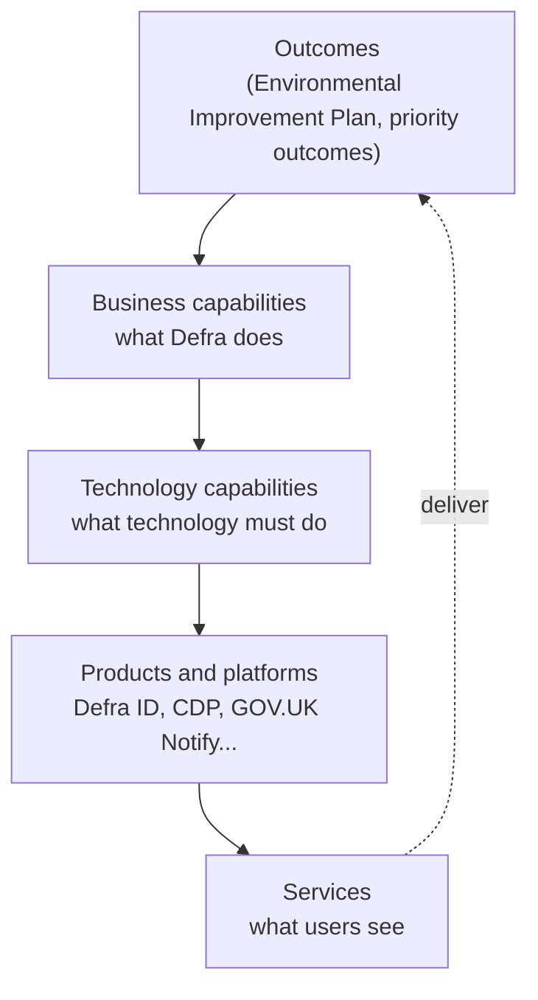

# The architecture handrail

Guardrails tell you where the edges are. The handrail is something to hold on to: a shared map of what Defra does, the technology that enables it, and what already exists that you can reuse.

## What is in the handrail

-   **[Business capabilities](business-capabilities.md)**

    ---

    *What* Defra does - nine core and two supporting capabilities, independent of organisation and technology.

-   **[Technology capabilities](technology-capabilities.md)**

    ---

    What technology does to enable the business, and the strategic options to use first.

-   **[Capability mapping](capability-mapping.md)**

    ---

    Which technology capabilities each business capability depends on - and where the biggest reuse opportunities are.

-   **[Reference architectures](reference-architectures/index.md)**

    ---

    Proven shapes for common types of Defra service, built from the capabilities above.

## How layers connect

Outcomes are delivered by business capabilities. Business capabilities are enabled by technology capabilities, which are provided by products and platforms. Those products and platforms are assembled into the services users see.

Business capabilities change slowly. Products and services change quickly. Mapping one to the other lets us:

- **see duplication** - five case management systems serving the same capability is a reuse opportunity
- **target investment** - fund the technology capabilities that enable the most business capabilities
- **give teams a head start** - a new licensing service starts from the licensing reference architecture, not a blank page
- **talk to the business in its own language** - capabilities, not systems

## Using the handrail on your project

1. **Find your business capability.** Which of the [eleven capabilities](business-capabilities.md) does your service support? Most services support one or two.
2. **Check the technology capabilities it needs.** Each business capability lists the [technology capabilities](technology-capabilities.md) that typically enable it.
3. **Use the strategic options first.** Each technology capability lists what to use. If it is marked *gap*, talk to the TDA so we solve it once.
4. **Start from a reference architecture** if one fits.
5. **Record your choices** in an [ADR](../governance/architecture-decision-records.md), naming capability ids (for example `BC05`, `TC08`) so decisions can be found later.

## Machine-readable model

The capability models are maintained as YAML in the repository and published as JSON so other tools - portfolio management, architecture repositories, dashboards - can use them:

- [`capabilities/business-capabilities.yaml`](https://github.com/howellsr/architecture/blob/main/capabilities/business-capabilities.yaml)
- [`capabilities/technology-capabilities.yaml`](https://github.com/howellsr/architecture/blob/main/capabilities/technology-capabilities.yaml)
- [`capabilities.json`](https://howellsr.github.io/architecture/capabilities.json) (generated at build time)

The site build validates the model: unknown references or technology capabilities that support nothing will fail the build.
