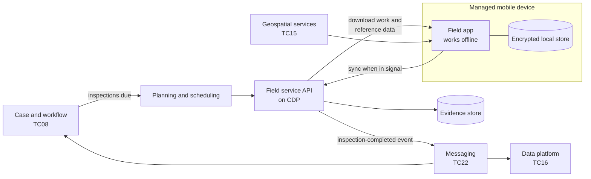

# Field inspection (proposed)

A proposed starting shape for services where staff plan, carry out and record inspections, surveys and sampling in the field - often with no mobile signal.

**Technology capability:** [TC11 Field work and inspection](../technology-capabilities.md#tc11), currently a **gap** - Defra has no strategic option. **Typical business capabilities:** [05 Issue licences and permits](../business-capabilities.md#bc05), [06 Enforce compliance](../business-capabilities.md#bc06), [01 Act as a custodian of the environment](../business-capabilities.md#bc01).

## Context

Inspectors, scientists and field officers work on farms, riverbanks, ports and coasts. They need the case history before they go, must record findings and evidence (photos, samples, locations) where they are, and often have no signal. Today many teams use paper, spreadsheets or one-off apps, so the same problem is solved many times.

## Proposed shape

## Questions to answer

!!! warning "To be confirmed"
    **TODO:** whether Defra intends to buy a field inspection product or build shared components, and which team owns the capability.

- Which device management, offline storage and sync approach is supported on Defra devices?
- How should conflicts be resolved when two people update the same record offline?
- What evidence standards apply to photos and samples used in enforcement?

## Guardrails to pay attention to

- [GR-FE-05 Design for low bandwidth and rural users](../../guardrails/front-end-and-accessibility.md#gr-fe-05)
- [GR-SEC-04 Encrypt in transit and at rest](../../guardrails/security.md#gr-sec-04), including on the device
- [GR-API-06 Use events for change notifications](../../guardrails/apis-and-integration.md#gr-api-06)
- [GR-TECH-01 Look for something to reuse first](../../guardrails/choosing-technology.md#gr-tech-01) - other government departments run field inspection services
