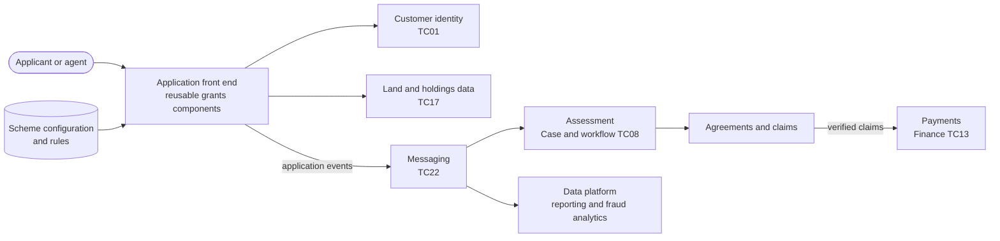

# Grants and schemes (proposed)

A proposed starting shape for configuring schemes, taking applications, managing agreements, checking claims and making payments.

**Technology capability:** [TC14 Grants and scheme management](../technology-capabilities.md#tc14), currently **emerging**. **Typical business capability:** [07 Administer funds and grants](../business-capabilities.md#bc07).

## Context

Defra runs many grant and payment schemes for farmers, land managers and others. Each new scheme risks becoming a new service built from scratch. Most share the same steps: check eligibility, apply, assess, agree, claim, verify, pay and sometimes recover.

## Proposed shape

## Questions to answer

!!! warning "To be confirmed"
    **TODO:** which reusable grants components exist on the Core Delivery Platform, who owns them, and how a new scheme team starts using them.

- How are scheme rules configured, versioned and tested?
- How do agreements, claims and payments connect to the finance system?
- How is fraud and error risk managed across schemes?

## Guardrails to pay attention to

- [GR-TECH-01 Look for something to reuse first](../../guardrails/choosing-technology.md#gr-tech-01)
- [GR-DATA-02 Use authoritative sources](../../guardrails/data.md#gr-data-02) for customers and land
- [GR-DATA-08 Manage data quality](../../guardrails/data.md#gr-data-08) for data that feeds payments
- [GR-AI-03 Keep a human accountable](../../guardrails/ai.md#gr-ai-03) where automation informs decisions
