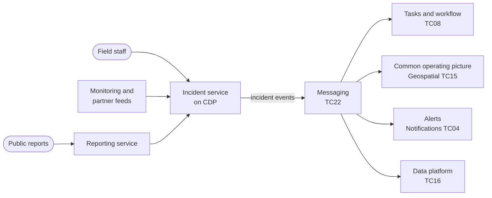

# Incident response (proposed)

A proposed starting shape for detecting, coordinating and reporting on incidents such as animal and plant disease outbreaks, floods and pollution events.

**Technology capability:** [TC12 Incident and emergency management](../technology-capabilities.md#tc12), currently a **gap**. **Typical business capability:** [08 Respond to incidents and crises](../business-capabilities.md#bc08).

## Context

Defra and its arm's length bodies respond to incidents that can grow from one report to a national emergency in days. Responders need a shared picture: what has been reported, where, what is being done, and by whom. Systems must scale quickly, work with partners outside Defra, and keep working when demand is highest.

## Proposed shape

## Questions to answer

!!! warning "To be confirmed"
    **TODO:** which incident types are in scope for a shared capability, and which team owns incident and emergency management technology.

- How do responders outside Defra, such as local authorities and other agencies, get access?
- What service tier does an incident service need, and how does it scale from quiet to surge?
- How do existing incident systems in arm's length bodies fit in?

## Guardrails to pay attention to

- [GR-HOST-07 Design for the resilience the service needs](../../guardrails/hosting-and-platforms.md#gr-host-07)
- [GR-OPS-03 Define and measure service levels](../../guardrails/observability-and-operations.md#gr-ops-03)
- [GR-DATA-02 Use authoritative sources](../../guardrails/data.md#gr-data-02) for locations, holdings and species
- [GR-API-06 Use events for change notifications](../../guardrails/apis-and-integration.md#gr-api-06)
