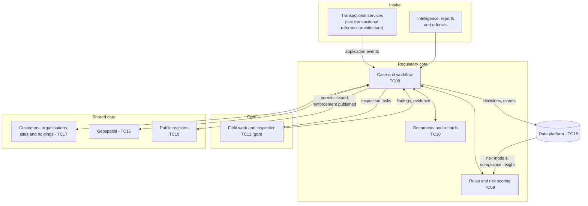

# Regulatory casework

The default shape for assessing applications, inspecting, investigating and taking enforcement action - the heart of how Defra regulates.

**Typical business capabilities:** [05 Issue licences and permits](../business-capabilities.md#bc05), [06 Enforce compliance](../business-capabilities.md#bc06).

## Context

Across Defra group, staff assess permit and licence applications, plan and carry out inspections, investigate incidents and take enforcement action. Historically each regime has had its own system. This reference architecture separates what is common to all regulatory regimes from what is specific to each, so new regimes can be added by configuration rather than new systems.

## Architecture

## Principles for this architecture

1. **One customer, many regimes.** A farmer may hold a water abstraction licence, a waste exemption and an animal movement record. Use shared reference data (`TC17`) so staff and users see the whole picture.
2. **Rules are data.** Eligibility, conditions and risk scores are versioned and testable, separate from workflow (`TC09`).
3. **Risk-based regulation needs data.** Decisions and inspection findings flow to the data platform so risk models improve over time.
4. **Field first.** Inspectors often have no signal. Field tools must work offline and synchronise safely.
5. **Registers are outputs, not separate systems.** Public registers are generated from case decisions and published as open data where the law allows.

## Building blocks

| Concern | Default | Notes |
| --- | --- | --- |
| Case and workflow | Strategic case management capability ([TC08](../technology-capabilities.md#tc08)) | Configure per regime; avoid new bespoke case systems |
| Rules | Rules as code, versioned with the service ([TC09](../technology-capabilities.md#tc09)) | Emerging - talk to the architecture team |
| Documents | Records management with retention labels ([TC10](../technology-capabilities.md#tc10)) | Apply retention schedules automatically |
| Field inspection | No strategic answer yet ([TC11](../technology-capabilities.md#tc11)) | Raise with the TDA - a cross-Defra need |
| Staff access | Microsoft Entra ID with role-based access | [GR-IAM-02](../../guardrails/identity-and-access.md#gr-iam-02) |

## Key decisions to record

- Which regimes share a case model and which need their own.
- Where the authoritative record of a permit or licence lives.
- How enforcement data is shared with other regulators and published.
- How AI or automated risk scoring is overseen ([GR-AI-03](../../guardrails/ai.md#gr-ai-03)).
