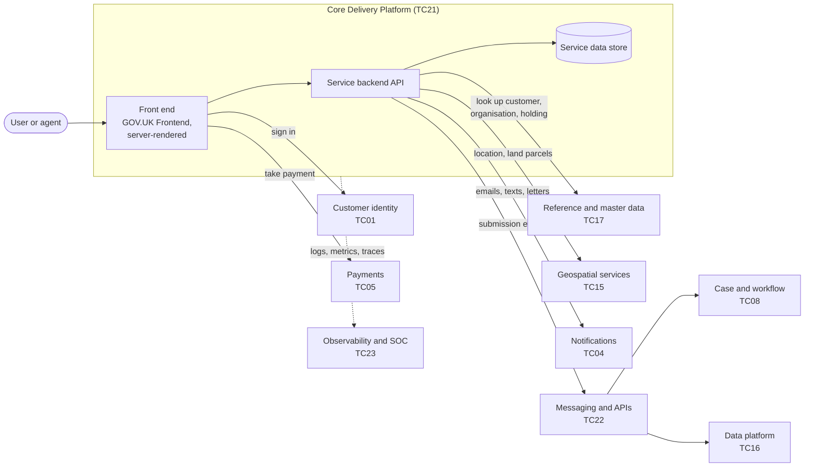

# Transactional digital service

The default shape for a public-facing Defra service where users apply, register, notify or claim something.

**Typical business capabilities:** [04 Engage with citizens and organisations](../business-capabilities.md#bc04), [05 Issue licences and permits](../business-capabilities.md#bc05), [07 Administer funds and grants](../business-capabilities.md#bc07).

!!! info "Part of the government picture"
    This reference architecture is Defra's detailed view of one part of the cross-government [Citizen Facing Reference Architecture](https://architecture.cddo.cabinetoffice.gov.uk/citizen-architecture/CF.html). That model lists Defra Grants in its business logic layer and the GOV.UK components used here - One Login, Pay, Notify and Forms - in its interaction and channel layers.

## Context

Most Defra services follow the same pattern: a user signs in, tells us something (often on behalf of a business or holding), may pay, and the information is processed by staff or automatically. This reference architecture covers the citizen-facing part and its hand-off to back-office processing.

## Architecture

## Building blocks

| Concern | Default | Guardrails |
| --- | --- | --- |
| Hosting | Core Delivery Platform | [GR-HOST-01](../../guardrails/hosting-and-platforms.md#gr-host-01) |
| Front end | Node.js, hapi, Nunjucks, GOV.UK Frontend; or the forms capability for simple form-based services | [GR-FE-02](../../guardrails/front-end-and-accessibility.md#gr-fe-02), [GR-FE-04](../../guardrails/front-end-and-accessibility.md#gr-fe-04) |
| Sign in | Defra ID / GOV.UK One Login | [GR-IAM-01](../../guardrails/identity-and-access.md#gr-iam-01) |
| Payments | GOV.UK Pay | [TC05](../technology-capabilities.md#tc05) |
| Notifications | GOV.UK Notify | [TC04](../technology-capabilities.md#tc04) |
| Hand-off to back office | Publish an event or call a documented API; never share a database | [GR-API-05](../../guardrails/apis-and-integration.md#gr-api-05), [GR-API-06](../../guardrails/apis-and-integration.md#gr-api-06) |
| Data | Own your service data; use authoritative sources for customers, holdings and locations | [GR-DATA-02](../../guardrails/data.md#gr-data-02) |
| Observability | Platform logging, metrics and tracing | [GR-OPS-01](../../guardrails/observability-and-operations.md#gr-ops-01) |

## Key decisions to record

- How the service represents organisations, agents and holdings (with the identity team).
- Whether back-office processing is automated, uses an existing case management product, or both.
- What happens when a downstream system is unavailable - users should still be able to submit.
- Retention period for submitted data and documents.

## Common pitfalls

- **Building a bespoke sign-in or address lookup.** Use the shared capabilities.
- **Synchronous calls to slow back-office systems** in the user's journey. Accept the submission, then process asynchronously.
- **Copying customer data** into the service rather than referencing the authoritative record.
- **Forgetting assisted digital** routes and staff-facing views of the same data.
