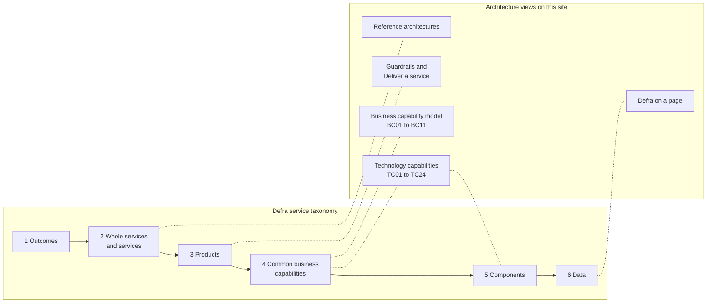

# Services and capabilities

What we mean by a service, a product, a capability and related words, using Defra's service taxonomy, and how the taxonomy connects to the architecture handrail.

## Why this matters

Service designers, product managers, architects and finance colleagues often use the same words for different things. A "service" can mean a whole area such as keeping animals, a single online transaction, or a running piece of software. When we do not agree what we mean, it is hard to compare services, find duplication or decide who owns what.

Defra's service strategy and design colleagues are developing a **service taxonomy model** to build that shared language. They describe it in [building a shared understanding of services](https://defradigital.blog.gov.uk/2025/07/31/building-a-shared-understanding-of-services/) (July 2025) and apply it in [mapping the whole service landscape](https://defradigital.blog.gov.uk/2025/12/10/defra-group-transformation-mapping-the-whole-service-landscape/). As they put it:

> "The model shows high-level groupings, not all the details within each layer. Different professions such as architecture or design may have their own ways of mapping. This is not intended to replace those, it's just a way of working together to create a shared understanding or view."

This page uses the taxonomy's definitions and shows where the architecture view - the [business capability model](business-capabilities.md), [technology capabilities](technology-capabilities.md) and [Defra on a page](../data/defra-on-a-page.md) - fits into it. It does not create a separate vocabulary.

!!! warning "To be confirmed"
    **TODO:** whether a later version of the service taxonomy has replaced version 2 (published July 2025), and whether the service strategy, ownership and performance team is content for this site to use its definitions as quoted here.

## The service taxonomy

The taxonomy has six levels. The definitions below are quoted from version 2 of the model, as published on the Defra Digital blog in July 2025.

| Level | Name | Definition |
| --- | --- | --- |
| 1 | **Outcomes** | "These are the results that Defra's actions have on the real world. These actions execute policy or legislation and ensure we meet users' needs." |
| 2 | **Whole services** | "It usually takes more than one part of government to deliver a whole service." |
| 2 | **Services** | "A service is all the things that government collectively provides to deliver an outcome for all of its users, through any path they take to reach their goal." This is the cross-government definition of a service from the Service Manual. |
| 3 | **Products** | "A product is a solution to a user's need or problem and usually forms part of a service." |
| 4 | **Common business capabilities** | "A description of what we do or could do - it might be a business activity or way of doing something." |
| 5 | **Components** | "An application, tool, platform or a physical asset (for example, a boat or a laptop)." |
| 6 | **Data** | "Data represents facts and observations that we rely on to make informed decisions and ensure everything we do is joined up and effective." |

## How the architecture handrail fits

| Taxonomy level | Where it shows up on this site |
| --- | --- |
| 1 Outcomes | The [DDTS doctrine](../principles/doctrine.md) and the outcomes that [business capabilities](business-capabilities.md) deliver |
| 2 Whole services and services | [Reference architectures](reference-architectures/index.md) describe common shapes of service. Services are assessed against the [Service Standard](https://www.gov.uk/service-manual/service-standard). |
| 3 Products | Most [guardrails](../guardrails/index.md), the [Deliver a service](../deliver/index.md) section and [ADRs](../governance/architecture-decision-records.md) apply to products and the teams that build them |
| 4 Common business capabilities | The [business capability model](business-capabilities.md) is Defra's architecture view of this level. [Technology capabilities](technology-capabilities.md) describe what technology must do to enable them. |
| 5 Components | The strategic options in each [technology capability](technology-capabilities.md), the [platforms](../deliver/platforms.md) teams build on, and reusable building blocks in the [patterns](../patterns/index.md) |
| 6 Data | [Defra on a page](../data/defra-on-a-page.md), [data standards](../data/data-standards.md) and authoritative sources |

## Where architecture uses words differently

The taxonomy is deliberately high level. Architecture sometimes needs finer distinctions. Where we do, we say so here rather than redefining the taxonomy's terms.

### Business capability

The taxonomy's common business capabilities include "a business activity or way of doing something". The architecture [business capability model](business-capabilities.md) is narrower: it describes **what** Defra does, independent of how it is done, who does it or which system supports it, so that it stays stable through reorganisations and system changes.

Colleagues applying the taxonomy in the Environment Agency found that "categorising and scaling capabilities is complicated. There are business, technical and scientific capabilities". On this site, business capabilities sit in the business capability model and technical ones in the [technology capabilities](technology-capabilities.md).

### Technology capability

**What technology must be able to do to enable business capabilities** - for example "Customer identity and access". This is an architecture term, aligned with the cross-government [Digital Technology Capability Model](https://architecture.cddo.cabinetoffice.gov.uk/digital-capability-model/index.html). It connects taxonomy level 4 (what we do) to level 5 (the components that do it).

### Platform

In the taxonomy, a platform is one kind of **component**. In architecture and engineering we also treat shared platforms, such as the Core Delivery Platform or Defra Customer Identity, as **products** in their own right, with their own users (delivery teams) and product owners. Both views are useful. Say which you mean.

### Component and "service" in software

Developers often call a running piece of software - a microservice, an API or a background job - a "service". In the taxonomy that is a **component**. On this site we say component, API or platform for these, and keep "service" for the taxonomy's meaning. In IT service management, "service" can also mean something a support team provides, such as a laptop or help desk.

### Journey

**The steps a user takes to reach their goal**, which may cross several services, products and organisations. Journeys are not a level in the taxonomy, but the definition of a service - "through any path they take to reach their goal" - depends on them. Journeys that cross services show where shared identity, shared data and joined-up integration matter most.

## Using these definitions

- **When you start a piece of work**, say which whole service and service it is part of, which products it changes, which [business capabilities](business-capabilities.md) it supports and which components it uses. The [discovery](../deliver/discovery.md) page asks for this.
- **In ADRs and assessments**, use capability ids (for example `BC05`) and say whether you mean a service, a product or a component.
- **If a definition does not work in your context**, say how you are using the word, and [tell us](https://github.com/howellsr/architecture/issues) so we can improve this page with the service design community.
