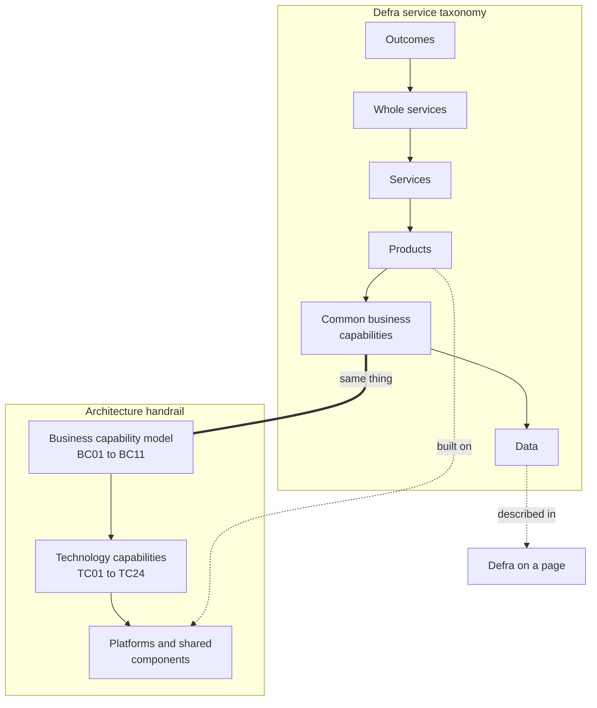

# Services and capabilities

What we mean by a service, a product, a capability and related words, how they connect, and how Defra's service taxonomy links through to the business capability model.

## Why this matters

Service designers, product managers, architects and finance colleagues often use the same words for different things. A "service" can mean a whole area such as "keeping animals" to one person, a single online transaction to another, and a running application to a third. When we do not agree what we mean, we struggle to compare services, find duplication or decide who owns what.

Defra's service strategy and design colleagues have been building a **service taxonomy** to create that shared language - see [building a shared understanding of services](https://defradigital.blog.gov.uk/2025/07/31/building-a-shared-understanding-of-services/) and [mapping the whole service landscape](https://defradigital.blog.gov.uk/2025/12/10/defra-group-transformation-mapping-the-whole-service-landscape/) on the Defra Digital blog. This page lines the architecture view up with that work, rather than inventing a separate vocabulary.

!!! warning "To be confirmed"
    **TODO:** confirm the definitions of each level of the Defra service taxonomy with the service strategy, ownership and performance team, and replace the summaries below with their agreed wording.

## The service taxonomy and the handrail

The service taxonomy describes six levels, from the outcomes Defra exists to achieve down to the data that informs decisions. **Common business capabilities** are one of those levels, and they are where the taxonomy meets the architecture [handrail](index.md).

## Definitions

Each term has a short definition, the context it comes from, and what it means for architecture. Where a word is used differently in different settings, we say so.

### Outcome

**The result Defra wants to achieve** for the environment, people and the economy - for example cleaner rivers or healthier animals. Outcomes come from Defra's strategy and priority outcomes.

- **Context:** strategy and the service taxonomy.
- **For architecture:** outcomes are the reason capabilities and services exist. Investment cases should trace from technology back to outcomes, through capabilities.

### Whole service

**A group of services that together meet a common set of user needs and help achieve common outcomes**, often delivered by several parts of Defra group and sometimes other parts of government - for example everything a person needs to do to keep animals.

- **Context:** the service taxonomy and whole service area mapping.
- **For architecture:** whole services show where several organisations and products serve the same users. They are the best place to look for shared journeys, shared data and duplicated technology.

### Service

**Something government provides that helps a user do something** - such as get a licence, report an incident or claim a payment - including the online, phone, paper and staff-assisted parts. A service is defined from the user's point of view, not by the organisation or system that delivers it.

- **Context:** service design, and the [Service Standard](https://www.gov.uk/service-manual/service-standard), which services are assessed against.
- **Other uses:** in technology and IT service management, "service" often means a running piece of software (a microservice or an API) or something a support team provides. On this site we say **component**, **API** or **platform** for those, to avoid confusion.
- **For architecture:** a service usually uses several products and platforms, and supports one or two business capabilities.

### Product

**A solution, usually digital, that meets user needs as part of one or more services**, owned and continuously improved by a product team - for example an online application form, a case management system or a mobile app.

- **Context:** product management and the service taxonomy.
- **For architecture:** products are what [ADRs](../governance/architecture-decision-records.md), [guardrails](../guardrails/index.md) and the [Deliver a service](../deliver/index.md) section mostly apply to. A product is built on [platforms](#platform) and uses [technology capabilities](technology-capabilities.md).

### Business capability

**What Defra does, independent of how it is done, who does it or which system supports it** - for example "Issue licences and permits". Capabilities are stable: they do not change when Defra reorganises or replaces a system.

- **Context:** enterprise and business architecture. The service taxonomy calls these **common business capabilities**: the business activities that many services rely on.
- **For architecture:** the [business capability model](business-capabilities.md) is the shared backbone. Mapping services and products to capabilities shows duplication and reuse opportunities - see [capability mapping](capability-mapping.md).

### Technology capability

**What technology must be able to do to enable business capabilities** - for example "Customer identity and access" or "Case and workflow management".

- **Context:** enterprise architecture, aligned with the cross-government [Digital Technology Capability Model](https://architecture.cddo.cabinetoffice.gov.uk/digital-capability-model/index.html).
- **For architecture:** each [technology capability](technology-capabilities.md) names the strategic options to use first.

### Platform

**Shared technology that many products build on**, run by a platform team as a product in its own right - for example the Core Delivery Platform or Defra ID.

- **Context:** technology and platform engineering.
- **For architecture:** the DDTS doctrine puts platforms before projects. See [getting onto Defra platforms](../deliver/platforms.md).

### Component

**A reusable building block inside a product or platform** - such as an API, a library or a front-end pattern.

- **Context:** software engineering. Sometimes called a "service" or "microservice" by developers.
- **For architecture:** components are where most reuse happens day to day. See the [patterns](../patterns/index.md).

### Data

**Facts that Defra and its users rely on to make informed decisions** - about customers, land, animals, the environment and more.

- **Context:** the service taxonomy and data architecture.
- **For architecture:** [Defra on a page](../data/defra-on-a-page.md) sets out the main data domains and their authoritative sources.

### Journey

**The steps a user takes to achieve a goal**, which may cross several services and organisations.

- **Context:** user research and service design.
- **For architecture:** journeys that cross services show where shared identity, shared data and joined-up integration matter most.

## Using these definitions

- **When you start a piece of work**, say which whole service and service it is part of, which products it changes, and which [business capabilities](business-capabilities.md) it supports. The [discovery](../deliver/discovery.md) page asks for this.
- **In ADRs and assessments**, use capability ids (for example `BC05`) and say whether you mean a service, a product or a component.
- **If a definition does not work in your context**, say how you are using the word, and [tell us](https://github.com/howellsr/architecture/issues) so we can improve this page.
