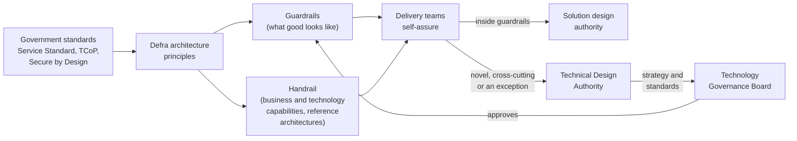

# Defra architecture

Guardrails, handrails and light-touch governance to help teams in Defra, and the partners who work with us, deliver great services quickly, safely and sustainably.

We work in the open. Everything here is written for **Defra product and platform teams** and for **delivery partners** - whether you work with us today or would like to.

## Start here

-   :material-road-variant:{ .lg .middle } **Guardrails**

    ---

    Opinionated good practice for building services in Defra. Stay inside them and you can self-assure and move fast.

    [:octicons-arrow-right-24: Read the guardrails](guardrails/index.md)

-   :material-sitemap:{ .lg .middle } **Handrail**

    ---

    Our business capability model mapped to technology capabilities and the reusable platforms that deliver them. Find what already exists before you build.

    [:octicons-arrow-right-24: Explore the handrail](handrail/index.md)

-   :material-scale-balance:{ .lg .middle } **Governance**

    ---

    Proportionate, delegated decision making through the Technology Governance Board, the Technical Design Authority and solution design authorities.

    [:octicons-arrow-right-24: Which route do I take?](governance/triage.md)

-   :material-database-outline:{ .lg .middle } **Data architecture**

    ---

    Defra on a page - the core things Defra cares about, where the authoritative data lives, and the data standards we use.

    [:octicons-arrow-right-24: Defra on a page](data/defra-on-a-page.md)

-   :material-shield-check-outline:{ .lg .middle } **Security architecture**

    ---

    How we apply Secure by Design, model threats and manage risk exceptions.

    [:octicons-arrow-right-24: Secure by Design in Defra](security/secure-by-design.md)

-   :material-handshake-outline:{ .lg .middle } **Working with us**

    ---

    What delivery partners can expect from us and what we expect from you.

    [:octicons-arrow-right-24: For delivery partners](about/delivery-partners.md)

## What Defra does

Every service we build should trace back to one of these business capabilities. They are the backbone of the [handrail](handrail/index.md).

<!-- capabilities:business-map -->

## How this fits together

The more a team's design follows the guardrails and reuses capabilities from the handrail, the lighter its governance becomes. Our aim is that **most decisions are made by teams, close to the work, and recorded in the open.**

## Related guidance

- [Defra Digital Service Manual](https://digital.defra.gov.uk/service-manual) - how Defra designs and delivers digital services
- [Service Standard](https://www.gov.uk/service-manual/service-standard) and [Technology Code of Practice](https://www.gov.uk/guidance/the-technology-code-of-practice)
- [Secure by Design](https://www.security.gov.uk/policy-and-guidance/secure-by-design/)
- [Defra Digital blog](https://defradigital.blog.gov.uk/)
- [All standards and links](standards/index.md)

!!! tip "Help us improve this site"
    This is a living repository. If something is missing, wrong or unclear, [open an issue or a pull request](contribute/index.md). Delivery partners are as welcome to contribute as Defra staff.
