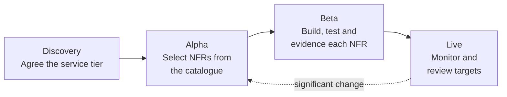

# Non-functional requirements

Non-functional requirements (NFRs) describe <em>how well</em> a system should work, rather than <em>what</em> it should do.

They set the expectations for quality, performance, reliability and overall user experience. Think of them as the rules that make a product feel fast, safe, easy to use and dependable - not the features themselves, but the qualities that make those features work smoothly.

If functional requirements are the "what", non-functional requirements are the "how well".

<!-- nfrs:status -->

!!! note "Kept for now"
    We are keeping this site's service tiers and NFR catalogue during alpha, and will review whether to retire them in favour of the business analysis lists after user feedback. Where the two differ, the business analysis [non-functional requirements](https://digital.defra.gov.uk/business-analysis/non-functional-requirements) in the Defra Digital Service Manual take precedence.

## Start here

-   **[Service tiers](service-tiers.md)**

    ---

    Choose the tier that matches the impact of your service failing. The tier sets your availability, recovery and support targets.

-   **[NFR catalogue](catalogue.md)**

    ---

    Every Defra NFR, with how to show it is met and the target for each tier. Copy the ones you need into your backlog.

-   **[Writing good NFRs](writing-nfrs.md)**

    ---

    How to draft requirements that are specific, measurable and testable - with examples.

## Using NFRs from design through to delivery

NFRs are not a document you write once. They shape the design, get built and tested like any other requirement, and are monitored in live.

| Phase | What to do with NFRs |
| --- | --- |
| **Discovery** | Understand the impact of the service failing and agree a provisional [service tier](service-tiers.md) with the service owner. |
| **Alpha** | Select the NFRs that apply from the [catalogue](catalogue.md), add any service-specific ones, and let them shape the architecture. Record any you will not meet in an [ADR](../governance/architecture-decision-records.md). |
| **Beta** | Put NFRs in the backlog with acceptance criteria. Automate the checks where you can - performance, accessibility and security tests in the pipeline. Gather evidence before the beta assessment. |
| **Live** | Monitor against the targets, report on them, and revisit the tier and targets when the service or its users change. |

## NFR categories

<!-- nfrs:categories -->

## How NFRs relate to guardrails

[Guardrails](../guardrails/index.md) say how Defra builds services: hosting, identity, security and so on. NFRs say how well each service must perform. Most NFRs link to the guardrail that helps you meet them, so following the guardrails gets you most of the way.

## Machine-readable catalogue

The tiers and catalogue are maintained as YAML in [`nfrs/`](https://github.com/howellsr/architecture/tree/main/nfrs) and published as [`nfrs.json`](https://howellsr.github.io/architecture/nfrs.json), so teams can import them into backlogs and test tooling.
