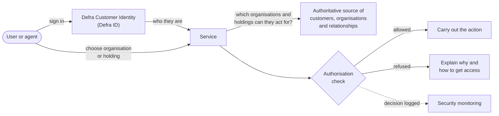

---
pattern:
  category: security
  status: draft
  summary: Users act for a business, a land holding or another person, and the service must check they are allowed to.
  guardrails: [GR-IAM-01, GR-IAM-04, GR-IAM-03, GR-DATA-02, GR-SEC-07]
  sbd: [access-control, one-login-pattern, stride-template]
  user_experience: written
---

# Acting on behalf of an organisation or holding

Separate who someone is from what they are allowed to do, so farmers, businesses, agents and land managers can act for the organisations and holdings they represent - and nobody else.

## Context

Many Defra users do not act for themselves. A farm business has several partners. A land agent manages dozens of holdings for different owners. An accountant claims a grant for a client. A vet certifies animals for a keeper.

Sign-in tells you **who** the person is. It does not tell you **which organisations or holdings they can act for**, or **what they can do** for each one. Services that mix the two up, or rebuild the rules themselves, give the wrong people access or lock out the right ones.

## Solution

Use the strategic customer identity service to authenticate the person. Get the **relationships** - which organisations and holdings they can act for, and in what role - from the authoritative source. Then make the service's own **authorisation decision** explicitly, in one place, and test it.

How it works:

1. The user signs in with [Defra Customer Identity](../deliver/platforms.md#defra-id), which uses GOV.UK One Login and Government Gateway behind the scenes. The service never stores passwords or builds its own sign-in.
2. The service gets the organisations and holdings the user can act for, and their role for each, from the authoritative source - not from a local table that drifts. Defra Customer Identity stores users' organisation accounts and the relationships between them centrally, so start there.
3. If the user can act for more than one, they choose which one they are acting for now, and the service shows it on every page.
4. Before every action, an **authorisation component** checks the role against the action - for example "an agent can submit a claim but cannot change bank details". Keep these rules in code, readable and covered by tests.
5. Every decision, especially refusals, is logged with the user, the organisation and the action.

## What users see

- **Sign in once**, through Defra Customer Identity. Users do not create a separate account for your service.
- **A choice of who they are acting for**, straight after sign-in, if they can act for more than one organisation or holding. Ask it as one question on its own page, using the GOV.UK Design System [question pages](https://design-system.service.gov.uk/patterns/question-pages/) pattern and [radios](https://design-system.service.gov.uk/components/radios/), and list each one with something users recognise, such as the business name and its reference. If they can act for only one, skip the question.
- **Who they are acting for, on every page**, with a way to switch. Agents with many clients need this most.
- **Only the actions their role allows.** Hide or explain actions they cannot take, rather than letting them fill in a form and refusing at the end.
- **A clear explanation when they cannot do something**, and how to get access.

## Content to design

| Situation | What to tell users |
| --- | --- |
| **Choosing who to act for** | A question such as "Which business are you applying for?", with names and references users recognise. Avoid internal terms such as "organisation id" or "relationship". |
| **Agent or owner** | Write for the person reading. An owner sees "your business"; an agent sees the client's name, such as "Applying for Brook Farm Ltd". Confirmation pages and emails say who submitted and who for. |
| **Missing permission** | Say what they cannot do and why, then how to fix it, for example: "You cannot change bank details for Brook Farm Ltd. Only the business owner can do this. Ask them to …". Do not just say "Access denied". |
| **No organisations or holdings found** | Explain that their account is not linked to any yet, and how to get linked or who to contact. |
| **Access has changed** | If a relationship is removed while they are using the service, tell them they no longer have access for that business and return them to the choice of who to act for. |
| **Acting for the wrong one** | Show the current business or holding clearly enough that users notice before they submit. |

How users get linked to an organisation or holding, and who they contact, depends on Defra Customer Identity. Check the current process with the Customer Identity team before writing this content - see [Defra Customer Identity](https://digital.defra.gov.uk/architecture-and-software-development/defra-customer-identity) in the Defra Digital Service Manual.

## What to test with users

- Do agents and owners **recognise the names and references** they are shown when choosing who to act for?
- Do users **notice who they are acting for** on each page, and can agents switch clients quickly?
- When a user **lacks permission**, do they understand why and know what to do next?
- Do partners, family members and employees working for one business understand **what they can and cannot do** in their role?
- Is the wording right for **both agents and owners**? Does each understand confirmation pages and emails written for the other?
- What happens in research when a user has **lots of relationships**, such as an agent with 50 clients? Does the choice page still work?

Recruit agents, not only owners: their needs are often different, and their mistakes affect someone else's business.

## Guardrails it helps you meet

<!-- patterns:guardrails -->

## Related Secure by Design artefacts

<!-- patterns:sbd -->

Threats to consider: a user changing an organisation id in a request to act for someone else (an insecure direct object reference), stale relationships after someone leaves a business, and agents with more access than they need. Check authorisation on the server for every request, not only when the page loads.

## When not to use it

- **Users only ever act for themselves**, such as a member of the public reporting an incident. Authentication alone is enough.
- **Staff-facing services.** Staff sign in with Microsoft Entra ID ([GR-IAM-02](../guardrails/identity-and-access.md#gr-iam-02)) and get permissions through roles and groups.

!!! warning "To be confirmed"
    **TODO:** whether relationships to land holdings, as well as organisations, come from Defra Customer Identity, and how services should query it.

## Related

- [Reading from an authoritative source](authoritative-source.md)
- [Identity and access guardrails](../guardrails/identity-and-access.md)
