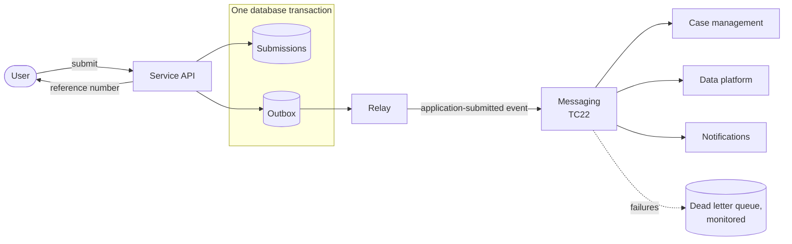

---
pattern:
  category: integration
  status: draft
  summary: A user submits something that other systems must process, and you do not want those systems' availability to block the user.
  guardrails: [GR-API-05, GR-API-06, GR-API-02, GR-OPS-04, GR-OPS-02]
  sbd: [security-patterns, stride-template]
---

# Asynchronous submission with an outbox

Accept a user's submission straight away, store it safely, and hand it to other systems through events - so a slow or broken back office never stops a user from applying.

## Context

Most Defra transactional services end with the user submitting something: an application, a claim, a notification. Behind the service sit case management, payments, the data platform and sometimes legacy systems. They are not always available, and they are often slow.

If the front end waits for each of them before telling the user "submitted", any one of them can stop the user finishing. If the service saves the submission and then publishes an event in a separate step, a failure between the two loses the event: the submission exists, but nothing downstream ever hears about it.

## Solution

Save the submission and an **outbox record** in the same database transaction. A separate **relay** reads the outbox and publishes each record as an event to the platform's messaging, marking it as sent once the broker confirms. Consumers - case management, the data platform, notifications - subscribe to the event and process it in their own time.

How it works:

1. The service validates the submission and saves it, with an outbox record describing the event, in **one transaction**. Either both are saved or neither is.
2. The user gets a reference number immediately. The confirmation page says what happens next and when.
3. The relay publishes outbox records in order and retries until the broker acknowledges them.
4. Consumers are **idempotent**: they use the event id to ignore duplicates, because the relay can publish a message more than once.
5. Messages that keep failing go to a dead letter queue, which raises an alert.

Describe the event in [AsyncAPI](https://www.asyncapi.com/) in the service repository. Put enough in the event for consumers to act - usually an id, type, time, version and a reference to the submission - and avoid copying personal data into it unless consumers need it.

## Guardrails it helps you meet

<!-- patterns:guardrails -->

## Related Secure by Design artefacts

<!-- patterns:sbd -->

Threats to consider in your [threat model](../security/threat-modelling.md): spoofed or tampered events, replayed messages, personal data in messages and logs, and an attacker filling the queue. Authenticate publishers and consumers, and encrypt messages in transit and at rest.

## When not to use it

- **The user needs the answer now.** If the outcome is decided instantly - an eligibility check, a postcode lookup - call the API synchronously and handle failure in the journey.
- **There is only one consumer and it is always available**, such as a database the service owns. The outbox adds moving parts for no benefit.
- **You need a transaction across services.** An outbox does not give you that. Design compensating actions (a saga) instead, and record the decision in an ADR.

## Related

- [Transactional digital service](../handrail/reference-architectures/transactional-service.md) reference architecture
- [Worked example: apply for a licence](worked-example/index.md), which uses this pattern
