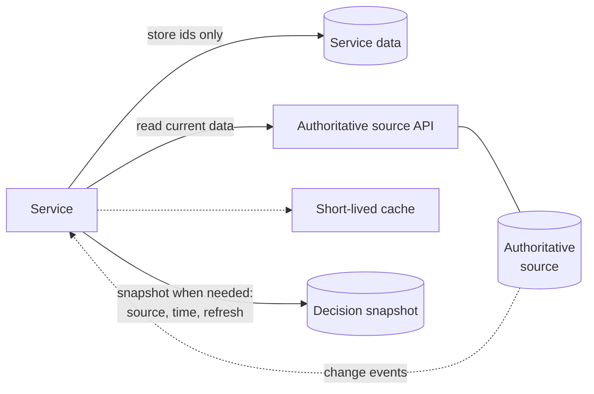

---
pattern:
  category: data
  status: draft
  summary: A service needs shared data - customers, organisations, holdings, locations or species - that another part of Defra owns.
  guardrails: [GR-DATA-02, GR-DATA-03, GR-DATA-04, GR-API-05, GR-API-07, GR-OPS-04]
  sbd: [security-requirements, stride-template]
---

# Reading from an authoritative source

Use the record Defra already holds, by reference, instead of keeping your own copy that slowly drifts out of date.

## Context

Defra services keep asking for the same things: who the customer is, which business they work for, which land parcels and holdings they manage, where something is, which species is involved. Each of these has an **authoritative source** - see [Defra on a page](../data/defra-on-a-page.md).

When services copy this data into their own databases, the copies drift. Users have to tell Defra the same thing many times, and decisions get made on out-of-date information.

## Solution

Store the **identifier** of the shared record, not the record itself. Read the current data from the authoritative source's API when you need it. Where you must keep a copy - for speed, resilience or a legal record of what the decision was based on - keep it deliberately: record where it came from, when, and how it is refreshed.

How it works:

1. Find the authoritative source for each shared entity in [Defra on a page](../data/defra-on-a-page.md), and the identifiers it uses in the [data standards](../data/data-standards.md).
2. Store those identifiers. Do not create your own ids for things that already have one.
3. Read through the source's documented API, authenticated as your service.
4. Cache only for a short time, and design for the source being unavailable: show what you can, and let users carry on where it is safe to.
5. If a decision depends on the data at a point in time - such as the land area a payment was calculated on - keep a **snapshot** with the decision, saying where and when it came from.
6. If the source publishes change events, subscribe, rather than polling.

## Guardrails it helps you meet

<!-- patterns:guardrails -->

## Related Secure by Design artefacts

<!-- patterns:sbd -->

## When not to use it

- **There is no authoritative source yet.** Talk to the [enterprise data architecture](../about/team.md) team. You may become the source, which brings duties under [GR-DATA-01](../guardrails/data.md#gr-data-01).
- **Analytical use at scale.** Use governed data products on the data platform, not high-volume calls to an operational API. See the [data and analytics](../handrail/reference-architectures/data-and-analytics.md) reference architecture.

## Related

- [Acting on behalf of an organisation or holding](acting-on-behalf.md)
- [Data guardrails](../guardrails/data.md)
