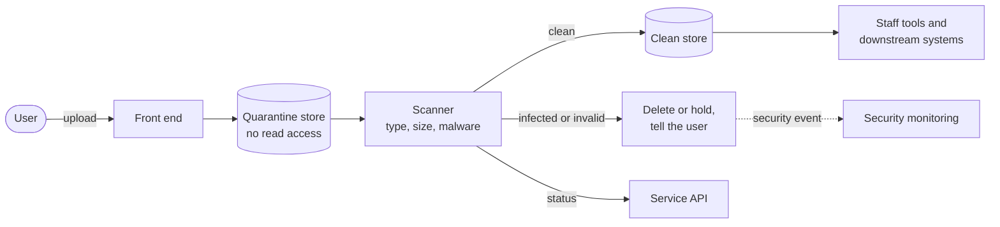

---
pattern:
  category: security
  status: draft
  summary: Users upload documents or images, and the files must be scanned and stored safely before anyone opens them.
  guardrails: [GR-SEC-04, GR-SEC-07, GR-HOST-06, GR-DATA-06, GR-DATA-09, GR-OPS-04]
  sbd: [security-patterns, dlp-strategy, stride-template]
---

# File upload with malware scanning

Treat every uploaded file as hostile until it has been scanned. Keep it apart from clean files, and only let staff and systems open files that have passed.

## Context

Licence applications, grant claims and incident reports often need evidence: photos, maps, certificates, spreadsheets. Uploaded files are one of the easiest ways to attack a service and the staff who open the files. They can carry malware, be far larger than expected, or pretend to be a different type of file.

## Solution

Upload files to a **quarantine** store that nothing else can read. Scan them, then move clean files to the **clean** store and record the result against the submission. Only the clean store is readable by the service, staff tools and downstream systems.

How it works:

1. Check the file's size and type **before** accepting it, and again by inspecting its content, not just its name.
2. Store it in quarantine with a random name. Never use the user's file name as a path.
3. Scan it. Until the scan finishes, show the user that the file is being checked, and do not let them submit until it has passed - or let them submit and tell staff a file is pending.
4. Move clean files to the clean store and record the result. Delete or hold infected files, raise a security event and ask the user to upload a different file.
5. Encrypt both stores, keep them in the UK and apply the retention period for the submission to its files.

## Guardrails it helps you meet

<!-- patterns:guardrails -->

## Related Secure by Design artefacts

<!-- patterns:sbd -->

!!! warning "To be confirmed"
    **TODO:** whether the Core Delivery Platform provides a shared file upload and malware scanning service, and how teams use it.

## When not to use it

- **Files never come from outside Defra's control**, such as files your own service generates. You still need to store them securely, but quarantine is unnecessary.
- **The user only needs to give you data, not a document.** Ask for the data in the form. It is easier for users and safer to process.

## Related

- [Worked example: apply for a licence](worked-example/index.md)
- [Security guardrails](../guardrails/security.md)
