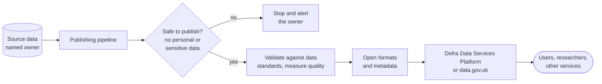

---
pattern:
  category: data
  status: draft
  summary: You hold non-personal data that others could use, and want to publish it so it can be found, trusted and reused.
  guardrails: [GR-DATA-07, GR-DATA-05, GR-DATA-03, GR-DATA-08, GR-DATA-01, GR-SEC-03]
  sbd: [dlp-strategy]
  user_experience: tbc
---

# Publishing open data with metadata

Publish data once, in open formats, with metadata that lets people find it, understand it and trust it - and an automated pipeline that keeps it current.

## Context

Defra holds a great deal of data that is useful outside government: environmental monitoring, flood risk, land use, species records. Data published as a one-off spreadsheet with no description is hard to find, quickly out of date and easy to misuse. Data published by hand can also leak information that should not be public.

## Solution

Publish through an automated pipeline from the data's source. The pipeline checks the data against the rules for what can be published, produces open formats, and publishes the data with **metadata**: what it is, who owns it, how it was collected, how good it is and how often it changes.

How it works:

1. Confirm the data set has a named owner and is recorded in the information asset register.
2. Check, automatically and on every run, that nothing personal, commercially sensitive or security-relevant is included. If the check fails, publish nothing and alert the owner.
3. Validate against the [data standards](../data/data-standards.md), so the data can be joined with other data sets.
4. Publish in open formats (such as CSV, GeoJSON or GeoPackage) under the [Open Government Licence](https://www.nationalarchives.gov.uk/doc/open-government-licence/version/3/).
5. Publish metadata in [UK GEMINI](https://www.agi.org.uk/why-uk-gemini/) for geospatial data or DCAT for other data, including quality, lineage, update frequency and contact.
6. Keep stable URLs for each data set and version, so people can cite them.

## What users see

!!! warning "To be confirmed"
    **TODO:** what users of the published data see, such as the dataset page, licence and update dates, the content for them, and what to test with users. Write these three sections with a designer and a user researcher.

## Content to design

To be written - see the box above.

## What to test with users

To be written - see the box above.

## Guardrails it helps you meet

<!-- patterns:guardrails -->

## Related Secure by Design artefacts

<!-- patterns:sbd -->

## When not to use it

- **The data includes personal data** that cannot be safely aggregated or anonymised. Share it under a data sharing agreement instead ([GR-DATA-04](../guardrails/data.md#gr-data-04)).
- **Official statistics.** Follow the Code of Practice for Statistics and your statistics producers' release process, which this pattern does not replace.

## Related

- [Data and analytics](../handrail/reference-architectures/data-and-analytics.md) reference architecture
- [Data guardrails](../guardrails/data.md)
