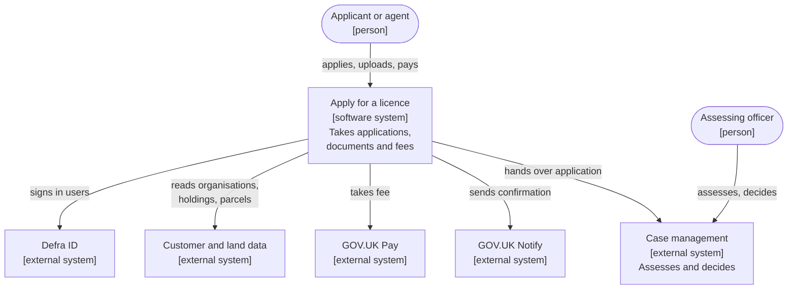
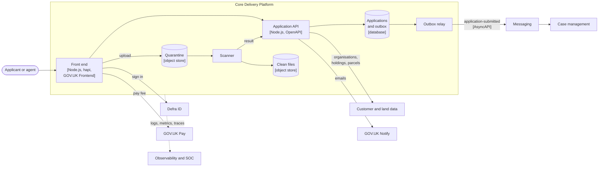

# Worked example: apply for a licence

A fictional Defra service, followed from context to containers, decisions and threats, to show how the reference architecture, patterns and guardrails fit together.

!!! info "This service is fictional"
    "Apply for a riverside works licence" is invented for this example. The names, volumes and decisions are illustrative and do not describe a real Defra service or system.

## The service

Landowners, farmers and contractors need a licence before doing certain works next to a river. Today they email a form and supporting documents. The new service lets them apply online, on their own behalf or as an agent for a landowner, upload a site plan and photos, and pay a fee. Applications are assessed by staff in a case management system.

| Aspect | In this example |
| --- | --- |
| Users | Landowners, farmers, contractors and agents; assessing staff |
| Volume | Around 5,000 applications a year, with peaks in spring |
| Business capability | [05 Issue licences and permits](../../handrail/business-capabilities.md#bc05) |
| Starting point | [Transactional digital service](../../handrail/reference-architectures/transactional-service.md) reference architecture |
| Service tier | T3 Standard - see [service tiers](../../nfrs/service-tiers.md) |
| Patterns used | [Asynchronous submission](../async-submission.md), [acting on behalf](../acting-on-behalf.md), [file upload with malware scanning](../file-upload.md), [authoritative source](../authoritative-source.md) |

## C4 system context

The system context shows the service, the people who use it and the systems it depends on.

## C4 containers

The container diagram opens up the service: what runs where and how the parts talk.

## What users see

The journey follows the patterns it uses, from a user's point of view:

1. **Sign in** with Defra Customer Identity. An agent then chooses which landowner they are applying for; a landowner applying for themselves goes straight on ([acting on behalf](../acting-on-behalf.md#what-users-see)).
2. **Answer questions about the works and the site**, one thing per page, saving as they go so they can come back.
3. **Upload a site plan and photos**, with the accepted types and sizes stated up front and each file's status shown while it is checked ([file upload](../file-upload.md#what-users-see)).
4. **Check their answers and pay the fee** with GOV.UK Pay.
5. **See a confirmation page** with a reference number and how long a decision takes, and get the same in an email ([asynchronous submission](../async-submission.md#what-users-see)). Agents also see the landowner's name.
6. **Come back to check the status**, and get an email when a decision is made.

Assessing staff see the application, its files and its status in case management, and only files that have passed the malware scan.

## Content to design

The team's content designer worked with the developers and the licensing team on:

- **The confirmation page and email:** the reference number, who applied for whom, and the assessment time the licensing team agreed to - not a guess.
- **File upload messages:** the accepted types and sizes, the "checking your file" message, and what to say when a file is rejected, without alarming users.
- **Agent and owner wording:** "your land" for owners, the landowner's name for agents, on every page and in every email.
- **Payment problems:** what happens to the application if payment fails or the user leaves before paying.
- **Delays in spring:** how the status page and emails explain a longer wait when applications peak.

## What to test with users

In alpha, the team tested with landowners, farmers, contractors and agents, including some on poor rural connections:

- whether agents could find and choose the right landowner, and noticed who they were applying for
- how long uploading a site plan and photos from a phone took in the field, and what users did while files were checked
- whether users kept their reference number and understood when to expect a decision
- what users did when told a file could not be uploaded
- whether the fee and what it pays for were clear before they started

These findings shaped [ADR 0003](adrs.md#adr-0003), which uses the authoritative relationships so agents only see landowners they act for.

## Decisions

The team recorded its significant decisions as ADRs ([GR-DEV-09](../../guardrails/software-development.md#gr-dev-09)). Three are shown in full on the [sample ADRs](adrs.md) page:

| ADR | Decision | Guardrails |
| --- | --- | --- |
| [0001](adrs.md#adr-0001) | Host on the Core Delivery Platform | `GR-HOST-01`, `GR-TECH-01` |
| [0002](adrs.md#adr-0002) | Accept applications asynchronously with an outbox | `GR-API-05`, `GR-API-06`, `GR-OPS-04` |
| [0003](adrs.md#adr-0003) | Use Defra ID and the authoritative relationships for agents | `GR-IAM-01`, `GR-IAM-04`, `GR-DATA-02` |

## Threats

The team ran a STRIDE threat model in alpha. An excerpt is on the [threat model excerpt](threat-model.md) page.

## How it lines up with the guardrails

| Concern | What the team did | Guardrails |
| --- | --- | --- |
| Reuse | Started from the transactional reference architecture and used strategic capabilities for identity, payments and notifications | `GR-TECH-01` |
| Hosting | Core Delivery Platform; infrastructure as code from the platform templates | `GR-HOST-01`, `GR-HOST-03` |
| Integration | Event to case management through the outbox; no shared database | `GR-API-05`, `GR-API-06`, `GR-API-02` |
| Identity | Defra ID; authorisation per organisation and holding in the API | `GR-IAM-01`, `GR-IAM-04` |
| Data | Stores ids for customers, holdings and parcels; DPIA completed | `GR-DATA-02`, `GR-DATA-06` |
| Security | Threat model, file scanning, IT health check before beta | `GR-SEC-02`, `GR-SEC-06` |
| Front end | GOV.UK Frontend, server-rendered, works without JavaScript | `GR-FE-02`, `GR-FE-03` |
| Operations | Platform observability; runbooks before public beta | `GR-OPS-01`, `GR-OPS-05` |

Use the [alpha](../../deliver/alpha.md) and [beta](../../deliver/beta.md) pages to see what the team needed at each phase.
