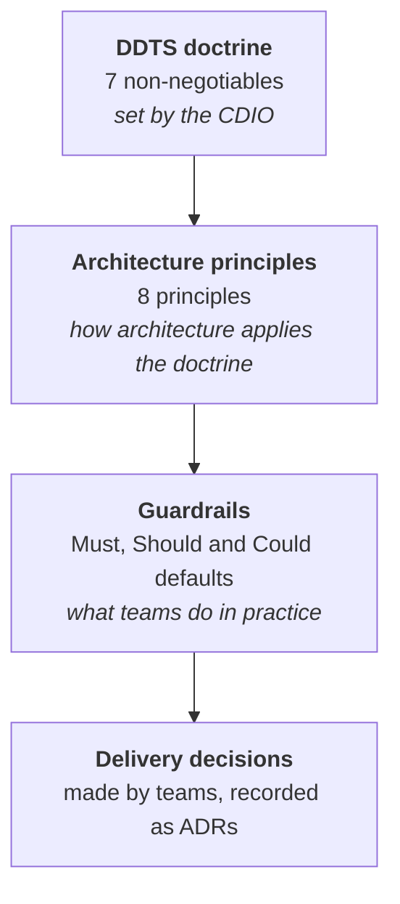

# Principles

How Defra decides. The DDTS doctrine sets the non-negotiables. The architecture principles apply them to technology change. The guardrails turn both into practical defaults for delivery teams.

-   **[DDTS doctrine](doctrine.md)**

    ---

    Seven non-negotiables for Digital, Data and Technology Services: platforms before projects, standards before exceptions, reuse before buy, data as an enterprise asset, assume AI, outcomes over structures, and digital first.

-   **[Architecture principles](architecture-principles.md)**

    ---

    Defra's eight Strategic Architecture Principles, with the rationale for each and how to follow it.

-   **[Guardrails](../guardrails/index.md)**

    ---

    The practical defaults that put the doctrine and principles into practice. Search them all in the [guardrail library](../guardrails/library.md).

## How to use them

- **Making a decision?** Start with the [decision check](../governance/decision-check.md). It tests your choice against the guardrails, which already reflect the doctrine and principles.
- **No guardrail covers it?** Ask which option best fits the principles, and which the doctrine would expect.
- **Need an exception?** The doctrine says standards come before exceptions, so explain why the default does not work in an [exception request](../governance/exceptions.md).

## How the doctrine, principles and guardrails line up

Generated from the site's content each time it is published, so it always shows the current picture - including where guardrails are still thin.

<!-- trace:coverage -->
