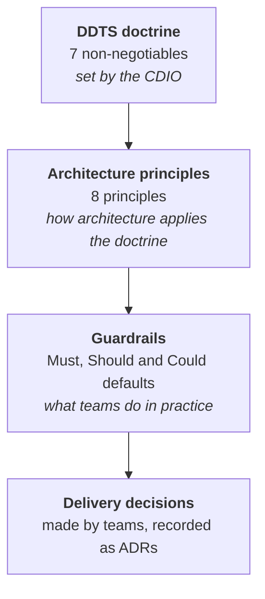

# Principles

How Defra decides. The DDTS doctrine sets the non-negotiables. The architecture principles apply them to technology change. The guardrails turn both into practical defaults for delivery teams.

-   **[DDTS doctrine](doctrine.md)**

    ---

    Seven non-negotiables for Digital, Data and Technology Services: platforms before projects, standards before exceptions, reuse before buy, data as an enterprise asset, assume AI, outcomes over structures, and digital first.

-   **[Architecture principles](architecture-principles.md)**

    ---

    Defra's eight Strategic Architecture Principles, with the rationale for each and how to follow it.

-   **[Guardrails](../guardrails/index.md)**

    ---

    The practical defaults that put the doctrine and principles into practice. Search them all in the [guardrail library](../guardrails/library.md).

## How to use them

- **Making a decision?** Start with the [decision check](../governance/decision-check.md). It tests your choice against the guardrails, which already reflect the doctrine and principles.
- **No guardrail covers it?** Ask which option best fits the principles, and which the doctrine would expect.
- **Need an exception?** The doctrine says standards come before exceptions, so explain why the default does not work in an [exception request](../governance/exceptions.md).

## How the doctrine and principles line up

| Doctrine | Architecture principles that apply it |
| --- | --- |
| [Platforms before projects. Built as products.](doctrine.md#ddts-01) | [1 Delivery-focused architecture](architecture-principles.md#gr-prin-01), [3 Maximise value, minimise waste](architecture-principles.md#gr-prin-03) |
| [Standards and guardrails before exceptions.](doctrine.md#ddts-02) | [1 Delivery-focused architecture](architecture-principles.md#gr-prin-01), [6 Secure today, safe tomorrow](architecture-principles.md#gr-prin-06) |
| [Reuse before buy.](doctrine.md#ddts-03) | [3 Maximise value, minimise waste](architecture-principles.md#gr-prin-03) |
| [Data is an enterprise asset.](doctrine.md#ddts-04) | [4 Clean data, clear decisions](architecture-principles.md#gr-prin-04), [5 Connect and collaborate](architecture-principles.md#gr-prin-05) |
| [Assume AI until proven otherwise.](doctrine.md#ddts-05) | [7 Empower to innovate](architecture-principles.md#gr-prin-07), [4 Clean data, clear decisions](architecture-principles.md#gr-prin-04) |
| [Outcomes and services over organisational structures.](doctrine.md#ddts-06) | [2 Design for users](architecture-principles.md#gr-prin-02), [5 Connect and collaborate](architecture-principles.md#gr-prin-05) |
| [Digital first where appropriate.](doctrine.md#ddts-07) | [2 Design for users](architecture-principles.md#gr-prin-02), [8 Right tools, right place](architecture-principles.md#gr-prin-08) |
