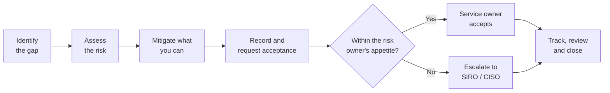

# Managing security exceptions

Sometimes a security control cannot be met - because of a legacy dependency, a supplier constraint or a delivery deadline. That is a risk decision, and it must be made explicitly, by the right person, for a limited time.

Required by guardrail [GR-SEC-09](../guardrails/security.md#gr-sec-09).

## The process

1. **Identify** the control or guardrail that cannot be met, and why.
2. **Assess** the risk with a security architect: likelihood, impact, and what an attacker could do.
3. **Mitigate** what you can with compensating controls - for example extra monitoring, network isolation or reduced data.
4. **Record** the residual risk in the risk register, with an owner and expiry date.
5. **Accept** at the right level:

    | Residual risk | Accepted by |
    | --- | --- |
    | Low | Service owner |
    | Medium | Service owner, with the security architect's agreement |
    | High | SIRO, on the advice of the CISO |
    | Very high / outside appetite | Not normally accepted - the service should not proceed until reduced |

6. **Track** remediation. Accepted risks expire - normally within 6 months for high risks and 12 months for others - and must be reviewed before renewal.

## Relationship to guardrail exceptions

If the gap is also a **Must** guardrail, raise a [guardrail exception](../governance/exceptions.md) with the TDA at the same time. One request, with the security risk record attached, covers both.

## What we do not accept

- Secrets in source code
- Unauthenticated access to personal or sensitive data
- Known-exploited critical vulnerabilities on internet-facing services without immediate mitigation
- Production changes outside an audited pipeline as a standing practice
