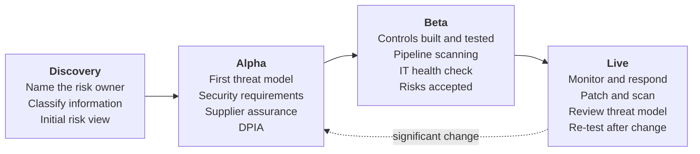

# Secure by Design in Defra

<a href="https://www.security.gov.uk/policy-and-guidance/secure-by-design/">Secure by Design</a> is the government's approach to building security into digital services from the start and throughout their life. This page explains how Defra teams apply it.

## The ten principles, in practice

| Secure by Design principle | What it means in Defra | Where to start |
| --- | --- | --- |
| **Create responsibility for cyber security risk** | Each service has a named risk owner (normally the service owner or SRO) who understands and owns its security risk. | [Who does what](index.md#who-does-what) |
| **Source secure technology products** | Assess suppliers and products before purchase; prefer strategic platforms that are already assured. | [GR-TECH-04](../guardrails/choosing-technology.md#gr-tech-04), [GR-SEC-08](../guardrails/security.md#gr-sec-08) |
| **Adopt a risk-driven approach** | Understand what you are protecting and from whom, then choose proportionate controls. | [Threat modelling](threat-modelling.md) |
| **Design usable security controls** | Security that gets in the way gets worked around. Test controls with users. | [GR-IAM-01](../guardrails/identity-and-access.md#gr-iam-01) |
| **Build in detect and respond security** | Log what matters and send it to the SOC; plan how you will respond. | [GR-SEC-07](../guardrails/security.md#gr-sec-07), [GR-OPS-01](../guardrails/observability-and-operations.md#gr-ops-01) |
| **Design flexible architectures** | Loosely coupled components that can be patched, replaced or isolated. | [GR-PRIN-07](../guardrails/principles.md#gr-prin-07) |
| **Minimise the attack surface** | Expose only what is needed; remove unused features, ports, accounts and dependencies. | [GR-API-07](../guardrails/apis-and-integration.md#gr-api-07) |
| **Defend in depth** | Layer controls so that one failure does not mean a breach. | [Security guardrails](../guardrails/security.md) |
| **Embed continuous assurance** | Automate scanning and testing in pipelines; review the threat model as the service changes. | [GR-SEC-05](../guardrails/security.md#gr-sec-05) |
| **Make changes securely** | Small, reviewed, automated changes through pipelines; no manual production changes. | [GR-HOST-03](../guardrails/hosting-and-platforms.md#gr-host-03), [GR-DEV-04](../guardrails/software-development.md#gr-dev-04) |

## Security through the delivery lifecycle

| Phase | Activities | Evidence for assessment |
| --- | --- | --- |
| Discovery | Identify the risk owner, information classification and personal data; initial view of threats and constraints | Risk owner named; classification recorded |
| Alpha | Collaborative threat modelling; derive security requirements; assess suppliers and products; start a DPIA | Threat model; security requirements in the backlog |
| Beta | Implement and test controls; pipeline security scanning; independent IT health check; accept residual risks | Health check report and remediation; risk acceptance records |
| Live | Monitor via the SOC; patch and scan continuously; review threat model at least annually and on significant change | Up-to-date threat model; vulnerability metrics |

## Proportionality

Secure by Design is risk-driven. A static information site and a payments service carry different risks. Talk to a security architect early to agree what is proportionate - most services on the strategic platforms inherit many controls and need far less bespoke work.
