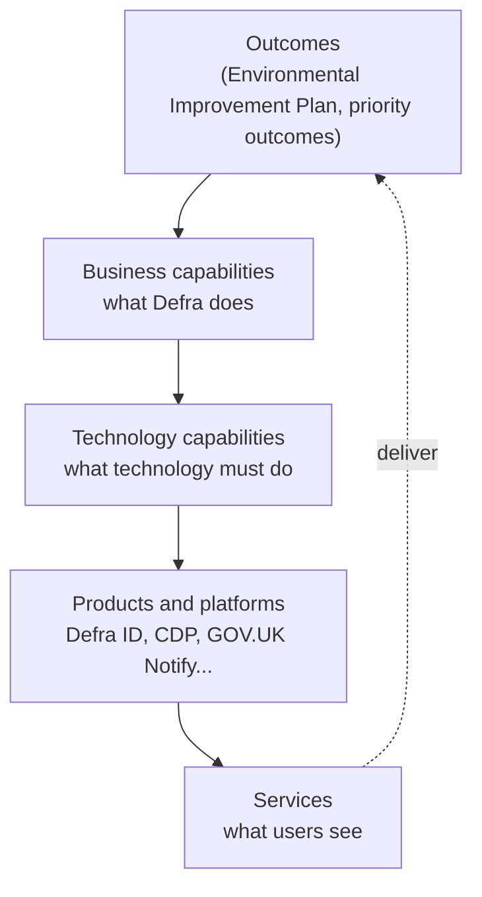

<!-- https://howellsr.github.io/architecture/handrail/ | maturity: published | site version 0.3.0 | generated from handrail/index.md -->

# The architecture handrail

Guardrails tell you where the edges are. The handrail is something to hold on to: a shared map of what Defra does, the technology that enables it, and what already exists that you can reuse.

## What is in the handrail

-   **[Services and capabilities](https://howellsr.github.io/architecture/handrail/services-and-capabilities/)**

    ---

    Defra's service taxonomy - outcomes, services, products, capabilities, components and data - and how the handrail fits into it. Draft.

-   **[Business capabilities](https://howellsr.github.io/architecture/handrail/business-capabilities/)**

    ---

    *What* Defra does - nine core and two supporting capabilities, independent of organisation and technology.

-   **[Technology capabilities](https://howellsr.github.io/architecture/handrail/technology-capabilities/)**

    ---

    What technology does to enable the business, in Technology Business Management (TBM) level 1 and level 2 areas.

-   **[Capability mapping](https://howellsr.github.io/architecture/handrail/capability-mapping/)**

    ---

    Which technology capabilities each business capability depends on - and where the biggest reuse opportunities are.

-   **[Reference architecture](https://howellsr.github.io/architecture/handrail/reference-architecture/)**

    ---

    A layered view of Defra's technology. Coming in a future iteration.

## How layers connect

Outcomes are delivered by business capabilities. Business capabilities are enabled by technology capabilities, which are provided by products and platforms. Those products and platforms are assembled into the services users see.

These layers line up with Defra's service taxonomy - see [services and capabilities](https://howellsr.github.io/architecture/handrail/services-and-capabilities/) for definitions and how they connect.

Business capabilities change slowly. Products and services change quickly. Mapping one to the other lets us:

- **see duplication** - five case management systems serving the same capability is a reuse opportunity
- **target investment** - fund the technology capabilities that enable the most business capabilities
- **give teams a head start** - a new licensing service starts from the regulatory casework service pattern, not a blank page
- **talk to the business in its own language** - capabilities, not systems

## Using the handrail on your project

1. **Find your business capability.** Which of the [eleven capabilities](https://howellsr.github.io/architecture/handrail/business-capabilities/) does your service support? Most services support one or two.
2. **Check the technology capabilities it needs.** The [capability mapping](https://howellsr.github.io/architecture/handrail/capability-mapping/) shows which [technology capabilities](https://howellsr.github.io/architecture/handrail/technology-capabilities/) each business capability typically depends on.
3. **Use the strategic options first.** Each technology capability lists what to use. If it is marked *gap*, talk to the TDA so we solve it once.
4. **Start from a service pattern** if one fits.
5. **Record your choices** in an [ADR](https://howellsr.github.io/architecture/governance/architecture-decision-records/), naming business capability ids (for example `BC05`) and technology capabilities (for example Enabling Platforms) so decisions can be found later.

## Technology radars

Two radars sit alongside the handrail.

!!! warning "Defra staff only"
    These links only open on a Defra device, or on the Defra VPN, and you need to be signed in with your Defra account. They will not work from a personal device or for delivery partners without Defra access.

| Radar | What it tells you | Use it to |
| --- | --- | --- |
| [Tools radar](https://eaflood.atlassian.net/jira/software/projects/TR/boards/630?filter=&groupBy=epic) (Defra device or VPN) | The software tools approved for use in Defra | Check whether a tool is already approved before you buy or adopt one ([GR-TECH-01](https://howellsr.github.io/architecture/guardrails/choosing-technology/#gr-tech-01), [GR-TECH-04](https://howellsr.github.io/architecture/guardrails/choosing-technology/#gr-tech-04)) |
| [Emerging Technology Radar 2026](https://defrati-my.sharepoint.com/personal/jan_murdoch_defrati_co_uk/_layouts/15/onedrive.aspx?id=%2Fpersonal%2Fjan%5Fmurdoch%5Fdefrati%5Fco%5Fuk%2FDocuments%2FDefra%20DDTS%20%2D%20Emerging%20Technologies%20Radar%202026%20%2Epdf&parent=%2Fpersonal%2Fjan%5Fmurdoch%5Fdefrati%5Fco%5Fuk%2FDocuments&ga=1) (Defra device or VPN) | The emerging technologies Defra is watching, what is ready to use now, what is on the horizon and what still needs time to mature | Spot opportunities early, and find out whether a technology is mature enough before you build on it |

The Emerging Technology Radar is published each year, and the 2026 edition added 28 technologies. It is organised around four themes that match where Defra group priorities are heading:

- **Digital transformation and data-driven services** - such as AI agents, digital twins, geospatial intelligence and privacy-preserving data tools
- **Environmental intelligence and resilience** - such as quantum sensors, edge intelligence, drones, autonomous vehicles and real-time monitoring
- **Sustainable digital operations and leadership** - such as energy-efficient compute, green software practice, circular IT asset management and lower-carbon cloud options
- **Cybersecurity and operational resilience** - such as secure multiparty computation, homomorphic encryption, post-quantum cryptography and AI-supported cyber defence

The emerging technology radar is not a list of approved technology. Before adopting an emerging technology, check the [technology capabilities](https://howellsr.github.io/architecture/handrail/technology-capabilities/) and the [guardrails](https://howellsr.github.io/architecture/guardrails/), and talk to the architecture team - novel use of AI goes to the [Technical Design Authority](https://howellsr.github.io/architecture/governance/tda/) ([GR-AI-06](https://howellsr.github.io/architecture/guardrails/ai/#gr-ai-06)).

## Machine-readable model

The capability models are maintained as YAML in the repository and published as JSON so other tools - portfolio management, architecture repositories, dashboards - can use them:

- [`capabilities/business-capabilities.yaml`](https://github.com/DEFRA/architecture/blob/main/capabilities/business-capabilities.yaml)
- [`capabilities/technology-capabilities.yaml`](https://github.com/DEFRA/architecture/blob/main/capabilities/technology-capabilities.yaml)
- [`capabilities.json`](https://defra.github.io/architecture/capabilities.json) (generated at build time)

The site build validates the model: unknown references or technology capabilities that support nothing will fail the build.

