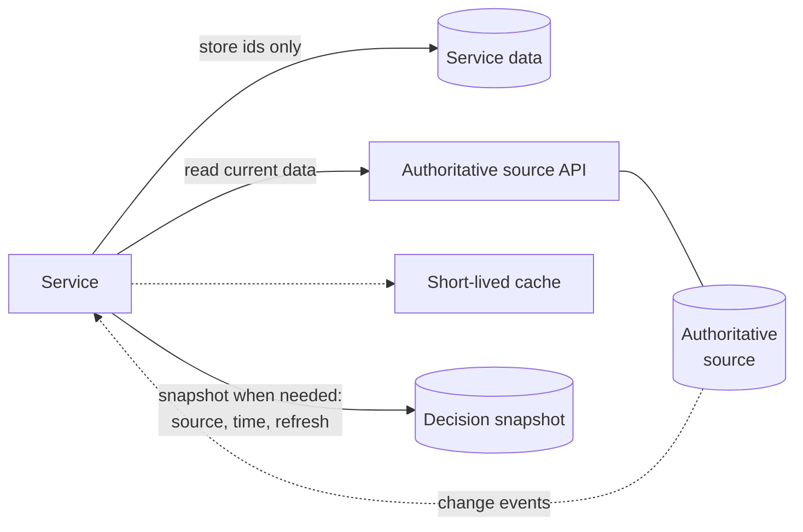

<!-- https://howellsr.github.io/architecture/patterns/authoritative-source/ | maturity: published | site version 0.3.0 | generated from patterns/authoritative-source.md -->

# Reading from an authoritative source

Use the record Defra already holds, by reference, instead of keeping your own copy that slowly drifts out of date.

## Context

Defra services keep asking for the same things: who the customer is, which business they work for, which land parcels and holdings they manage, where something is, which species is involved. Each of these has an **authoritative source** - see [Defra on a page](https://howellsr.github.io/architecture/data/defra-on-a-page/).

When services copy this data into their own databases, the copies drift. Users have to tell Defra the same thing many times, and decisions get made on out-of-date information.

## Solution

Store the **identifier** of the shared record, not the record itself. Read the current data from the authoritative source's API when you need it. Where you must keep a copy - for speed, resilience or a legal record of what the decision was based on - keep it deliberately: record where it came from, when, and how it is refreshed.

How it works:

1. Find the authoritative source for each shared entity in [Defra on a page](https://howellsr.github.io/architecture/data/defra-on-a-page/), and the identifiers it uses in the [data standards](https://howellsr.github.io/architecture/data/data-standards/).
2. Store those identifiers. Do not create your own ids for things that already have one.
3. Read through the source's documented API, authenticated as your service.
4. Cache only for a short time, and design for the source being unavailable: show what you can, and let users carry on where it is safe to.
5. If a decision depends on the data at a point in time - such as the land area a payment was calculated on - keep a **snapshot** with the decision, saying where and when it came from.
6. If the source publishes change events, subscribe, rather than polling.

## What users see

!!! warning "To be confirmed"
    **TODO:** what users see when data from the authoritative source is out of date or unavailable, the content for those situations, and what to test with users. Write these three sections with a designer and a user researcher.

## Content to design

To be written - see the box above.

## What to test with users

To be written - see the box above.

## Guardrails it helps you meet

| Guardrail | Level | What the guardrail asks |
| --- | --- | --- |
| [GR-DATA-02](https://howellsr.github.io/architecture/guardrails/data/#gr-data-02) Use authoritative sources | Should | Use the authoritative source for shared entities - customers, organisations, land parcels, holdings, locations, species - rather than creating local copies that drift. See Defra on a page. |
| [GR-DATA-03](https://howellsr.github.io/architecture/guardrails/data/#gr-data-03) Use agreed data standards and identifiers | Should | Use the data standards for dates, addresses, locations, identifiers and code lists, so data can be joined across services. |
| [GR-DATA-04](https://howellsr.github.io/architecture/guardrails/data/#gr-data-04) Collect once, share safely | Should | Do not ask users for information Defra already holds. Share data between services through APIs or governed data products, with data sharing agreements where required. |
| [GR-API-05](https://howellsr.github.io/architecture/guardrails/apis-and-integration/#gr-api-05) No integration through shared databases | Should | Services do not read or write another service's database directly. Integrate through APIs, events or governed data products. |
| [GR-API-07](https://howellsr.github.io/architecture/guardrails/apis-and-integration/#gr-api-07) Secure every API | Must | All APIs authenticate callers (OAuth 2.0 / OpenID Connect or mutual TLS), authorise every request, validate input and apply rate limiting. No API is "internal so it's safe". |
| [GR-OPS-04](https://howellsr.github.io/architecture/guardrails/observability-and-operations/#gr-ops-04) Health checks and graceful degradation | Should | Expose health endpoints, set timeouts and retries on dependencies, and degrade gracefully (for example save progress and tell the user) when a dependency fails. |

## Related Secure by Design artefacts

- [Security requirements](https://github.com/co-cddo/SbD/tree/Main/Security%20Architecture%20/Security%20Requirements)
- [STRIDE threat modelling template](https://github.com/co-cddo/SbD/blob/Main/Risks%20and%20Threats/Stride%20Threat%20Modelling%20Template%20-%20Secure%20By%20Design%20Artefact%20Library.xlsx)
- The whole [Secure by Design artefact library](https://github.com/co-cddo/SbD)

## When not to use it

- **There is no authoritative source yet.** Talk to the [enterprise data architecture](https://howellsr.github.io/architecture/about/team/) team. You may become the source, which brings duties under [GR-DATA-01](https://howellsr.github.io/architecture/guardrails/data/#gr-data-01).
- **Analytical use at scale.** Use governed data products on the data platform, not high-volume calls to an operational API. See the [data and analytics](https://howellsr.github.io/architecture/patterns/service/data-and-analytics/) service pattern.

## Related

- [Acting on behalf of an organisation or holding](https://howellsr.github.io/architecture/patterns/acting-on-behalf/)
- [Data guardrails](https://howellsr.github.io/architecture/guardrails/data/)

