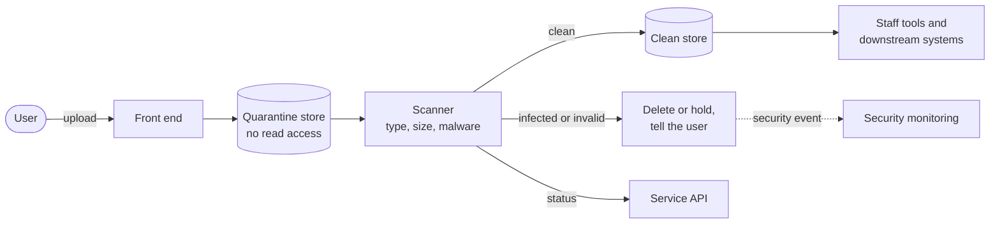

<!-- https://howellsr.github.io/architecture/patterns/file-upload/ | maturity: published | site version 0.3.0 | generated from patterns/file-upload.md -->

# File upload with malware scanning

Treat every uploaded file as hostile until it has been scanned. Keep it apart from clean files, and only let staff and systems open files that have passed.

## Context

Licence applications, grant claims and incident reports often need evidence: photos, maps, certificates, spreadsheets. Uploaded files are one of the easiest ways to attack a service and the staff who open the files. They can carry malware, be far larger than expected, or pretend to be a different type of file.

## Solution

Upload files to a **quarantine** store that nothing else can read. Scan them, then move clean files to the **clean** store and record the result against the submission. Only the clean store is readable by the service, staff tools and downstream systems.

How it works:

1. Check the file's size and type **before** accepting it, and again by inspecting its content, not just its name.
2. Store it in quarantine with a random name. Never use the user's file name as a path.
3. Scan it. Until the scan finishes, show the user that the file is being checked, and do not let them submit until it has passed - or let them submit and tell staff a file is pending.
4. Move clean files to the clean store and record the result. Delete or hold infected files, raise a security event and ask the user to upload a different file.
5. Encrypt both stores, keep them in the UK and apply the retention period for the submission to its files.

## What users see

- **The limits before they start.** Above the upload control, say which file types you accept and the largest size, so users do not find out by failing. Use the GOV.UK Design System [file upload](https://design-system.service.gov.uk/components/file-upload/) component.
- **A short wait while the file is checked.** After upload, show that the file is being checked, for example "Checking your file". Most scans take seconds, but the wait must be visible and must not look like the page has frozen.
- **The result for each file.** Show each file's name with its status, such as "Uploaded" or "There is a problem with this file", and let users remove a file or add another.
- **What happens if they carry on before the check finishes.** Either they cannot continue until every file has passed, or they can continue and are told a file is still being checked. Choose one with the team, and test it.

What users do not see: the quarantine and clean stores, or the scanner. They see only whether each file was accepted.

## Content to design

| Situation | What to tell users |
| --- | --- |
| **Before upload** | The accepted file types in words people know ("PDF, JPG or PNG"), the maximum size ("up to 10MB"), and what the file should show. Use the limits the scanner and storage are actually configured with. |
| **File too big** | Use an [error message](https://design-system.service.gov.uk/components/error-message/), such as "The selected file must be smaller than 10MB". |
| **Wrong file type** | For example, "The selected file must be a PDF, JPG or PNG". Check the content, not just the name, so a renamed file gets this message too. |
| **File being checked** | For example, "Checking your file - this usually takes a few seconds". |
| **Infected or rejected file** | Do not accuse the user or show technical detail. For example, "This file could not be uploaded. Try a different file, or contact us if this keeps happening." Do not say "virus", and do not show the file back to them. |
| **Scanning is unavailable** | Say uploads are not available right now and when to try again, and whether they can save their progress and come back. |
| **Empty or unreadable file** | For example, "The selected file is empty". |

The sizes and types above are examples. Agree the real limits with the developers, and use the GOV.UK Design System [error message](https://design-system.service.gov.uk/components/error-message/) and [error summary](https://design-system.service.gov.uk/components/error-summary/) wording conventions.

## What to test with users

- Do users **notice the limits** before choosing a file, and do they have files that meet them? For example, photos from phones are often larger than expected.
- Do users **understand the wait** while a file is checked, or do they think it has frozen and upload again?
- When a file is **rejected**, do they understand what to do next without being alarmed?
- Can users with **assistive technology** hear the upload status change, and reach the remove and add buttons?
- On a **slow or rural connection**, how long do uploads take, and what happens if the connection drops ([GR-FE-05](https://howellsr.github.io/architecture/guardrails/front-end-and-accessibility/#gr-fe-05))?
- Do agents and businesses uploading **several files** keep track of which ones they have added?

## Guardrails it helps you meet

| Guardrail | Level | What the guardrail asks |
| --- | --- | --- |
| [GR-SEC-04](https://howellsr.github.io/architecture/guardrails/security/#gr-sec-04) Encrypt in transit and at rest | Must | Use TLS 1.2 or higher for all traffic, internal and external, and encrypt data at rest using platform-managed or customer-managed keys. |
| [GR-SEC-07](https://howellsr.github.io/architecture/guardrails/security/#gr-sec-07) Log for detection and response | Must | Send security-relevant events (authentication, authorisation failures, administrative actions, data exports) to the security operations centre. See GR-OPS-01. |
| [GR-HOST-06](https://howellsr.github.io/architecture/guardrails/hosting-and-platforms/#gr-host-06) Host data in the UK | Should | Data classified OFFICIAL is held in UK regions unless an assessed and approved exception exists. |
| [GR-DATA-06](https://howellsr.github.io/architecture/guardrails/data/#gr-data-06) Protect personal data by design | Must | Complete a data protection impact assessment (DPIA) before processing personal data, minimise what you collect, and apply retention and deletion automatically. |
| [GR-DATA-09](https://howellsr.github.io/architecture/guardrails/data/#gr-data-09) Retain and dispose of records properly | Must | Apply Defra's retention schedules. Records of permanent value are identified for transfer to The National Archives. |
| [GR-OPS-04](https://howellsr.github.io/architecture/guardrails/observability-and-operations/#gr-ops-04) Health checks and graceful degradation | Should | Expose health endpoints, set timeouts and retries on dependencies, and degrade gracefully (for example save progress and tell the user) when a dependency fails. |

## Related Secure by Design artefacts

- [Security patterns](https://github.com/co-cddo/SbD/tree/Main/Security%20Architecture%20/Security%20Patterns)
- [Data loss prevention strategy](https://github.com/co-cddo/SbD/blob/Main/Security%20Architecture%20/Security%20Documentation/Data%20Loss%20Prevention%20%28DLP%29%20Strategy%20aligning%20with%20SbD/Data%20Loss%20Prevention%20%28DLP%29%20Strategy%20-%20Alignment%20with%20SbD.md)
- [STRIDE threat modelling template](https://github.com/co-cddo/SbD/blob/Main/Risks%20and%20Threats/Stride%20Threat%20Modelling%20Template%20-%20Secure%20By%20Design%20Artefact%20Library.xlsx)
- The whole [Secure by Design artefact library](https://github.com/co-cddo/SbD)

!!! warning "To be confirmed"
    **TODO:** whether the Core Delivery Platform provides a shared file upload and malware scanning service, and how teams use it.

## When not to use it

- **Files never come from outside Defra's control**, such as files your own service generates. You still need to store them securely, but quarantine is unnecessary.
- **The user only needs to give you data, not a document.** Ask for the data in the form. It is easier for users and safer to process.

## Related

- [Worked example: apply for a licence](https://howellsr.github.io/architecture/patterns/worked-example/)
- [Security guardrails](https://howellsr.github.io/architecture/guardrails/security/)

