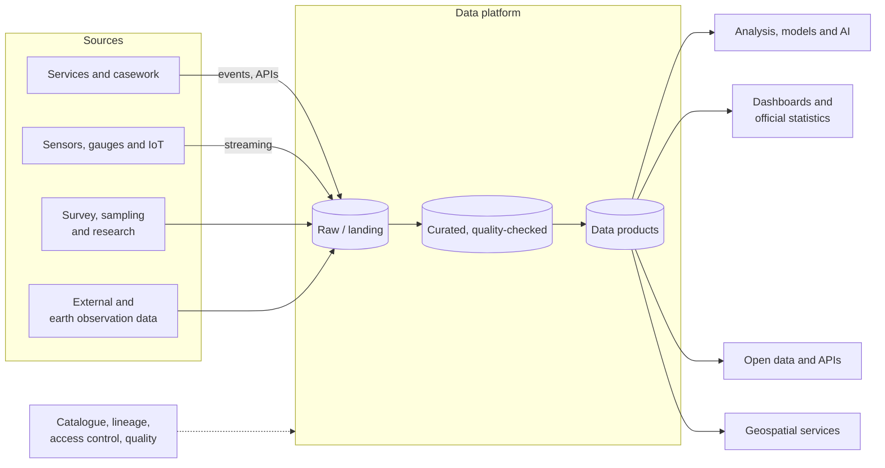

<!-- https://howellsr.github.io/architecture/patterns/service/data-and-analytics/ | maturity: draft | site version 0.3.0 | generated from patterns/service/data-and-analytics.md -->

# Data and analytics

An exploratory starting shape for collecting, managing, analysing and publishing evidence and environmental data.

!!! warning "Draft - to be confirmed"
    Exploratory, early work. Service patterns are starting points for discussion, not agreed designs, and have not been reviewed by the Technical Design Authority. Talk to the architecture team before building on one.

**Typical business capabilities:** [01 Act as a custodian of the environment and ecosystems](https://howellsr.github.io/architecture/handrail/business-capabilities/#bc01), [02 Conduct research and analyse evidence](https://howellsr.github.io/architecture/handrail/business-capabilities/#bc02), and the insight behind every other capability.

## Context

Defra is one of government's most data-intensive departments: environmental monitoring, scientific research, earth observation, spatial data, official statistics and the operational data generated by services. This service pattern describes how data moves from source to insight to publication, with governance throughout.

## Architecture

## Principles for this architecture

1. **Data products, not data dumps.** Curated data sets have an owner, a contract (schema, quality, refresh frequency) and documentation.
2. **Govern once, at the platform.** Access control, lineage, cataloguing and quality checks are provided by the platform, not reinvented per team.
3. **Keep raw data immutable** so analysis can be reproduced.
4. **Spatial is a first-class concern.** Use British National Grid (EPSG:27700) for storage and analysis of GB data and publish in standard formats - see [data standards](https://howellsr.github.io/architecture/data/data-standards/).
5. **Publish openly by default** through the [Defra Data Services Platform](https://environment.data.gov.uk/).

## Key decisions to record

- Classification and access model for each data product.
- Retention and archiving of raw data, particularly high-volume sensor data.
- Which data products are authoritative for which [Defra on a page](https://howellsr.github.io/architecture/data/defra-on-a-page/) entities.

