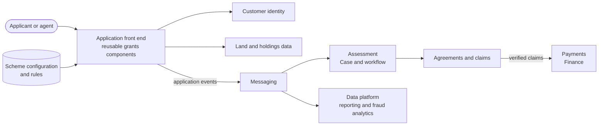

<!-- https://howellsr.github.io/architecture/patterns/service/grants/ | maturity: draft | site version 0.3.0 | generated from patterns/service/grants.md -->

# Grants and schemes (proposed)

A proposed starting shape for configuring schemes, taking applications, managing agreements, checking claims and making payments.

!!! warning "Draft - to be confirmed"
    Exploratory, early work. Service patterns are starting points for discussion, not agreed designs, and have not been reviewed by the Technical Design Authority. Talk to the architecture team before building on one.

**Technology capability:** grants and scheme management, under [Manufacturing & Delivery](https://howellsr.github.io/architecture/handrail/technology-capabilities/#manufacturing-and-delivery). Reusable grants components are still being established. **Typical business capability:** [07 Administer funds and grants](https://howellsr.github.io/architecture/handrail/business-capabilities/#bc07).

## Context

Defra runs many grant and payment schemes for farmers, land managers and others. Each new scheme risks becoming a new service built from scratch. Most share the same steps: check eligibility, apply, assess, agree, claim, verify, pay and sometimes recover.

## Proposed shape

## Questions to answer

!!! warning "To be confirmed"
    **TODO:** which reusable grants components exist on the Core Delivery Platform, who owns them, and how a new scheme team starts using them.

- How are scheme rules configured, versioned and tested?
- How do agreements, claims and payments connect to the finance system?
- How is fraud and error risk managed across schemes?

## Guardrails to pay attention to

- [GR-TECH-01 Look for something to reuse first](https://howellsr.github.io/architecture/guardrails/choosing-technology/#gr-tech-01)
- [GR-DATA-02 Use authoritative sources](https://howellsr.github.io/architecture/guardrails/data/#gr-data-02) for customers and land
- [GR-DATA-08 Manage data quality](https://howellsr.github.io/architecture/guardrails/data/#gr-data-08) for data that feeds payments
- [GR-AI-03 Keep a human accountable](https://howellsr.github.io/architecture/guardrails/ai/#gr-ai-03) where automation informs decisions

