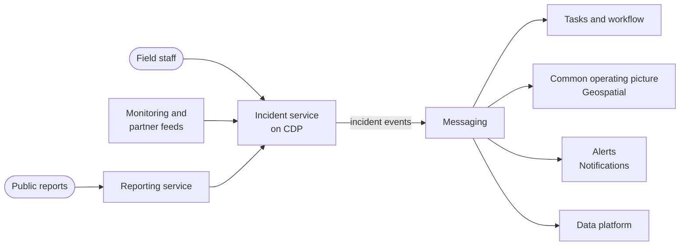

<!-- https://howellsr.github.io/architecture/patterns/service/incident-response/ | maturity: draft | site version 0.3.0 | generated from patterns/service/incident-response.md -->

# Incident response (proposed)

A proposed starting shape for detecting, coordinating and reporting on incidents such as animal and plant disease outbreaks, floods and pollution events.

!!! warning "Draft - to be confirmed"
    Exploratory, early work. Service patterns are starting points for discussion, not agreed designs, and have not been reviewed by the Technical Design Authority. Talk to the architecture team before building on one.

**Technology capability:** incident and emergency management, under [Manufacturing & Delivery](https://howellsr.github.io/architecture/handrail/technology-capabilities/#manufacturing-and-delivery). Defra has **no Defra-wide answer yet**. **Typical business capability:** [08 Respond to incidents and crises](https://howellsr.github.io/architecture/handrail/business-capabilities/#bc08).

## Context

Defra and its arm's length bodies respond to incidents that can grow from one report to a national emergency in days. Responders need a shared picture: what has been reported, where, what is being done, and by whom. Systems must scale quickly, work with partners outside Defra, and keep working when demand is highest.

## Proposed shape

## Questions to answer

!!! warning "To be confirmed"
    **TODO:** which incident types are in scope for a shared capability, and which team owns incident and emergency management technology.

- How do responders outside Defra, such as local authorities and other agencies, get access?
- What service tier does an incident service need, and how does it scale from quiet to surge?
- How do existing incident systems in arm's length bodies fit in?

## Guardrails to pay attention to

- [GR-HOST-07 Design for the resilience the service needs](https://howellsr.github.io/architecture/guardrails/hosting-and-platforms/#gr-host-07)
- [GR-OPS-03 Define and measure service levels](https://howellsr.github.io/architecture/guardrails/observability-and-operations/#gr-ops-03)
- [GR-DATA-02 Use authoritative sources](https://howellsr.github.io/architecture/guardrails/data/#gr-data-02) for locations, holdings and species
- [GR-API-06 Use events for change notifications](https://howellsr.github.io/architecture/guardrails/apis-and-integration/#gr-api-06)

