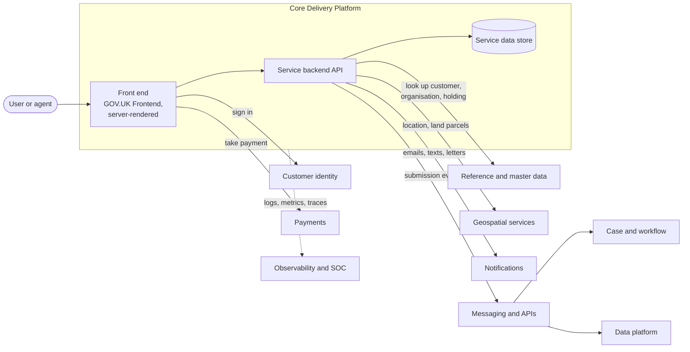

<!-- https://howellsr.github.io/architecture/patterns/service/transactional-service/ | maturity: draft | site version 0.3.0 | generated from patterns/service/transactional-service.md -->

# Transactional digital service

An exploratory starting shape for a public-facing Defra service where users apply, register, notify or claim something.

!!! warning "Draft - to be confirmed"
    Exploratory, early work. Service patterns are starting points for discussion, not agreed designs, and have not been reviewed by the Technical Design Authority. Talk to the architecture team before building on one.

**Typical business capabilities:** [04 Engage with citizens and organisations](https://howellsr.github.io/architecture/handrail/business-capabilities/#bc04), [05 Issue licences and permits](https://howellsr.github.io/architecture/handrail/business-capabilities/#bc05), [07 Administer funds and grants](https://howellsr.github.io/architecture/handrail/business-capabilities/#bc07).

!!! info "Part of the government picture"
    This service pattern is Defra's detailed view of one part of the cross-government [Citizen Facing Reference Architecture](https://architecture.cddo.cabinetoffice.gov.uk/citizen-architecture/CF.html). That model lists Defra Grants in its business logic layer and the GOV.UK components used here - One Login, Pay, Notify and Forms - in its interaction and channel layers.

## Context

Most Defra services follow the same pattern: a user signs in, tells us something (often on behalf of a business or holding), may pay, and the information is processed by staff or automatically. This service pattern covers the citizen-facing part and its hand-off to back-office processing.

## Architecture

## Building blocks

| Concern | Default | Guardrails |
| --- | --- | --- |
| Hosting | Core Delivery Platform | [GR-HOST-01](https://howellsr.github.io/architecture/guardrails/hosting-and-platforms/#gr-host-01) |
| Front end | Node.js, hapi, Nunjucks, GOV.UK Frontend; or the forms capability for simple form-based services | [GR-FE-02](https://howellsr.github.io/architecture/guardrails/front-end-and-accessibility/#gr-fe-02), [GR-FE-04](https://howellsr.github.io/architecture/guardrails/front-end-and-accessibility/#gr-fe-04) |
| Sign in | Defra Customer Identity (Defra ID), which uses GOV.UK One Login and Government Gateway | [GR-IAM-01](https://howellsr.github.io/architecture/guardrails/identity-and-access/#gr-iam-01) |
| Payments | GOV.UK Pay | [Finance](https://howellsr.github.io/architecture/handrail/technology-capabilities/#finance) |
| Notifications | GOV.UK Notify | [Customer Service](https://howellsr.github.io/architecture/handrail/technology-capabilities/#customer-service) |
| Hand-off to back office | Publish an event or call a documented API; never share a database | [GR-API-05](https://howellsr.github.io/architecture/guardrails/apis-and-integration/#gr-api-05), [GR-API-06](https://howellsr.github.io/architecture/guardrails/apis-and-integration/#gr-api-06) |
| Data | Own your service data; use authoritative sources for customers, holdings and locations | [GR-DATA-02](https://howellsr.github.io/architecture/guardrails/data/#gr-data-02) |
| Observability | Platform logging, metrics and tracing | [GR-OPS-01](https://howellsr.github.io/architecture/guardrails/observability-and-operations/#gr-ops-01) |

## Key decisions to record

- How the service represents organisations, agents and holdings (with the identity team).
- Whether back-office processing is automated, uses an existing case management product, or both.
- What happens when a downstream system is unavailable - users should still be able to submit.
- Retention period for submitted data and documents.

## Common pitfalls

- **Building a bespoke sign-in or address lookup.** Use the shared capabilities.
- **Synchronous calls to slow back-office systems** in the user's journey. Accept the submission, then process asynchronously.
- **Copying customer data** into the service rather than referencing the authoritative record.
- **Forgetting assisted digital** routes and staff-facing views of the same data.

