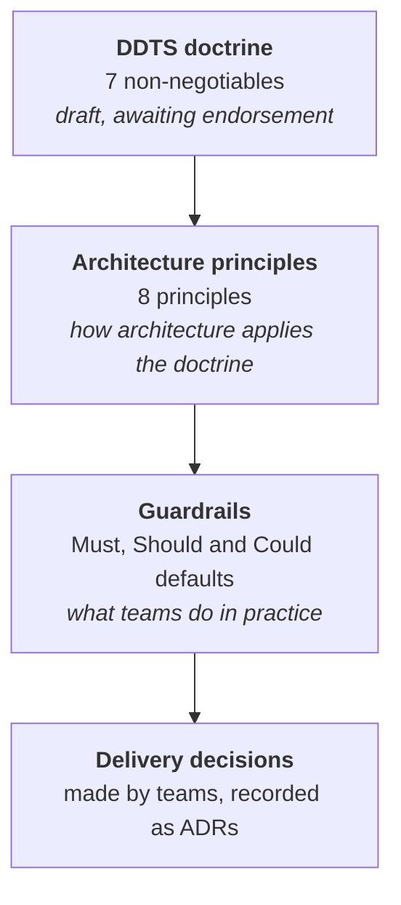

<!-- https://howellsr.github.io/architecture/principles/ | maturity: published | site version 0.3.0 | generated from principles/index.md -->

# Principles

How Defra decides. The DDTS doctrine sets the non-negotiables. The architecture principles apply them to technology change. The guardrails turn both into practical defaults for delivery teams.

-   **[DDTS doctrine](https://howellsr.github.io/architecture/principles/doctrine/)**

    ---

    Seven non-negotiables for Digital, Data and Technology Services: platforms before projects, standards before exceptions, reuse before buy, data as an enterprise asset, assume AI, outcomes over structures, and digital first.

-   **[Architecture principles](https://howellsr.github.io/architecture/principles/architecture-principles/)**

    ---

    Defra's eight Strategic Architecture Principles, with the rationale for each and how to follow it.

-   **[Guardrails](https://howellsr.github.io/architecture/guardrails/)**

    ---

    The practical defaults that put the doctrine and principles into practice. Search them all in the [guardrail library](https://howellsr.github.io/architecture/guardrails/library/).

## How to use them

- **Making a decision?** Start with the [decision check](https://howellsr.github.io/architecture/governance/decision-check/). It tests your choice against the guardrails, which already reflect the doctrine and principles.
- **No guardrail covers it?** Ask which option best fits the principles, and which the doctrine would expect.
- **Need an exception?** The doctrine says standards come before exceptions, so explain why the default does not work in an [exception request](https://howellsr.github.io/architecture/governance/exceptions/).

## How the doctrine, principles and guardrails line up

Generated from the site's content each time it is published, so it always shows the current picture - including where guardrails are still thin.

| Doctrine | Architecture principles | Guardrail areas | Guardrails |
| --- | --- | --- | ---: |
| [1. Platforms before projects. Built as products](https://howellsr.github.io/architecture/principles/doctrine/#ddts-01) | [1. Delivery-focused architecture](https://howellsr.github.io/architecture/principles/architecture-principles/#gr-prin-01) [3. Maximise value, minimise waste](https://howellsr.github.io/architecture/principles/architecture-principles/#gr-prin-03) | [Choosing technology](https://howellsr.github.io/architecture/guardrails/choosing-technology/), [Hosting and platforms](https://howellsr.github.io/architecture/guardrails/hosting-and-platforms/), [Observability and operations](https://howellsr.github.io/architecture/guardrails/observability-and-operations/), [Products and platforms](https://howellsr.github.io/architecture/guardrails/products-and-platforms/), [Software development](https://howellsr.github.io/architecture/guardrails/software-development/), [Open source and working in the open](https://howellsr.github.io/architecture/guardrails/open-source/), [Sustainability](https://howellsr.github.io/architecture/guardrails/sustainability/) | 43 |
| [2. Standards and guardrails before exceptions](https://howellsr.github.io/architecture/principles/doctrine/#ddts-02) | [1. Delivery-focused architecture](https://howellsr.github.io/architecture/principles/architecture-principles/#gr-prin-01) [6. Secure today, safe tomorrow](https://howellsr.github.io/architecture/principles/architecture-principles/#gr-prin-06) | [Choosing technology](https://howellsr.github.io/architecture/guardrails/choosing-technology/), [Hosting and platforms](https://howellsr.github.io/architecture/guardrails/hosting-and-platforms/), [Observability and operations](https://howellsr.github.io/architecture/guardrails/observability-and-operations/), [Products and platforms](https://howellsr.github.io/architecture/guardrails/products-and-platforms/), [Software development](https://howellsr.github.io/architecture/guardrails/software-development/), [Identity and access](https://howellsr.github.io/architecture/guardrails/identity-and-access/), [Security](https://howellsr.github.io/architecture/guardrails/security/) | 48 |
| [3. Reuse before buy](https://howellsr.github.io/architecture/principles/doctrine/#ddts-03) | [3. Maximise value, minimise waste](https://howellsr.github.io/architecture/principles/architecture-principles/#gr-prin-03) | [Choosing technology](https://howellsr.github.io/architecture/guardrails/choosing-technology/), [Hosting and platforms](https://howellsr.github.io/architecture/guardrails/hosting-and-platforms/), [Open source and working in the open](https://howellsr.github.io/architecture/guardrails/open-source/), [Products and platforms](https://howellsr.github.io/architecture/guardrails/products-and-platforms/), [Software development](https://howellsr.github.io/architecture/guardrails/software-development/), [Sustainability](https://howellsr.github.io/architecture/guardrails/sustainability/) | 36 |
| [4. Data is an enterprise asset](https://howellsr.github.io/architecture/principles/doctrine/#ddts-04) | [4. Clean data, clear decisions](https://howellsr.github.io/architecture/principles/architecture-principles/#gr-prin-04) [5. Connect and collaborate](https://howellsr.github.io/architecture/principles/architecture-principles/#gr-prin-05) | [Artificial intelligence](https://howellsr.github.io/architecture/guardrails/ai/), [Data](https://howellsr.github.io/architecture/guardrails/data/), [APIs and integration](https://howellsr.github.io/architecture/guardrails/apis-and-integration/), [Identity and access](https://howellsr.github.io/architecture/guardrails/identity-and-access/) | 36 |
| [5. Assume AI until proven otherwise](https://howellsr.github.io/architecture/principles/doctrine/#ddts-05) | [7. Empower to innovate](https://howellsr.github.io/architecture/principles/architecture-principles/#gr-prin-07) [4. Clean data, clear decisions](https://howellsr.github.io/architecture/principles/architecture-principles/#gr-prin-04) | [Artificial intelligence](https://howellsr.github.io/architecture/guardrails/ai/), [Open source and working in the open](https://howellsr.github.io/architecture/guardrails/open-source/), [Data](https://howellsr.github.io/architecture/guardrails/data/) | 27 |
| [6. Outcomes and services over organisational structures](https://howellsr.github.io/architecture/principles/doctrine/#ddts-06) | [2. Design for users](https://howellsr.github.io/architecture/principles/architecture-principles/#gr-prin-02) [5. Connect and collaborate](https://howellsr.github.io/architecture/principles/architecture-principles/#gr-prin-05) | [Digital first and end-to-end services](https://howellsr.github.io/architecture/guardrails/digital-first/), [Front end and accessibility](https://howellsr.github.io/architecture/guardrails/front-end-and-accessibility/), [APIs and integration](https://howellsr.github.io/architecture/guardrails/apis-and-integration/), [Identity and access](https://howellsr.github.io/architecture/guardrails/identity-and-access/) | 24 |
| [7. Digital first where appropriate](https://howellsr.github.io/architecture/principles/doctrine/#ddts-07) | [2. Design for users](https://howellsr.github.io/architecture/principles/architecture-principles/#gr-prin-02) [8. Right tools, right place](https://howellsr.github.io/architecture/principles/architecture-principles/#gr-prin-08) | [Digital first and end-to-end services](https://howellsr.github.io/architecture/guardrails/digital-first/), [Front end and accessibility](https://howellsr.github.io/architecture/guardrails/front-end-and-accessibility/), [Field working and devices](https://howellsr.github.io/architecture/guardrails/field-working-and-devices/) | 14 |

