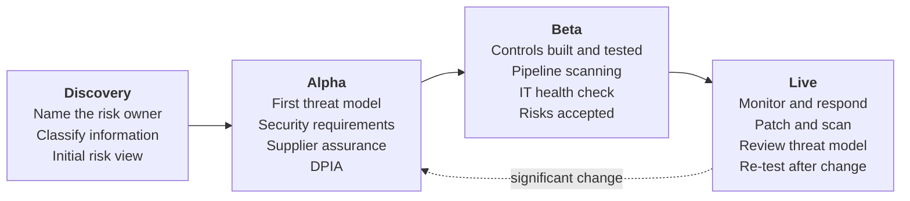

<!-- https://howellsr.github.io/architecture/security/secure-by-design/ | maturity: published | site version 0.3.0 | generated from security/secure-by-design.md -->

# Secure by Design in Defra

<a href="https://www.security.gov.uk/policy-and-guidance/secure-by-design/">Secure by Design</a> is the government's approach to building security into digital services from the start and throughout their life. This page is the architecture view of how Defra teams apply it. The Defra Security team owns Defra's security policies and the Secure by Design lifecycle requirements.

## The ten principles, in practice

| Secure by Design principle | What it means in Defra | Where to start |
| --- | --- | --- |
| **Create responsibility for cyber security risk** | Each service has a named risk owner (normally the service owner or SRO) who understands and owns its security risk. | [Who does what](https://howellsr.github.io/architecture/security/#who-does-what) |
| **Source secure technology products** | Assess suppliers and products before purchase; prefer strategic platforms that are already assured. | [GR-TECH-04](https://howellsr.github.io/architecture/guardrails/choosing-technology/#gr-tech-04), [GR-SEC-08](https://howellsr.github.io/architecture/guardrails/security/#gr-sec-08) |
| **Adopt a risk-driven approach** | Understand what you are protecting and from whom, then choose proportionate controls. | [Threat modelling](https://howellsr.github.io/architecture/security/threat-modelling/) |
| **Design usable security controls** | Security that gets in the way gets worked around. Test controls with users. | [GR-IAM-01](https://howellsr.github.io/architecture/guardrails/identity-and-access/#gr-iam-01) |
| **Build in detect and respond security** | Log what matters and send it to the SOC; plan how you will respond. | [GR-SEC-07](https://howellsr.github.io/architecture/guardrails/security/#gr-sec-07), [GR-OPS-01](https://howellsr.github.io/architecture/guardrails/observability-and-operations/#gr-ops-01) |
| **Design flexible architectures** | Loosely coupled components that can be patched, replaced or isolated. | [GR-PRIN-01](https://howellsr.github.io/architecture/principles/architecture-principles/#gr-prin-01) |
| **Minimise the attack surface** | Expose only what is needed; remove unused features, ports, accounts and dependencies. | [GR-API-07](https://howellsr.github.io/architecture/guardrails/apis-and-integration/#gr-api-07) |
| **Defend in depth** | Layer controls so that one failure does not mean a breach. | [Security guardrails](https://howellsr.github.io/architecture/guardrails/security/) |
| **Embed continuous assurance** | Automate scanning and testing in pipelines; review the threat model as the service changes. | [GR-SEC-05](https://howellsr.github.io/architecture/guardrails/security/#gr-sec-05) |
| **Make changes securely** | Small, reviewed, automated changes through pipelines; no manual production changes. | [GR-HOST-03](https://howellsr.github.io/architecture/guardrails/hosting-and-platforms/#gr-host-03), [GR-DEV-04](https://howellsr.github.io/architecture/guardrails/software-development/#gr-dev-04) |

## Security through the delivery lifecycle

The authoritative Secure by Design requirements for each stage of a project are on the [DDTS Portfolio Hub](https://defra.sharepoint.com/sites/def-ddts-portfoliohub/SitePages/Secure-by-Design.aspx), maintained by the Defra Security team. The Defra Digital Service Manual's [security](https://digital.defra.gov.uk/security) page links to them. What follows is the architecture view of those requirements: the design work and evidence architects help with in each phase. Where the two differ, the Portfolio Hub requirements apply.

!!! warning "To be confirmed"
    **TODO:** reconcile this phase table with the Secure by Design lifecycle requirements on the DDTS Portfolio Hub, and record any differences.

| Phase | Activities | Evidence for assessment |
| --- | --- | --- |
| Discovery | Identify the risk owner, information classification and personal data; initial view of threats and constraints | Risk owner named; classification recorded |
| Alpha | Collaborative threat modelling; derive security requirements; assess suppliers and products; start a DPIA | Threat model; security requirements in the backlog |
| Beta | Implement and test controls; pipeline security scanning; independent IT health check; accept residual risks | Health check report and remediation; risk acceptance records |
| Live | Monitor via the SOC; patch and scan continuously; review threat model at least annually and on significant change | Up-to-date threat model; vulnerability metrics |

## Reuse proven security artefacts

Before designing a control from scratch, check the cross-government [Secure by Design artefact library](https://github.com/co-cddo/SbD). It collects proven solutions to common security problems - patterns, blueprints, checklists, requirements, threat models, templates and code samples - organised by domain:

| Domain | Useful for |
| --- | --- |
| Access control and authentication | Identity patterns alongside [GR-IAM guardrails](https://howellsr.github.io/architecture/guardrails/identity-and-access/) |
| Artificial intelligence | Securing AI services, alongside [GR-AI guardrails](https://howellsr.github.io/architecture/guardrails/ai/) |
| Business continuity and disaster recovery | Resilience designs for your [service tier](https://howellsr.github.io/architecture/nfrs/service-tiers/) |
| Cloud | Secure cloud configuration and hosting patterns |
| Operations, risks and threats | Example [threat models](https://howellsr.github.io/architecture/security/threat-modelling/) and monitoring patterns |
| Security architecture and governance | Reference designs and assurance approaches |

The library is in alpha and run in the open. If your team builds something reusable, propose it through the library's GitHub issues so other departments benefit too. Never put sensitive information in a public issue.

## Proportionality

Secure by Design is risk-driven. A static information site and a payments service carry different risks. Talk to a security architect early to agree what is proportionate - most services on the strategic platforms inherit many controls and need far less bespoke work.

